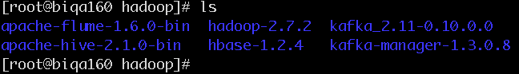
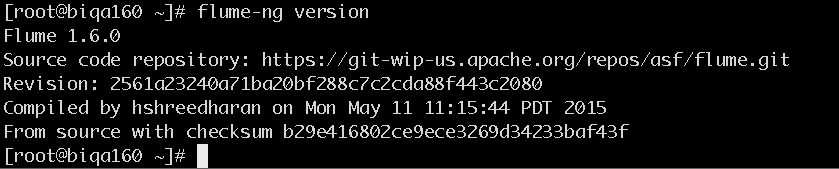

### flume安装(以192.168.52.160为例)
## 1. 安装
* 创建安装目录 

    ```
    mkdir -p /opt/hadoop/  
    cd /opt/hadoop/
    ```

* 下载压缩包
[flume下载](http://www.apache.org/dist/flume/1.6.0/)

* 解压缩文件

    `tar -zxvf apache-flume-1.6.0-bin.tar.gz`

    

## 2. 配置

> 我们把提供相同应用的服务器组称之为一个quorum，quorum中的所有机器都有相同的配置文件。
在这里我们以3个机器组成的quorum为例，具体配置如下。

*  添加环境变量

```
vi /etc/profile
//修改如下

export FLUME_HOME=/home/opt/hadoop/apache-flume-1.6.0-bin
export FLUME_CONF_DIR=$FLUME_HOME/conf

export PATH=$JAVA_HOME/bin:$HADOOP_HOME/sbin:$HADOOP_HOME/bin:$HIVE_HOME/bin:$KAFKA_HOME/bin:$FLUME_HOME/bin:$M2_HOME/bin:$PATH


source /etc/profile

```

* 修改<font color="red"> flume-env.sh </font>配置文件,主要是JAVA_HOME变量设置

>从模板复制而来`cp flume-env.sh.template flume-env.sh`

        `export JAVA_HOME=/usr/java/jdk1.8.0_45`

【至此，flume安装完成】
<font color="blue">验证：</font>

 


## 3. 简单示例


#### 1. 修改配置文件

`vi /opt/hadoop/apache-flume-1.6.0-bin/conf/flume.conf`

输入以下内容

```
# 指定Agent的组件名称
a1.sources = r1
a1.sinks = k1
a1.channels = c1

# 指定Flume source(要监听的路径)
a1.sources.r1.type = spooldir
a1.sources.r1.spoolDir = /root/path  #确保存在此目录，无则创建

# 指定Flume sink
a1.sinks.k1.type = logger

# 指定Flume channel
a1.channels.c1.type = memory
a1.channels.c1.capacity = 1000
a1.channels.c1.transactionCapacity = 100

# 绑定source和sink到channel上
a1.sources.r1.channels = c1
a1.sinks.k1.channel = c1
```

#### 2. 启动flume agent

`cd /opt/hadoop/apache-flume-1.6.0-bin/flume-ng agent --conf conf --conf-file conf/flume.conf --name a1 -Dflume.root.logger=INFO,console`


参数|作用|举例
-------|----------|----------
–conf 或 -c | 指定配置文件夹，包含flume-env.sh和log4j的配置文件 |  –conf conf
–conf-file 或 -f | 配置文件地址 | –conf-file conf/flume.conf
–name 或 -n | agent名称 | –name a1
-z | zookeeper连接字符串 | -z zkhost:2181,zkhost1:2181
-p | zookeeper中的存储路径前缀  | -p /flume


#### 3. 写入日志内容

`vi 1.log`

写入`Hello Flume.`作为测试内容。然后拷贝到flume监听路径。

`cp 1.log  /root/path/`

接着就可以在前一个终端看到刚刚采集的内容了,如下：

`2016-06-27 10:02:58,322 (SinkRunner-PollingRunner-DefaultSinkProcessor) [INFO - org.apache.flume.sink.LoggerSink.process(LoggerSink.java:94)] Event: { headers:{} body: 48 65 6C 6C 6F 20 77 6F 72 6C 64 0D             Hello Flume. }`

至此flume已经能够正常运行。


