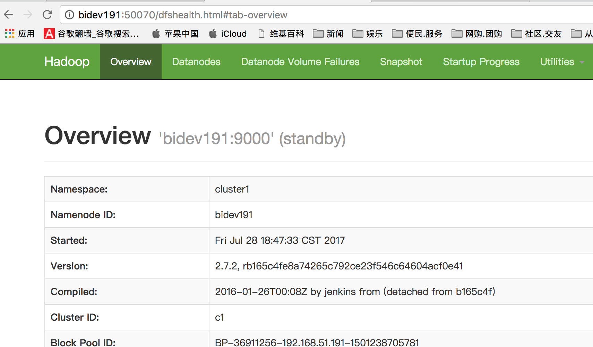
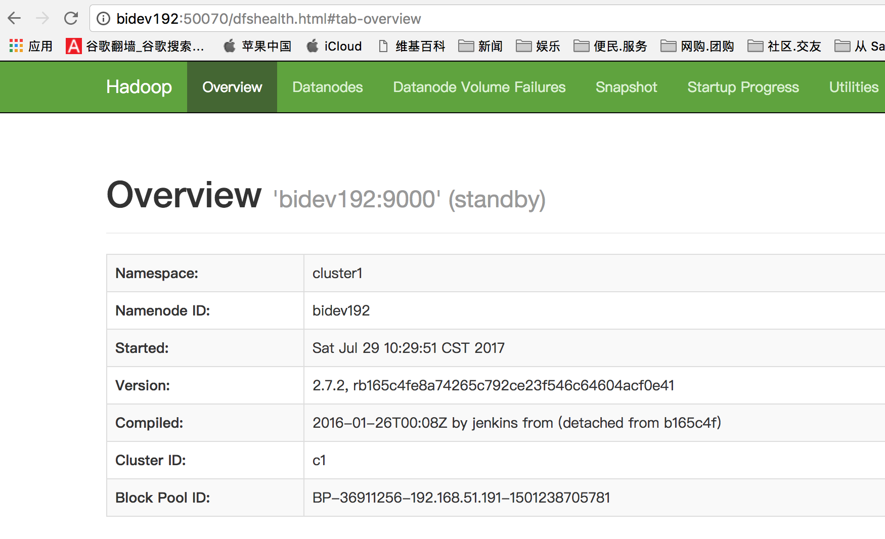
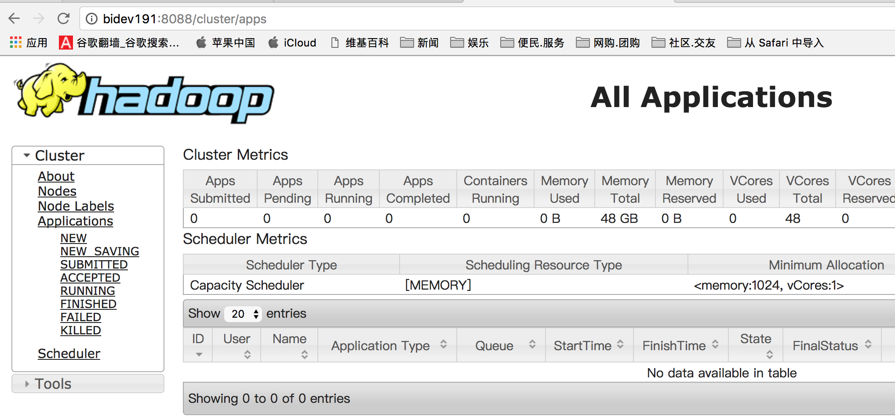
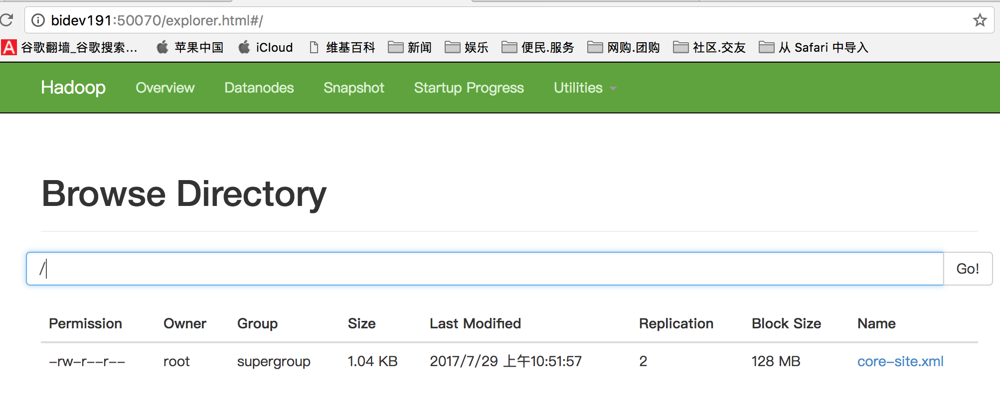
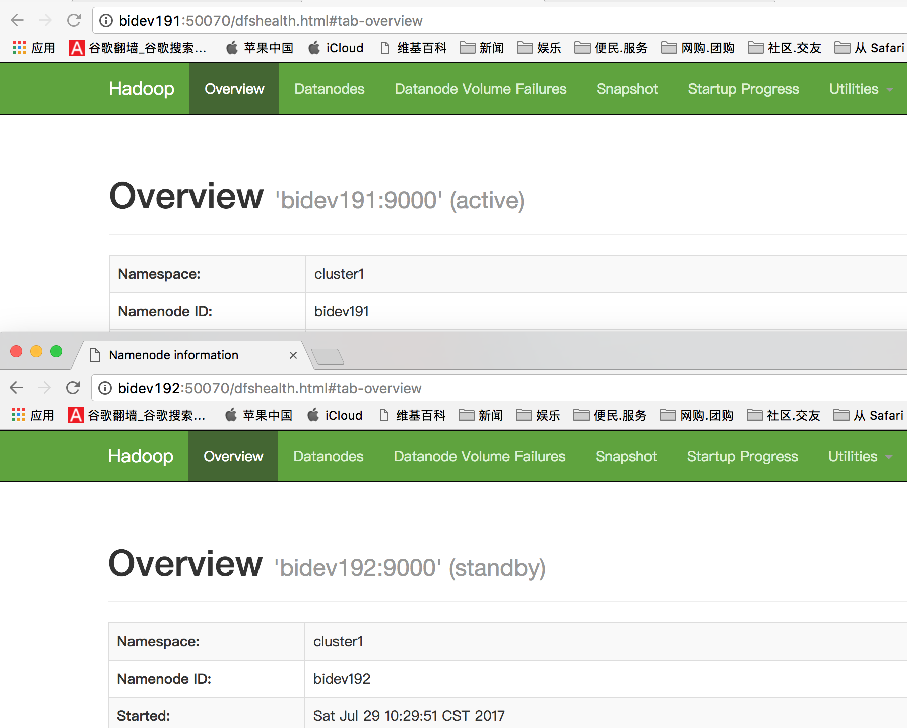

## hadoop单集群安装(以192.168.51.191为例)
### 1. 安装
* 创建安装目录 


```
    `//已创建可忽略`
    mkdir -p /opt/hadoop/  
    cd /opt/hadoop/
```

* 下载压缩包  
    [hadoop-2.7.2.tar.gz](http://mirror.bit.edu.cn/apache/hadoop/common/hadoop-2.7.2/hadoop-2.7.2.tar.gz)  
    [apache其他及历史版本](http://archive.apache.org/dist/)

* 解压缩文件

    `tar -zxvf hadoop-2.7.2.tar.gz`


### 2. 配置

> 配置文件一共包括6个，分别是hadoop-env.sh、core-site.xml、hdfs-site.xml、mapred-site.xml、yarn-site.xml和slaves。除了hdfs-site.xml文件在不同集群配置不同外，其余文件在四个节点的配置是完全一样的，可以复制。
> (备注：mapred-site.xml.template修改或复制为mapred-site.xml)

添加环境变量
```
export HADOOP_HOME=/opt/hadoop/hadoop-2.7.2
export PATH=$JAVA_HOME/bin:$ZK_HOME/bin:$HADOOP_HOME/sbin:$HADOOP_HOME/bin:$PATH
```


*  文件*hadoop-env.sh*

    就是修改这一行内容，修改后的结果如下  
    `export JAVA_HOME=/usr/java/jdk1.8.0_45`  
    【这里的JAVA_HOME的值是jdk的安装路径。如果你那里不一样，请修改为自己的地址】

* 文件core-site.xml

```
<configuration>
<property>
<name>fs.defaultFS</name>
<value>hdfs://cluster1</value>
</property>
【这里的值指的是默认的HDFS路径。当有多个HDFS集群同时工作时，用户如果不写集群名称，那么默认使用哪个哪？在这里指定！该值来自于hdfs-site.xml中的配置】

<property>
<name>hadoop.tmp.dir</name>
<value>/opt/hadoop/hadoop-2.7.2/tmp</value>
</property>
【这里的路径默认是NameNode、DataNode、JournalNode等存放数据的公共目录。用户也可以自己单独指定这三类节点的目录。】

<property>
<name>ha.zookeeper.quorum</name>
<value>hadoop101:2181,hadoop102:2181,hadoop103:2181</value>
</property>
【这里是ZooKeeper集群的地址和端口。注意，数量一定是奇数，且不少于三个节点】

</configuration>
```

* 文件hdfs-site.xml

```
<configuration>
<property>
<name>dfs.replication</name>
<value>2</value>
</property>
【指定DataNode存储block的副本数量。默认值是3个，我们现在有6个DataNode，该值不大于6即可。】

<property>
<name>dfs.nameservices</name>
<value>cluster1</value>
</property>
【使用federation时，使用了2个HDFS集群。这里抽象出两个NameService实际上就是给这1个HDFS集群起了个别名。名字可以随便起，相互不重复即可。这里是一个集群】

<property>
<name>dfs.ha.namenodes.cluster1</name>
<value>bidev191,bidev192</value>
</property>
【指定NameService是cluster1时的namenode有哪些，这里的值也是逻辑名称，名字随便起，相互不重复即可】

<property>
<name>dfs.namenode.rpc-address.cluster1.bidev191</name>
<value>bidev191:9000</value>
</property>
【指定bidev191的RPC地址】

<property>
<name>dfs.namenode.http-address.cluster1.bidev191</name>
<value>bidev191:50070</value>
</property>
【指定bidev191的http地址】

<property>
<name>dfs.namenode.rpc-address.cluster1.bidev192</name>
<value>bidev192:9000</value>
</property>
【指定bidev192的RPC地址】

<property>
<name>dfs.namenode.http-address.cluster1.bidev192</name>
<value>bidev192:50070</value>
</property>
【指定bidev192的http地址】

<property>
<name>dfs.namenode.shared.edits.dir</name>
<value>qjournal://bidev191:8485;bidev192:8485;bidev193:8485/cluster1</value>
</property>
【指定cluster1的两个NameNode共享edits文件目录时，使用的JournalNode集群信息】

<property>
<name>dfs.ha.automatic-failover.enabled.cluster1</name>
<value>true</value>
</property>
【指定cluster1是否启动自动故障恢复，即当NameNode出故障时，是否自动切换到另一台NameNode】

<property>
<name>dfs.client.failover.proxy.provider.cluster1</name>
<value>org.apache.hadoop.hdfs.server.namenode.ha.ConfiguredFailoverProxyProvider</value>
</property>
【指定cluster1出故障时，哪个实现类负责执行故障切换】

<!--
<property>
<name>dfs.namenode.shared.edits.dir</name>
<value>qjournal://bidev191:8485;bidev192:8485;bidev193:8485/cluster2</value>
</property>
【这段代码是注释掉的，不要打开】
-->
<property>
<name>dfs.journalnode.edits.dir</name>
<value>/opt/hadoop/hadoop-2.7.2/tmp/journal</value>
</property>
【指定JournalNode集群在对NameNode的目录进行共享时，自己存储数据的磁盘路径】

<property>
<name>dfs.ha.fencing.methods</name>
<value>sshfence</value>
</property>
【一旦需要NameNode切换，使用ssh方式进行操作】

<property>
<name>dfs.ha.fencing.ssh.private-key-files</name>
<value>/root/.ssh/id_rsa</value>
</property>
【如果使用ssh进行故障切换，使用ssh通信时用的密钥存储的位置】

<property>
<name>dfs.namenode.shared.edits.dir</name>
<value>qjournal://bidev191:8485;bidev192:8485;bidev193:8485/hadoop-journal</value>
</property>
【设置一组 journalNode 的 URI 地址，active NN 将 edit log 写入这些JournalNode，  
而 standby NameNode 读取这些 edit log，并作用在内存中的目录树中。如果journalNode有多个节点则使用分号分割。  
该属性值应符合以下格式qjournal://host1:port1;host2:port2;host3:port3/journalId】
</configuration>
```


* 文件mapred-site.xml

```
<configuration>
<property>
<name>mapreduce.framework.name</name>
<value>yarn</value>
</property>
【指定运行mapreduce的环境是yarn，与hadoop1截然不同的地方】
</configuration>
```

* 文件yarn-site.xml

```
<configuration>
<property>
<name>yarn.resourcemanager.hostname</name>
<value>bidev191</value>
</property>
【自定ResourceManager的地址，还是单点，这是隐患】

<property>
<name>yarn.nodemanager.aux-services</name>
<value>mapreduce_shuffle</value>
</property>
</configuration>
```

* 文件slaves

```
bidev192
bidev193
bidev197
biqa160
biqa161
biqa162
【指定所有的DataNode节点列表，每行一个节点名称】
```

注意：以上配置在各个节点都相同。  
将`/opt/hadoop/hadoop-2.7.2`拷贝到其他节点。例：`scp -r /opt/hadoop/hadoop-2.7.2/ bidev192:/opt/hadoop/ `

### 3. 启动过程

#### 1. 首先检查各个节点的配置文件是否正确

#### 2. 启动ZooKeeper集群
[关于ZooKeeper的集群配置和启动](./zookeeper安装.md)

><font color=red> 在bidev191、bidev192、bidev193上分别执行命令：zkServer.sh start</font>


<font color=blue>*三个节点都执行完启动命令后，在hadoop101执行以下验证。*

验证：</font>

```
[root@bidev191 ~]# zkCli.sh 
Connecting to localhost:2181
2017-07-28 23:14:33,722 [myid:] - INFO  [main:Environment@100] - Client environment:zookeeper.version=3.4.6-1569965, built on 02/20/2014 09:09 GMT
2017-07-28 23:14:33,729 [myid:] - INFO  [main:Environment@100] - Client environment:host.name=bidev191
2017-07-28 23:14:33,729 [myid:] - INFO  [main:Environment@100] - Client environment:java.version=1.8.0_45
2017-07-28 23:14:33,734 [myid:] - INFO  [main:Environment@100] - Client environment:java.vendor=Oracle Corporation
2017-07-28 23:14:33,734 [myid:] - INFO  [main:Environment@100] - Client environment:java.home=/usr/java/jdk1.8.0_45/jre
2017-07-28 23:14:33,734 [myid:] - INFO  [main:Environment@100] - Client environment:java.class.path=/opt/hadoop/zookeeper-3.4.6/bin/../build/classes:/opt/hadoop/zookeeper-3.4.6/bin/../build/lib/*.jar:/opt/hadoop/zookeeper-3.4.6/bin/../lib/slf4j-log4j12-1.6.1.jar:/opt/hadoop/zookeeper-3.4.6/bin/../lib/slf4j-api-1.6.1.jar:/opt/hadoop/zookeeper-3.4.6/bin/../lib/netty-3.7.0.Final.jar:/opt/hadoop/zookeeper-3.4.6/bin/../lib/log4j-1.2.16.jar:/opt/hadoop/zookeeper-3.4.6/bin/../lib/jline-0.9.94.jar:/opt/hadoop/zookeeper-3.4.6/bin/../zookeeper-3.4.6.jar:/opt/hadoop/zookeeper-3.4.6/bin/../src/java/lib/*.jar:/opt/hadoop/zookeeper-3.4.6/bin/../conf:.:/usr/java/jdk1.8.0_45/lib/dt.jar:/usr/java/jdk1.8.0_45/lib/tools.jar
2017-07-28 23:14:33,734 [myid:] - INFO  [main:Environment@100] - Client environment:java.library.path=/usr/java/packages/lib/amd64:/usr/lib64:/lib64:/lib:/usr/lib
2017-07-28 23:14:33,735 [myid:] - INFO  [main:Environment@100] - Client environment:java.io.tmpdir=/tmp
2017-07-28 23:14:33,735 [myid:] - INFO  [main:Environment@100] - Client environment:java.compiler=<NA>
2017-07-28 23:14:33,735 [myid:] - INFO  [main:Environment@100] - Client environment:os.name=Linux
2017-07-28 23:14:33,735 [myid:] - INFO  [main:Environment@100] - Client environment:os.arch=amd64
2017-07-28 23:14:33,735 [myid:] - INFO  [main:Environment@100] - Client environment:os.version=2.6.32-431.el6.x86_64
2017-07-28 23:14:33,736 [myid:] - INFO  [main:Environment@100] - Client environment:user.name=root
2017-07-28 23:14:33,736 [myid:] - INFO  [main:Environment@100] - Client environment:user.home=/root
2017-07-28 23:14:33,736 [myid:] - INFO  [main:Environment@100] - Client environment:user.dir=/root
2017-07-28 23:14:33,738 [myid:] - INFO  [main:ZooKeeper@438] - Initiating client connection, connectString=localhost:2181 sessionTimeout=30000 watcher=org.apache.zookeeper.ZooKeeperMain$MyWatcher@446cdf90
Welcome to ZooKeeper!
2017-07-28 23:14:33,790 [myid:] - INFO  [main-SendThread(localhost:2181):ClientCnxn$SendThread@975] - Opening socket connection to server localhost/127.0.0.1:2181. Will not attempt to authenticate using SASL (unknown error)
JLine support is enabled
2017-07-28 23:14:33,914 [myid:] - INFO  [main-SendThread(localhost:2181):ClientCnxn$SendThread@852] - Socket connection established to localhost/127.0.0.1:2181, initiating session
2017-07-28 23:14:33,948 [myid:] - INFO  [main-SendThread(localhost:2181):ClientCnxn$SendThread@1235] - Session establishment complete on server localhost/127.0.0.1:2181, sessionid = 0x15d8311f2b90012, negotiated timeout = 30000

WATCHER::

WatchedEvent state:SyncConnected type:None path:null
[zk: localhost:2181(CONNECTED) 0] ls /
[zookeeper]
[zk: localhost:2181(CONNECTED) 1] 

```


【可以看到ZK集群 中只有一个节点zookeeper。稍后格式化会多一个hadoop-ha】    


#### 3. 格式化ZooKeeper集群，目的是在ZooKeeper集群上建立HA的相应节点

<font color=red>在bidev191上执行命令：`hdfs zkfc –formatZK`</font>

*命令输出:*_例子_


```
命令输出：

[root@hadoop101 hadoop]# /usr/local/hadoop/bin/hdfs zkfc -formatZK 
14/02/12 07:28:56 INFO tools.DFSZKFailoverController: Failover controller configured for NameNode NameNode at hadoop101/192.168.80.101:9000 
14/02/12 07:28:57 INFO zookeeper.ZooKeeper: Client environment:zookeeper.version=3.4.5-1392090, built on 09/30/2012 17:52 GMT 
14/02/12 07:28:57 INFO zookeeper.ZooKeeper: Client environment:host.name=hadoop101 
14/02/12 07:28:57 INFO zookeeper.ZooKeeper: Client environment:java.version=1.7.0_45 
14/02/12 07:28:57 INFO zookeeper.ZooKeeper: Client environment:java.vendor=Oracle Corporation 
14/02/12 07:28:57 INFO zookeeper.ZooKeeper: Client environment:java.home=/usr/local/jdk/jre 
14/02/12 07:28:57 INFO zookeeper.ZooKeeper: Client environment:java.class.path=/usr/local/hadoop/etc/hadoop:/usr/local/hadoop/share/hadoop/common/lib/protobuf-java-2.5.0.jar:/usr/local/hadoop/share/hadoop/common/lib/snappy-java-1.0.4.1.jar:/usr/local/hadoop/share/hadoop/common/lib/jsch-0.1.42.jar:/usr/local/hadoop/share/hadoop/common/lib/jersey-server-1.9.jar:/usr/local/hadoop/share/hadoop/common/lib/slf4j-log4j12-1.7.5.jar:/usr/local/hadoop/share/hadoop/common/lib/commons-digester-1.8.jar:/usr/local/hadoop/share/hadoop/common/lib/commons-cli-1.2.jar:/usr/local/hadoop/share/hadoop/common/lib/jackson-core-asl-1.8.8.jar:/usr/local/hadoop/share/hadoop/common/lib/commons-el-1.0.jar:/usr/local/hadoop/share/hadoop/common/lib/jets3t-0.6.1.jar:/usr/local/hadoop/share/hadoop/common/lib/jersey-core-1.9.jar:/usr/local/hadoop/share/hadoop/common/lib/slf4j-api-1.7.5.jar:/usr/local/hadoop/share/hadoop/common/lib/xz-1.0.jar:/usr/local/hadoop/share/hadoop/common/lib/commons-lang-2.5.jar:/usr/local/hadoop/share/hadoop/common/lib/jasper-runtime-5.5.23.jar:/usr/local/hadoop/share/hadoop/common/lib/jackson-xc-1.8.8.jar:/usr/local/hadoop/share/hadoop/common/lib/commons-codec-1.4.jar:/usr/local/hadoop/share/hadoop/common/lib/activation-1.1.jar:/usr/local/hadoop/share/hadoop/common/lib/avro-1.7.4.jar:/usr/local/hadoop/share/hadoop/common/lib/commons-httpclient-3.1.jar:/usr/local/hadoop/share/hadoop/common/lib/commons-beanutils-1.7.0.jar:/usr/local/hadoop/share/hadoop/common/lib/hadoop-annotations-2.2.0.jar:/usr/local/hadoop/share/hadoop/common/lib/jsp-api-2.1.jar:/usr/local/hadoop/share/hadoop/common/lib/commons-compress-1.4.1.jar:/usr/local/hadoop/share/hadoop/common/lib/commons-beanutils-core-1.8.0.jar:/usr/local/hadoop/share/hadoop/common/lib/commons-configuration-1.6.jar:/usr/local/hadoop/share/hadoop/common/lib/jaxb-impl-2.2.3-1.jar:/usr/local/hadoop/share/hadoop/common/lib/zookeeper-3.4.5.jar:/usr/local/hadoop/share/hadoop/common/lib/hadoop-auth-2.2.0.jar:/usr/local/hadoop/share/hadoop/common/lib/commons-io-2.1.jar:/usr/local/hadoop/share/hadoop/common/lib/netty-3.6.2.Final.jar:/usr/local/hadoop/share/hadoop/common/lib/stax-api-1.0.1.jar:/usr/local/hadoop/share/hadoop/common/lib/commons-collections-3.2.1.jar:/usr/local/hadoop/share/hadoop/common/lib/servlet-api-2.5.jar:/usr/local/hadoop/share/hadoop/common/lib/junit-4.8.2.jar:/usr/local/hadoop/share/hadoop/common/lib/jetty-util-6.1.26.jar:/usr/local/hadoop/share/hadoop/common/lib/jackson-mapper-asl-1.8.8.jar:/usr/local/hadoop/share/hadoop/common/lib/jsr305-1.3.9.jar:/usr/local/hadoop/share/hadoop/common/lib/mockito-all-1.8.5.jar:/usr/local/hadoop/share/hadoop/common/lib/commons-logging-1.1.1.jar:/usr/local/hadoop/share/hadoop/common/lib/commons-math-2.1.jar:/usr/local/hadoop/share/hadoop/common/lib/jaxb-api-2.2.2.jar:/usr/local/hadoop/share/hadoop/common/lib/jersey-json-1.9.jar:/usr/local/hadoop/share/hadoop/common/lib/asm-3.2.jar:/usr/local/hadoop/share/hadoop/common/lib/commons-net-3.1.jar:/usr/local/hadoop/share/hadoop/common/lib/jetty-6.1.26.jar:/usr/local/hadoop/share/hadoop/common/lib/jasper-compiler-5.5.23.jar:/usr/local/hadoop/share/hadoop/common/lib/guava-11.0.2.jar:/usr/local/hadoop/share/hadoop/common/lib/xmlenc-0.52.jar:/usr/local/hadoop/share/hadoop/common/lib/log4j-1.2.17.jar:/usr/local/hadoop/share/hadoop/common/lib/paranamer-2.3.jar:/usr/local/hadoop/share/hadoop/common/lib/jackson-jaxrs-1.8.8.jar:/usr/local/hadoop/share/hadoop/common/lib/jettison-1.1.jar:/usr/local/hadoop/share/hadoop/common/hadoop-common-2.2.0-tests.jar:/usr/local/hadoop/share/hadoop/common/hadoop-common-2.2.0.jar:/usr/local/hadoop/share/hadoop/common/hadoop-nfs-2.2.0.jar:/usr/local/hadoop/share/hadoop/hdfs:/usr/local/hadoop/share/hadoop/hdfs/lib/protobuf-java-2.5.0.jar:/usr/local/hadoop/share/hadoop/hdfs/lib/jersey-server-1.9.jar:/usr/local/hadoop/share/hadoop/hdfs/lib/commons-cli-1.2.jar:/usr/local/hadoop/share/hadoop/hdfs/lib/jackson-core-asl-1.8.8.jar:/usr/local/hadoop/share/hadoop/hdfs/lib/commons-el-1.0.jar:/usr/local/hadoop/share/hadoop/hdfs/lib/jersey-core-1.9.jar:/usr/local/hadoop/share/hadoop/hdfs/lib/commons-daemon-1.0.13.jar:/usr/local/hadoop/share/hadoop/hdfs/lib/commons-lang-2.5.jar:/usr/local/hadoop/share/hadoop/hdfs/lib/jasper-runtime-5.5.23.jar:/usr/local/hadoop/share/hadoop/hdfs/lib/commons-codec-1.4.jar:/usr/local/hadoop/share/hadoop/hdfs/lib/jsp-api-2.1.jar:/usr/local/hadoop/share/hadoop/hdfs/lib/commons-io-2.1.jar:/usr/local/hadoop/share/hadoop/hdfs/lib/netty-3.6.2.Final.jar:/usr/local/hadoop/share/hadoop/hdfs/lib/servlet-api-2.5.jar:/usr/local/hadoop/share/hadoop/hdfs/lib/jetty-util-6.1.26.jar:/usr/local/hadoop/share/hadoop/hdfs/lib/jackson-mapper-asl-1.8.8.jar:/usr/local/hadoop/share/hadoop/hdfs/lib/jsr305-1.3.9.jar:/usr/local/hadoop/share/hadoop/hdfs/lib/commons-logging-1.1.1.jar:/usr/local/hadoop/share/hadoop/hdfs/lib/asm-3.2.jar:/usr/local/hadoop/share/hadoop/hdfs/lib/jetty-6.1.26.jar:/usr/local/hadoop/share/hadoop/hdfs/lib/guava-11.0.2.jar:/usr/local/hadoop/share/hadoop/hdfs/lib/xmlenc-0.52.jar:/usr/local/hadoop/share/hadoop/hdfs/lib/log4j-1.2.17.jar:/usr/local/hadoop/share/hadoop/hdfs/hadoop-hdfs-nfs-2.2.0.jar:/usr/local/hadoop/share/hadoop/hdfs/hadoop-hdfs-2.2.0-tests.jar:/usr/local/hadoop/share/hadoop/hdfs/hadoop-hdfs-2.2.0.jar:/usr/local/hadoop/share/hadoop/yarn/lib/protobuf-java-2.5.0.jar:/usr/local/hadoop/share/hadoop/yarn/lib/snappy-java-1.0.4.1.jar:/usr/local/hadoop/share/hadoop/yarn/lib/jersey-server-1.9.jar:/usr/local/hadoop/share/hadoop/yarn/lib/guice-3.0.jar:/usr/local/hadoop/share/hadoop/yarn/lib/jackson-core-asl-1.8.8.jar:/usr/local/hadoop/share/hadoop/yarn/lib/jersey-core-1.9.jar:/usr/local/hadoop/share/hadoop/yarn/lib/xz-1.0.jar:/usr/local/hadoop/share/hadoop/yarn/lib/hamcrest-core-1.1.jar:/usr/local/hadoop/share/hadoop/yarn/lib/avro-1.7.4.jar:/usr/local/hadoop/share/hadoop/yarn/lib/aopalliance-1.0.jar:/usr/local/hadoop/share/hadoop/yarn/lib/hadoop-annotations-2.2.0.jar:/usr/local/hadoop/share/hadoop/yarn/lib/commons-compress-1.4.1.jar:/usr/local/hadoop/share/hadoop/yarn/lib/javax.inject-1.jar:/usr/local/hadoop/share/hadoop/yarn/lib/guice-servlet-3.0.jar:/usr/local/hadoop/share/hadoop/yarn/lib/commons-io-2.1.jar:/usr/local/hadoop/share/hadoop/yarn/lib/netty-3.6.2.Final.jar:/usr/local/hadoop/share/hadoop/yarn/lib/jackson-mapper-asl-1.8.8.jar:/usr/local/hadoop/share/hadoop/yarn/lib/asm-3.2.jar:/usr/local/hadoop/share/hadoop/yarn/lib/junit-4.10.jar:/usr/local/hadoop/share/hadoop/yarn/lib/jersey-guice-1.9.jar:/usr/local/hadoop/share/hadoop/yarn/lib/log4j-1.2.17.jar:/usr/local/hadoop/share/hadoop/yarn/lib/paranamer-2.3.jar:/usr/local/hadoop/share/hadoop/yarn/hadoop-yarn-api-2.2.0.jar:/usr/local/hadoop/share/hadoop/yarn/hadoop-yarn-server-tests-2.2.0.jar:/usr/local/hadoop/share/hadoop/yarn/hadoop-yarn-site-2.2.0.jar:/usr/local/hadoop/share/hadoop/yarn/hadoop-yarn-client-2.2.0.jar:/usr/local/hadoop/share/hadoop/yarn/hadoop-yarn-server-nodemanager-2.2.0.jar:/usr/local/hadoop/share/hadoop/yarn/hadoop-yarn-applications-distributedshell-2.2.0.jar:/usr/local/hadoop/share/hadoop/yarn/hadoop-yarn-server-resourcemanager-2.2.0.jar:/usr/local/hadoop/share/hadoop/yarn/hadoop-yarn-server-web-proxy-2.2.0.jar:/usr/local/hadoop/share/hadoop/yarn/hadoop-yarn-applications-unmanaged-am-launcher-2.2.0.jar:/usr/local/hadoop/share/hadoop/yarn/hadoop-yarn-server-common-2.2.0.jar:/usr/local/hadoop/share/hadoop/yarn/hadoop-yarn-common-2.2.0.jar:/usr/local/hadoop/share/hadoop/mapreduce/lib/protobuf-java-2.5.0.jar:/usr/local/hadoop/share/hadoop/mapreduce/lib/snappy-java-1.0.4.1.jar:/usr/local/hadoop/share/hadoop/mapreduce/lib/jersey-server-1.9.jar:/usr/local/hadoop/share/hadoop/mapreduce/lib/guice-3.0.jar:/usr/local/hadoop/share/hadoop/mapreduce/lib/jackson-core-asl-1.8.8.jar:/usr/local/hadoop/share/hadoop/mapreduce/lib/jersey-core-1.9.jar:/usr/local/hadoop/share/hadoop/mapreduce/lib/xz-1.0.jar:/usr/local/hadoop/share/hadoop/mapreduce/lib/hamcrest-core-1.1.jar:/usr/local/hadoop/share/hadoop/mapreduce/lib/avro-1.7.4.jar:/usr/local/hadoop/share/hadoop/mapreduce/lib/aopalliance-1.0.jar:/usr/local/hadoop/share/hadoop/mapreduce/lib/hadoop-annotations-2.2.0.jar:/usr/local/hadoop/share/hadoop/mapreduce/lib/commons-compress-1.4.1.jar:/usr/local/hadoop/share/hadoop/mapreduce/lib/javax.inject-1.jar:/usr/local/hadoop/share/hadoop/mapreduce/lib/guice-servlet-3.0.jar:/usr/local/hadoop/share/hadoop/mapreduce/lib/commons-io-2.1.jar:/usr/local/hadoop/share/hadoop/mapreduce/lib/netty-3.6.2.Final.jar:/usr/local/hadoop/share/hadoop/mapreduce/lib/jackson-mapper-asl-1.8.8.jar:/usr/local/hadoop/share/hadoop/mapreduce/lib/asm-3.2.jar:/usr/local/hadoop/share/hadoop/mapreduce/lib/junit-4.10.jar:/usr/local/hadoop/share/hadoop/mapreduce/lib/jersey-guice-1.9.jar:/usr/local/hadoop/share/hadoop/mapreduce/lib/log4j-1.2.17.jar:/usr/local/hadoop/share/hadoop/mapreduce/lib/paranamer-2.3.jar:/usr/local/hadoop/share/hadoop/mapreduce/hadoop-mapreduce-client-hs-plugins-2.2.0.jar:/usr/local/hadoop/share/hadoop/mapreduce/hadoop-mapreduce-client-jobclient-2.2.0-tests.jar:/usr/local/hadoop/share/hadoop/mapreduce/hadoop-mapreduce-client-jobclient-2.2.0.jar:/usr/local/hadoop/share/hadoop/mapreduce/hadoop-mapreduce-client-app-2.2.0.jar:/usr/local/hadoop/share/hadoop/mapreduce/hadoop-mapreduce-client-core-2.2.0.jar:/usr/local/hadoop/share/hadoop/mapreduce/hadoop-mapreduce-client-shuffle-2.2.0.jar:/usr/local/hadoop/share/hadoop/mapreduce/hadoop-mapreduce-examples-2.2.0.jar:/usr/local/hadoop/share/hadoop/mapreduce/hadoop-mapreduce-client-hs-2.2.0.jar:/usr/local/hadoop/share/hadoop/mapreduce/hadoop-mapreduce-client-common-2.2.0.jar:/usr/local/hadoop/contrib/capacity-scheduler/*.jar 
14/02/12 07:28:57 INFO zookeeper.ZooKeeper: Client environment:java.library.path=/usr/local/hadoop/lib/native 
14/02/12 07:28:57 INFO zookeeper.ZooKeeper: Client environment:java.io.tmpdir=/tmp 
14/02/12 07:28:57 INFO zookeeper.ZooKeeper: Client environment:java.compiler=<NA> 
14/02/12 07:28:57 INFO zookeeper.ZooKeeper: Client environment:os.name=Linux 
14/02/12 07:28:57 INFO zookeeper.ZooKeeper: Client environment:os.arch=amd64 
14/02/12 07:28:57 INFO zookeeper.ZooKeeper: Client environment:os.version=2.6.32-431.el6.x86_64 
14/02/12 07:28:57 INFO zookeeper.ZooKeeper: Client environment:user.name=root 
14/02/12 07:28:57 INFO zookeeper.ZooKeeper: Client environment:user.home=/root 
14/02/12 07:28:57 INFO zookeeper.ZooKeeper: Client environment:user.dir=/usr/local/hadoop 
14/02/12 07:28:57 INFO zookeeper.ZooKeeper: Initiating client connection, connectString=hadoop101:2181,hadoop102:2181,hadoop103:2181 sessionTimeout=5000 watcher=org.apache.hadoop.ha.ActiveStandbyElector$WatcherWithClientRef@3e9c00ea 
14/02/12 07:28:57 INFO zookeeper.ClientCnxn: Opening socket connection to server hadoop102/192.168.80.102:2181. Will not attempt to authenticate using SASL (unknown error) 
14/02/12 07:28:57 INFO zookeeper.ClientCnxn: Socket connection established to hadoop102/192.168.80.102:2181, initiating session 
14/02/12 07:28:57 INFO zookeeper.ClientCnxn: Session establishment complete on server hadoop102/192.168.80.102:2181, sessionid = 0x6644234039710000, negotiated timeout = 5000 
14/02/12 07:28:57 INFO ha.ActiveStandbyElector: Session connected. 
14/02/12 07:28:57 INFO ha.ActiveStandbyElector: Successfully created /hadoop-ha/cluster1 in ZK. 
14/02/12 07:28:57 INFO zookeeper.ZooKeeper: Session: 0x6644234039710000 closed 
14/02/12 07:28:57 INFO zookeeper.ClientCnxn: EventThread shut down 
[root@hadoop101 hadoop]#
```


<font color=blue>验证:</font>

```
[root@bidev191 ~]# zkCli.sh 
Connecting to localhost:2181
2017-07-28 23:14:33,722 [myid:] - INFO  [main:Environment@100] - Client environment:zookeeper.version=3.4.6-1569965, built on 02/20/2014 09:09 GMT
2017-07-28 23:14:33,729 [myid:] - INFO  [main:Environment@100] - Client environment:host.name=bidev191
2017-07-28 23:14:33,729 [myid:] - INFO  [main:Environment@100] - Client environment:java.version=1.8.0_45
2017-07-28 23:14:33,734 [myid:] - INFO  [main:Environment@100] - Client environment:java.vendor=Oracle Corporation
2017-07-28 23:14:33,734 [myid:] - INFO  [main:Environment@100] - Client environment:java.home=/usr/java/jdk1.8.0_45/jre
2017-07-28 23:14:33,734 [myid:] - INFO  [main:Environment@100] - Client environment:java.class.path=/opt/hadoop/zookeeper-3.4.6/bin/../build/classes:/opt/hadoop/zookeeper-3.4.6/bin/../build/lib/*.jar:/opt/hadoop/zookeeper-3.4.6/bin/../lib/slf4j-log4j12-1.6.1.jar:/opt/hadoop/zookeeper-3.4.6/bin/../lib/slf4j-api-1.6.1.jar:/opt/hadoop/zookeeper-3.4.6/bin/../lib/netty-3.7.0.Final.jar:/opt/hadoop/zookeeper-3.4.6/bin/../lib/log4j-1.2.16.jar:/opt/hadoop/zookeeper-3.4.6/bin/../lib/jline-0.9.94.jar:/opt/hadoop/zookeeper-3.4.6/bin/../zookeeper-3.4.6.jar:/opt/hadoop/zookeeper-3.4.6/bin/../src/java/lib/*.jar:/opt/hadoop/zookeeper-3.4.6/bin/../conf:.:/usr/java/jdk1.8.0_45/lib/dt.jar:/usr/java/jdk1.8.0_45/lib/tools.jar
2017-07-28 23:14:33,734 [myid:] - INFO  [main:Environment@100] - Client environment:java.library.path=/usr/java/packages/lib/amd64:/usr/lib64:/lib64:/lib:/usr/lib
2017-07-28 23:14:33,735 [myid:] - INFO  [main:Environment@100] - Client environment:java.io.tmpdir=/tmp
2017-07-28 23:14:33,735 [myid:] - INFO  [main:Environment@100] - Client environment:java.compiler=<NA>
2017-07-28 23:14:33,735 [myid:] - INFO  [main:Environment@100] - Client environment:os.name=Linux
2017-07-28 23:14:33,735 [myid:] - INFO  [main:Environment@100] - Client environment:os.arch=amd64
2017-07-28 23:14:33,735 [myid:] - INFO  [main:Environment@100] - Client environment:os.version=2.6.32-431.el6.x86_64
2017-07-28 23:14:33,736 [myid:] - INFO  [main:Environment@100] - Client environment:user.name=root
2017-07-28 23:14:33,736 [myid:] - INFO  [main:Environment@100] - Client environment:user.home=/root
2017-07-28 23:14:33,736 [myid:] - INFO  [main:Environment@100] - Client environment:user.dir=/root
2017-07-28 23:14:33,738 [myid:] - INFO  [main:ZooKeeper@438] - Initiating client connection, connectString=localhost:2181 sessionTimeout=30000 watcher=org.apache.zookeeper.ZooKeeperMain$MyWatcher@446cdf90
Welcome to ZooKeeper!
2017-07-28 23:14:33,790 [myid:] - INFO  [main-SendThread(localhost:2181):ClientCnxn$SendThread@975] - Opening socket connection to server localhost/127.0.0.1:2181. Will not attempt to authenticate using SASL (unknown error)
JLine support is enabled
2017-07-28 23:14:33,914 [myid:] - INFO  [main-SendThread(localhost:2181):ClientCnxn$SendThread@852] - Socket connection established to localhost/127.0.0.1:2181, initiating session
2017-07-28 23:14:33,948 [myid:] - INFO  [main-SendThread(localhost:2181):ClientCnxn$SendThread@1235] - Session establishment complete on server localhost/127.0.0.1:2181, sessionid = 0x15d8311f2b90012, negotiated timeout = 30000

WATCHER::

WatchedEvent state:SyncConnected type:None path:null
[zk: localhost:2181(CONNECTED) 0] ls /
[zookeeper,hadoop-ha]
[zk: localhost:2181(CONNECTED) 1] ls /hadoop-ha 
[cluster1] 
[zk: localhost:2181(CONNECTED) 2]
```

【格式化操作的目的是在ZK集群中建立一个节点，用于保存集群c1中NameNode的状态数据】

#### 4. 启动JournalNode集群

<font color="red">在bidev191、bidev192、bidev193上分别执行命令：`hadoop-daemon.sh start journalnode`</font>


命令输出(以bidev191为例)：
```
[root@bidev191 hadoop]# /opt/hadoop/hadoop-2.7.2/sbin/hadoop-daemon.sh start journalnode 
starting journalnode, logging to /opt/hadoop/hadoop-2.7.2/logs/hadoop-root-journalnode-bidev191.out 
[root@bidev191 hadoop]#
```


<font color="blue"> 在每个节点执行完启动命令后，每个节点都执行以下验证。

验证(以hadoop101为例)：</font>

```
[root@bidev191 ~]# jps
5381 QuorumPeerMain
9324 JournalNode
30767 Jps
```

【产生一个java进程JournalNode】

查看一下目录结构
```
[root@bidev191 ~]# ls /opt/hadoop/hadoop-2.7.2/tmp/
journal
[root@bidev191 ~]#
```

【启动JournalNode后，会在本地磁盘产生一个目录，用户保存NameNode的edits文件的数据】


#### 5. 格式化集群c1的一个NameNode

从bidev191和bidev192中任选一个即可，这里选择的是bidev191

<font color=red>在bidev191执行以下命令：`hdfs namenode -format -clusterId c1`</font>

命令输出：例子
```
[root@hadoop101 hadoop]# /usr/local/hadoop/bin/hdfs namenode -format -clusterId c1 
14/02/12 08:07:59 INFO namenode.NameNode: STARTUP_MSG: 
/************************************************************ 
STARTUP_MSG: Starting NameNode 
STARTUP_MSG:   host = hadoop101/192.168.80.101 
STARTUP_MSG:   args = [-format, -clusterId, c1] 
STARTUP_MSG:   version = 2.2.0 
STARTUP_MSG:   classpath = /usr/local/hadoop/etc/hadoop:/usr/local/hadoop/share/hadoop/common/lib/protobuf-java-2.5.0.jar:/usr/local/hadoop/share/hadoop/common/lib/snappy-java-1.0.4.1.jar:/usr/local/hadoop/share/hadoop/common/lib/jsch-0.1.42.jar:/usr/local/hadoop/share/hadoop/common/lib/jersey-server-1.9.jar:/usr/local/hadoop/share/hadoop/common/lib/slf4j-log4j12-1.7.5.jar:/usr/local/hadoop/share/hadoop/common/lib/commons-digester-1.8.jar:/usr/local/hadoop/share/hadoop/common/lib/commons-cli-1.2.jar:/usr/local/hadoop/share/hadoop/common/lib/jackson-core-asl-1.8.8.jar:/usr/local/hadoop/share/hadoop/common/lib/commons-el-1.0.jar:/usr/local/hadoop/share/hadoop/common/lib/jets3t-0.6.1.jar:/usr/local/hadoop/share/hadoop/common/lib/jersey-core-1.9.jar:/usr/local/hadoop/share/hadoop/common/lib/slf4j-api-1.7.5.jar:/usr/local/hadoop/share/hadoop/common/lib/xz-1.0.jar:/usr/local/hadoop/share/hadoop/common/lib/commons-lang-2.5.jar:/usr/local/hadoop/share/hadoop/common/lib/jasper-runtime-5.5.23.jar:/usr/local/hadoop/share/hadoop/common/lib/jackson-xc-1.8.8.jar:/usr/local/hadoop/share/hadoop/common/lib/commons-codec-1.4.jar:/usr/local/hadoop/share/hadoop/common/lib/activation-1.1.jar:/usr/local/hadoop/share/hadoop/common/lib/avro-1.7.4.jar:/usr/local/hadoop/share/hadoop/common/lib/commons-httpclient-3.1.jar:/usr/local/hadoop/share/hadoop/common/lib/commons-beanutils-1.7.0.jar:/usr/local/hadoop/share/hadoop/common/lib/hadoop-annotations-2.2.0.jar:/usr/local/hadoop/share/hadoop/common/lib/jsp-api-2.1.jar:/usr/local/hadoop/share/hadoop/common/lib/commons-compress-1.4.1.jar:/usr/local/hadoop/share/hadoop/common/lib/commons-beanutils-core-1.8.0.jar:/usr/local/hadoop/share/hadoop/common/lib/commons-configuration-1.6.jar:/usr/local/hadoop/share/hadoop/common/lib/jaxb-impl-2.2.3-1.jar:/usr/local/hadoop/share/hadoop/common/lib/zookeeper-3.4.5.jar:/usr/local/hadoop/share/hadoop/common/lib/hadoop-auth-2.2.0.jar:/usr/local/hadoop/share/hadoop/common/lib/commons-io-2.1.jar:/usr/local/hadoop/share/hadoop/common/lib/netty-3.6.2.Final.jar:/usr/local/hadoop/share/hadoop/common/lib/stax-api-1.0.1.jar:/usr/local/hadoop/share/hadoop/common/lib/commons-collections-3.2.1.jar:/usr/local/hadoop/share/hadoop/common/lib/servlet-api-2.5.jar:/usr/local/hadoop/share/hadoop/common/lib/junit-4.8.2.jar:/usr/local/hadoop/share/hadoop/common/lib/jetty-util-6.1.26.jar:/usr/local/hadoop/share/hadoop/common/lib/jackson-mapper-asl-1.8.8.jar:/usr/local/hadoop/share/hadoop/common/lib/jsr305-1.3.9.jar:/usr/local/hadoop/share/hadoop/common/lib/mockito-all-1.8.5.jar:/usr/local/hadoop/share/hadoop/common/lib/commons-logging-1.1.1.jar:/usr/local/hadoop/share/hadoop/common/lib/commons-math-2.1.jar:/usr/local/hadoop/share/hadoop/common/lib/jaxb-api-2.2.2.jar:/usr/local/hadoop/share/hadoop/common/lib/jersey-json-1.9.jar:/usr/local/hadoop/share/hadoop/common/lib/asm-3.2.jar:/usr/local/hadoop/share/hadoop/common/lib/commons-net-3.1.jar:/usr/local/hadoop/share/hadoop/common/lib/jetty-6.1.26.jar:/usr/local/hadoop/share/hadoop/common/lib/jasper-compiler-5.5.23.jar:/usr/local/hadoop/share/hadoop/common/lib/guava-11.0.2.jar:/usr/local/hadoop/share/hadoop/common/lib/xmlenc-0.52.jar:/usr/local/hadoop/share/hadoop/common/lib/log4j-1.2.17.jar:/usr/local/hadoop/share/hadoop/common/lib/paranamer-2.3.jar:/usr/local/hadoop/share/hadoop/common/lib/jackson-jaxrs-1.8.8.jar:/usr/local/hadoop/share/hadoop/common/lib/jettison-1.1.jar:/usr/local/hadoop/share/hadoop/common/hadoop-common-2.2.0-tests.jar:/usr/local/hadoop/share/hadoop/common/hadoop-common-2.2.0.jar:/usr/local/hadoop/share/hadoop/common/hadoop-nfs-2.2.0.jar:/usr/local/hadoop/share/hadoop/hdfs:/usr/local/hadoop/share/hadoop/hdfs/lib/protobuf-java-2.5.0.jar:/usr/local/hadoop/share/hadoop/hdfs/lib/jersey-server-1.9.jar:/usr/local/hadoop/share/hadoop/hdfs/lib/commons-cli-1.2.jar:/usr/local/hadoop/share/hadoop/hdfs/lib/jackson-core-asl-1.8.8.jar:/usr/local/hadoop/share/hadoop/hdfs/lib/commons-el-1.0.jar:/usr/local/hadoop/share/hadoop/hdfs/lib/jersey-core-1.9.jar:/usr/local/hadoop/share/hadoop/hdfs/lib/commons-daemon-1.0.13.jar:/usr/local/hadoop/share/hadoop/hdfs/lib/commons-lang-2.5.jar:/usr/local/hadoop/share/hadoop/hdfs/lib/jasper-runtime-5.5.23.jar:/usr/local/hadoop/share/hadoop/hdfs/lib/commons-codec-1.4.jar:/usr/local/hadoop/share/hadoop/hdfs/lib/jsp-api-2.1.jar:/usr/local/hadoop/share/hadoop/hdfs/lib/commons-io-2.1.jar:/usr/local/hadoop/share/hadoop/hdfs/lib/netty-3.6.2.Final.jar:/usr/local/hadoop/share/hadoop/hdfs/lib/servlet-api-2.5.jar:/usr/local/hadoop/share/hadoop/hdfs/lib/jetty-util-6.1.26.jar:/usr/local/hadoop/share/hadoop/hdfs/lib/jackson-mapper-asl-1.8.8.jar:/usr/local/hadoop/share/hadoop/hdfs/lib/jsr305-1.3.9.jar:/usr/local/hadoop/share/hadoop/hdfs/lib/commons-logging-1.1.1.jar:/usr/local/hadoop/share/hadoop/hdfs/lib/asm-3.2.jar:/usr/local/hadoop/share/hadoop/hdfs/lib/jetty-6.1.26.jar:/usr/local/hadoop/share/hadoop/hdfs/lib/guava-11.0.2.jar:/usr/local/hadoop/share/hadoop/hdfs/lib/xmlenc-0.52.jar:/usr/local/hadoop/share/hadoop/hdfs/lib/log4j-1.2.17.jar:/usr/local/hadoop/share/hadoop/hdfs/hadoop-hdfs-nfs-2.2.0.jar:/usr/local/hadoop/share/hadoop/hdfs/hadoop-hdfs-2.2.0-tests.jar:/usr/local/hadoop/share/hadoop/hdfs/hadoop-hdfs-2.2.0.jar:/usr/local/hadoop/share/hadoop/yarn/lib/protobuf-java-2.5.0.jar:/usr/local/hadoop/share/hadoop/yarn/lib/snappy-java-1.0.4.1.jar:/usr/local/hadoop/share/hadoop/yarn/lib/jersey-server-1.9.jar:/usr/local/hadoop/share/hadoop/yarn/lib/guice-3.0.jar:/usr/local/hadoop/share/hadoop/yarn/lib/jackson-core-asl-1.8.8.jar:/usr/local/hadoop/share/hadoop/yarn/lib/jersey-core-1.9.jar:/usr/local/hadoop/share/hadoop/yarn/lib/xz-1.0.jar:/usr/local/hadoop/share/hadoop/yarn/lib/hamcrest-core-1.1.jar:/usr/local/hadoop/share/hadoop/yarn/lib/avro-1.7.4.jar:/usr/local/hadoop/share/hadoop/yarn/lib/aopalliance-1.0.jar:/usr/local/hadoop/share/hadoop/yarn/lib/hadoop-annotations-2.2.0.jar:/usr/local/hadoop/share/hadoop/yarn/lib/commons-compress-1.4.1.jar:/usr/local/hadoop/share/hadoop/yarn/lib/javax.inject-1.jar:/usr/local/hadoop/share/hadoop/yarn/lib/guice-servlet-3.0.jar:/usr/local/hadoop/share/hadoop/yarn/lib/commons-io-2.1.jar:/usr/local/hadoop/share/hadoop/yarn/lib/netty-3.6.2.Final.jar:/usr/local/hadoop/share/hadoop/yarn/lib/jackson-mapper-asl-1.8.8.jar:/usr/local/hadoop/share/hadoop/yarn/lib/asm-3.2.jar:/usr/local/hadoop/share/hadoop/yarn/lib/junit-4.10.jar:/usr/local/hadoop/share/hadoop/yarn/lib/jersey-guice-1.9.jar:/usr/local/hadoop/share/hadoop/yarn/lib/log4j-1.2.17.jar:/usr/local/hadoop/share/hadoop/yarn/lib/paranamer-2.3.jar:/usr/local/hadoop/share/hadoop/yarn/hadoop-yarn-api-2.2.0.jar:/usr/local/hadoop/share/hadoop/yarn/hadoop-yarn-server-tests-2.2.0.jar:/usr/local/hadoop/share/hadoop/yarn/hadoop-yarn-site-2.2.0.jar:/usr/local/hadoop/share/hadoop/yarn/hadoop-yarn-client-2.2.0.jar:/usr/local/hadoop/share/hadoop/yarn/hadoop-yarn-server-nodemanager-2.2.0.jar:/usr/local/hadoop/share/hadoop/yarn/hadoop-yarn-applications-distributedshell-2.2.0.jar:/usr/local/hadoop/share/hadoop/yarn/hadoop-yarn-server-resourcemanager-2.2.0.jar:/usr/local/hadoop/share/hadoop/yarn/hadoop-yarn-server-web-proxy-2.2.0.jar:/usr/local/hadoop/share/hadoop/yarn/hadoop-yarn-applications-unmanaged-am-launcher-2.2.0.jar:/usr/local/hadoop/share/hadoop/yarn/hadoop-yarn-server-common-2.2.0.jar:/usr/local/hadoop/share/hadoop/yarn/hadoop-yarn-common-2.2.0.jar:/usr/local/hadoop/share/hadoop/mapreduce/lib/protobuf-java-2.5.0.jar:/usr/local/hadoop/share/hadoop/mapreduce/lib/snappy-java-1.0.4.1.jar:/usr/local/hadoop/share/hadoop/mapreduce/lib/jersey-server-1.9.jar:/usr/local/hadoop/share/hadoop/mapreduce/lib/guice-3.0.jar:/usr/local/hadoop/share/hadoop/mapreduce/lib/jackson-core-asl-1.8.8.jar:/usr/local/hadoop/share/hadoop/mapreduce/lib/jersey-core-1.9.jar:/usr/local/hadoop/share/hadoop/mapreduce/lib/xz-1.0.jar:/usr/local/hadoop/share/hadoop/mapreduce/lib/hamcrest-core-1.1.jar:/usr/local/hadoop/share/hadoop/mapreduce/lib/avro-1.7.4.jar:/usr/local/hadoop/share/hadoop/mapreduce/lib/aopalliance-1.0.jar:/usr/local/hadoop/share/hadoop/mapreduce/lib/hadoop-annotations-2.2.0.jar:/usr/local/hadoop/share/hadoop/mapreduce/lib/commons-compress-1.4.1.jar:/usr/local/hadoop/share/hadoop/mapreduce/lib/javax.inject-1.jar:/usr/local/hadoop/share/hadoop/mapreduce/lib/guice-servlet-3.0.jar:/usr/local/hadoop/share/hadoop/mapreduce/lib/commons-io-2.1.jar:/usr/local/hadoop/share/hadoop/mapreduce/lib/netty-3.6.2.Final.jar:/usr/local/hadoop/share/hadoop/mapreduce/lib/jackson-mapper-asl-1.8.8.jar:/usr/local/hadoop/share/hadoop/mapreduce/lib/asm-3.2.jar:/usr/local/hadoop/share/hadoop/mapreduce/lib/junit-4.10.jar:/usr/local/hadoop/share/hadoop/mapreduce/lib/jersey-guice-1.9.jar:/usr/local/hadoop/share/hadoop/mapreduce/lib/log4j-1.2.17.jar:/usr/local/hadoop/share/hadoop/mapreduce/lib/paranamer-2.3.jar:/usr/local/hadoop/share/hadoop/mapreduce/hadoop-mapreduce-client-hs-plugins-2.2.0.jar:/usr/local/hadoop/share/hadoop/mapreduce/hadoop-mapreduce-client-jobclient-2.2.0-tests.jar:/usr/local/hadoop/share/hadoop/mapreduce/hadoop-mapreduce-client-jobclient-2.2.0.jar:/usr/local/hadoop/share/hadoop/mapreduce/hadoop-mapreduce-client-app-2.2.0.jar:/usr/local/hadoop/share/hadoop/mapreduce/hadoop-mapreduce-client-core-2.2.0.jar:/usr/local/hadoop/share/hadoop/mapreduce/hadoop-mapreduce-client-shuffle-2.2.0.jar:/usr/local/hadoop/share/hadoop/mapreduce/hadoop-mapreduce-examples-2.2.0.jar:/usr/local/hadoop/share/hadoop/mapreduce/hadoop-mapreduce-client-hs-2.2.0.jar:/usr/local/hadoop/share/hadoop/mapreduce/hadoop-mapreduce-client-common-2.2.0.jar:/contrib/capacity-scheduler/*.jar 
STARTUP_MSG:   build = Unknown -r Unknown; compiled by 'root' on 2013-12-26T08:50Z 
STARTUP_MSG:   java = 1.7.0_45 
************************************************************/ 
14/02/12 08:07:59 INFO namenode.NameNode: registered UNIX signal handlers for [TERM, HUP, INT] 
Formatting using clusterid: c1 
14/02/12 08:08:01 INFO namenode.HostFileManager: read includes: 
HostSet( 
) 
14/02/12 08:08:01 INFO namenode.HostFileManager: read excludes: 
HostSet( 
) 
14/02/12 08:08:01 INFO blockmanagement.DatanodeManager: dfs.block.invalidate.limit=1000 
14/02/12 08:08:01 INFO util.GSet: Computing capacity for map BlocksMap 
14/02/12 08:08:01 INFO util.GSet: VM type       = 64-bit 
14/02/12 08:08:01 INFO util.GSet: 2.0% max memory = 966.7 MB 
14/02/12 08:08:01 INFO util.GSet: capacity      = 2^21 = 2097152 entries 
14/02/12 08:08:01 INFO blockmanagement.BlockManager: dfs.block.access.token.enable=false 
14/02/12 08:08:01 INFO blockmanagement.BlockManager: defaultReplication         = 2 
14/02/12 08:08:01 INFO blockmanagement.BlockManager: maxReplication             = 512 
14/02/12 08:08:01 INFO blockmanagement.BlockManager: minReplication             = 1 
14/02/12 08:08:01 INFO blockmanagement.BlockManager: maxReplicationStreams      = 2 
14/02/12 08:08:01 INFO blockmanagement.BlockManager: shouldCheckForEnoughRacks  = false 
14/02/12 08:08:01 INFO blockmanagement.BlockManager: replicationRecheckInterval = 3000 
14/02/12 08:08:01 INFO blockmanagement.BlockManager: encryptDataTransfer        = false 
14/02/12 08:08:01 INFO namenode.FSNamesystem: fsOwner             = root (auth:SIMPLE) 
14/02/12 08:08:01 INFO namenode.FSNamesystem: supergroup          = supergroup 
14/02/12 08:08:01 INFO namenode.FSNamesystem: isPermissionEnabled = true 
14/02/12 08:08:01 INFO namenode.FSNamesystem: Determined nameservice ID: cluster1 
14/02/12 08:08:01 INFO namenode.FSNamesystem: HA Enabled: true 
14/02/12 08:08:01 INFO namenode.FSNamesystem: Append Enabled: true 
14/02/12 08:08:01 INFO util.GSet: Computing capacity for map INodeMap 
14/02/12 08:08:01 INFO util.GSet: VM type       = 64-bit 
14/02/12 08:08:01 INFO util.GSet: 1.0% max memory = 966.7 MB 
14/02/12 08:08:01 INFO util.GSet: capacity      = 2^20 = 1048576 entries 
14/02/12 08:08:01 INFO namenode.NameNode: Caching file names occuring more than 10 times 
14/02/12 08:08:01 INFO namenode.FSNamesystem: dfs.namenode.safemode.threshold-pct = 0.9990000128746033 
14/02/12 08:08:01 INFO namenode.FSNamesystem: dfs.namenode.safemode.min.datanodes = 0 
14/02/12 08:08:01 INFO namenode.FSNamesystem: dfs.namenode.safemode.extension     = 30000 
14/02/12 08:08:01 INFO namenode.FSNamesystem: Retry cache on namenode is enabled 
14/02/12 08:08:01 INFO namenode.FSNamesystem: Retry cache will use 0.03 of total heap and retry cache entry expiry time is 600000 millis 
14/02/12 08:08:01 INFO util.GSet: Computing capacity for map Namenode Retry Cache 
14/02/12 08:08:01 INFO util.GSet: VM type       = 64-bit 
14/02/12 08:08:01 INFO util.GSet: 0.029999999329447746% max memory = 966.7 MB 
14/02/12 08:08:01 INFO util.GSet: capacity      = 2^15 = 32768 entries 
14/02/12 08:08:03 INFO common.Storage: Storage directory /usr/local/hadoop/tmp/dfs/name has been successfully formatted. 
14/02/12 08:08:04 INFO namenode.FSImage: Saving image file /usr/local/hadoop/tmp/dfs/name/current/fsimage.ckpt_0000000000000000000 using no compression 
14/02/12 08:08:04 INFO namenode.FSImage: Image file /usr/local/hadoop/tmp/dfs/name/current/fsimage.ckpt_0000000000000000000 of size 196 bytes saved in 0 seconds. 
14/02/12 08:08:04 INFO namenode.NNStorageRetentionManager: Going to retain 1 images with txid >= 0 
14/02/12 08:08:04 INFO util.ExitUtil: Exiting with status 0 
14/02/12 08:08:04 INFO namenode.NameNode: SHUTDOWN_MSG: 
/************************************************************ 
SHUTDOWN_MSG: Shutting down NameNode at hadoop101/192.168.80.101 
************************************************************/ 
[root@hadoop101 hadoop]#
```

<font color="blue">验证：</font>

```
[root@bidev191 ~]# ls /opt/hadoop/hadoop-2.7.2/tmp/
dfs  journal
[root@bidev191 ~]# ls /opt/hadoop/hadoop-2.7.2/tmp/dfs/
name
[root@bidev191 ~]# 
```

【格式化NameNode会在磁盘产生一个目录，用于保存NameNode的fsimage、edits等文件】

#### 6. 启动c1中刚才格式化的NameNode

<font color=red>在bidev191上执行命令：`hadoop-daemon.sh start namenode`</font>

命令输出：

[root@bidev191 hadoop]# hadoop-daemon.sh start namenode 
starting namenode, logging to /opt/hadoop/hadoop-2.7.2/logs/hadoop-root-namenode-bidev191.out

<font color="blue">验证：</font>

```
[root@bidev191 hadoop]# jps
31827 Jps
5381 QuorumPeerMain
14485 NameNode
9324 JournalNode
[root@bidev191 hadoop]# 
```


【启动后，产生一个新的java进程NameNode】

通过浏览器访问，也可以看到下图所示



#### 7. 把NameNode的数据从bidev191同步到bidev192中

<font color="red"> 在bidev192上执行命令：`hdfs namenode –bootstrapStandby`</font>

命令输出：
```
[root@bidev192 ~]# hdfs namenode -bootstrapStandby 
17/07/29 09:44:19 INFO namenode.NameNode: STARTUP_MSG: 
/************************************************************
STARTUP_MSG: Starting NameNode
STARTUP_MSG:   host = bidev192/192.168.51.192
STARTUP_MSG:   args = [-bootstrapStandby]
STARTUP_MSG:   version = 2.7.2
STARTUP_MSG:   classpath = /opt/hadoop/hadoop-2.7.2/etc/hadoop:/opt/hadoop/hadoop-2.7.2/share/hadoop/common/lib/jsch-0.1.42.jar:/opt/hadoop/hadoop-2.7.2/share/hadoop/common/lib/hamcrest-core-1.3.jar:/opt/hadoop/hadoop-2.7.2/share/hadoop/common/lib/curator-framework-2.7.1.jar:/opt/hadoop/hadoop-2.7.2/share/hadoop/common/lib/hadoop-annotations-2.7.2.jar:/opt/hadoop/hadoop-2.7.2/share/hadoop/common/lib/commons-collections-3.2.2.jar:/opt/hadoop/hadoop-2.7.2/share/hadoop/common/lib/jetty-6.1.26.jar:/opt/hadoop/hadoop-2.7.2/share/hadoop/common/lib/jsp-api-2.1.jar:/opt/hadoop/hadoop-2.7.2/share/hadoop/common/lib/jackson-jaxrs-1.9.13.jar:/opt/hadoop/hadoop-2.7.2/share/hadoop/common/lib/htrace-core-3.1.0-incubating.jar:/opt/hadoop/hadoop-2.7.2/share/hadoop/common/lib/servlet-api-2.5.jar:/opt/hadoop/hadoop-2.7.2/share/hadoop/common/lib/hadoop-auth-2.7.2.jar:/opt/hadoop/hadoop-2.7.2/share/hadoop/common/lib/commons-io-2.4.jar:/opt/hadoop/hadoop-2.7.2/share/hadoop/common/lib/snappy-java-1.0.4.1.jar:/opt/hadoop/hadoop-2.7.2/share/hadoop/common/lib/jackson-xc-1.9.13.jar:/opt/hadoop/hadoop-2.7.2/share/hadoop/common/lib/jackson-mapper-asl-1.9.13.jar:/opt/hadoop/hadoop-2.7.2/share/hadoop/common/lib/guava-11.0.2.jar:/opt/hadoop/hadoop-2.7.2/share/hadoop/common/lib/netty-3.6.2.Final.jar:/opt/hadoop/hadoop-2.7.2/share/hadoop/common/lib/jettison-1.1.jar:/opt/hadoop/hadoop-2.7.2/share/hadoop/common/lib/stax-api-1.0-2.jar:/opt/hadoop/hadoop-2.7.2/share/hadoop/common/lib/commons-math3-3.1.1.jar:/opt/hadoop/hadoop-2.7.2/share/hadoop/common/lib/mockito-all-1.8.5.jar:/opt/hadoop/hadoop-2.7.2/share/hadoop/common/lib/log4j-1.2.17.jar:/opt/hadoop/hadoop-2.7.2/share/hadoop/common/lib/jackson-core-asl-1.9.13.jar:/opt/hadoop/hadoop-2.7.2/share/hadoop/common/lib/jersey-json-1.9.jar:/opt/hadoop/hadoop-2.7.2/share/hadoop/common/lib/commons-lang-2.6.jar:/opt/hadoop/hadoop-2.7.2/share/hadoop/common/lib/jaxb-impl-2.2.3-1.jar:/opt/hadoop/hadoop-2.7.2/share/hadoop/common/lib/api-util-1.0.0-M20.jar:/opt/hadoop/hadoop-2.7.2/share/hadoop/common/lib/jersey-core-1.9.jar:/opt/hadoop/hadoop-2.7.2/share/hadoop/common/lib/commons-logging-1.1.3.jar:/opt/hadoop/hadoop-2.7.2/share/hadoop/common/lib/httpclient-4.2.5.jar:/opt/hadoop/hadoop-2.7.2/share/hadoop/common/lib/junit-4.11.jar:/opt/hadoop/hadoop-2.7.2/share/hadoop/common/lib/asm-3.2.jar:/opt/hadoop/hadoop-2.7.2/share/hadoop/common/lib/httpcore-4.2.5.jar:/opt/hadoop/hadoop-2.7.2/share/hadoop/common/lib/xz-1.0.jar:/opt/hadoop/hadoop-2.7.2/share/hadoop/common/lib/curator-client-2.7.1.jar:/opt/hadoop/hadoop-2.7.2/share/hadoop/common/lib/commons-net-3.1.jar:/opt/hadoop/hadoop-2.7.2/share/hadoop/common/lib/protobuf-java-2.5.0.jar:/opt/hadoop/hadoop-2.7.2/share/hadoop/common/lib/commons-configuration-1.6.jar:/opt/hadoop/hadoop-2.7.2/share/hadoop/common/lib/apacheds-kerberos-codec-2.0.0-M15.jar:/opt/hadoop/hadoop-2.7.2/share/hadoop/common/lib/xmlenc-0.52.jar:/opt/hadoop/hadoop-2.7.2/share/hadoop/common/lib/jersey-server-1.9.jar:/opt/hadoop/hadoop-2.7.2/share/hadoop/common/lib/jets3t-0.9.0.jar:/opt/hadoop/hadoop-2.7.2/share/hadoop/common/lib/api-asn1-api-1.0.0-M20.jar:/opt/hadoop/hadoop-2.7.2/share/hadoop/common/lib/activation-1.1.jar:/opt/hadoop/hadoop-2.7.2/share/hadoop/common/lib/curator-recipes-2.7.1.jar:/opt/hadoop/hadoop-2.7.2/share/hadoop/common/lib/jetty-util-6.1.26.jar:/opt/hadoop/hadoop-2.7.2/share/hadoop/common/lib/jaxb-api-2.2.2.jar:/opt/hadoop/hadoop-2.7.2/share/hadoop/common/lib/apacheds-i18n-2.0.0-M15.jar:/opt/hadoop/hadoop-2.7.2/share/hadoop/common/lib/commons-digester-1.8.jar:/opt/hadoop/hadoop-2.7.2/share/hadoop/common/lib/jsr305-3.0.0.jar:/opt/hadoop/hadoop-2.7.2/share/hadoop/common/lib/avro-1.7.4.jar:/opt/hadoop/hadoop-2.7.2/share/hadoop/common/lib/zookeeper-3.4.6.jar:/opt/hadoop/hadoop-2.7.2/share/hadoop/common/lib/java-xmlbuilder-0.4.jar:/opt/hadoop/hadoop-2.7.2/share/hadoop/common/lib/commons-beanutils-core-1.8.0.jar:/opt/hadoop/hadoop-2.7.2/share/hadoop/common/lib/commons-beanutils-1.7.0.jar:/opt/hadoop/hadoop-2.7.2/share/hadoop/common/lib/paranamer-2.3.jar:/opt/hadoop/hadoop-2.7.2/share/hadoop/common/lib/commons-codec-1.4.jar:/opt/hadoop/hadoop-2.7.2/share/hadoop/common/lib/commons-compress-1.4.1.jar:/opt/hadoop/hadoop-2.7.2/share/hadoop/common/lib/slf4j-api-1.7.10.jar:/opt/hadoop/hadoop-2.7.2/share/hadoop/common/lib/commons-cli-1.2.jar:/opt/hadoop/hadoop-2.7.2/share/hadoop/common/lib/gson-2.2.4.jar:/opt/hadoop/hadoop-2.7.2/share/hadoop/common/lib/commons-httpclient-3.1.jar:/opt/hadoop/hadoop-2.7.2/share/hadoop/common/lib/slf4j-log4j12-1.7.10.jar:/opt/hadoop/hadoop-2.7.2/share/hadoop/common/hadoop-nfs-2.7.2.jar:/opt/hadoop/hadoop-2.7.2/share/hadoop/common/hadoop-common-2.7.2-tests.jar:/opt/hadoop/hadoop-2.7.2/share/hadoop/common/hadoop-common-2.7.2.jar:/opt/hadoop/hadoop-2.7.2/share/hadoop/hdfs:/opt/hadoop/hadoop-2.7.2/share/hadoop/hdfs/lib/jetty-6.1.26.jar:/opt/hadoop/hadoop-2.7.2/share/hadoop/hdfs/lib/xml-apis-1.3.04.jar:/opt/hadoop/hadoop-2.7.2/share/hadoop/hdfs/lib/htrace-core-3.1.0-incubating.jar:/opt/hadoop/hadoop-2.7.2/share/hadoop/hdfs/lib/servlet-api-2.5.jar:/opt/hadoop/hadoop-2.7.2/share/hadoop/hdfs/lib/commons-io-2.4.jar:/opt/hadoop/hadoop-2.7.2/share/hadoop/hdfs/lib/jackson-mapper-asl-1.9.13.jar:/opt/hadoop/hadoop-2.7.2/share/hadoop/hdfs/lib/guava-11.0.2.jar:/opt/hadoop/hadoop-2.7.2/share/hadoop/hdfs/lib/netty-3.6.2.Final.jar:/opt/hadoop/hadoop-2.7.2/share/hadoop/hdfs/lib/log4j-1.2.17.jar:/opt/hadoop/hadoop-2.7.2/share/hadoop/hdfs/lib/jackson-core-asl-1.9.13.jar:/opt/hadoop/hadoop-2.7.2/share/hadoop/hdfs/lib/commons-lang-2.6.jar:/opt/hadoop/hadoop-2.7.2/share/hadoop/hdfs/lib/jersey-core-1.9.jar:/opt/hadoop/hadoop-2.7.2/share/hadoop/hdfs/lib/netty-all-4.0.23.Final.jar:/opt/hadoop/hadoop-2.7.2/share/hadoop/hdfs/lib/commons-logging-1.1.3.jar:/opt/hadoop/hadoop-2.7.2/share/hadoop/hdfs/lib/asm-3.2.jar:/opt/hadoop/hadoop-2.7.2/share/hadoop/hdfs/lib/xercesImpl-2.9.1.jar:/opt/hadoop/hadoop-2.7.2/share/hadoop/hdfs/lib/protobuf-java-2.5.0.jar:/opt/hadoop/hadoop-2.7.2/share/hadoop/hdfs/lib/xmlenc-0.52.jar:/opt/hadoop/hadoop-2.7.2/share/hadoop/hdfs/lib/jersey-server-1.9.jar:/opt/hadoop/hadoop-2.7.2/share/hadoop/hdfs/lib/leveldbjni-all-1.8.jar:/opt/hadoop/hadoop-2.7.2/share/hadoop/hdfs/lib/jetty-util-6.1.26.jar:/opt/hadoop/hadoop-2.7.2/share/hadoop/hdfs/lib/jsr305-3.0.0.jar:/opt/hadoop/hadoop-2.7.2/share/hadoop/hdfs/lib/commons-codec-1.4.jar:/opt/hadoop/hadoop-2.7.2/share/hadoop/hdfs/lib/commons-cli-1.2.jar:/opt/hadoop/hadoop-2.7.2/share/hadoop/hdfs/lib/commons-daemon-1.0.13.jar:/opt/hadoop/hadoop-2.7.2/share/hadoop/hdfs/hadoop-hdfs-2.7.2-tests.jar:/opt/hadoop/hadoop-2.7.2/share/hadoop/hdfs/hadoop-hdfs-2.7.2.jar:/opt/hadoop/hadoop-2.7.2/share/hadoop/hdfs/hadoop-hdfs-nfs-2.7.2.jar:/opt/hadoop/hadoop-2.7.2/share/hadoop/yarn/lib/javax.inject-1.jar:/opt/hadoop/hadoop-2.7.2/share/hadoop/yarn/lib/commons-collections-3.2.2.jar:/opt/hadoop/hadoop-2.7.2/share/hadoop/yarn/lib/jetty-6.1.26.jar:/opt/hadoop/hadoop-2.7.2/share/hadoop/yarn/lib/jackson-jaxrs-1.9.13.jar:/opt/hadoop/hadoop-2.7.2/share/hadoop/yarn/lib/servlet-api-2.5.jar:/opt/hadoop/hadoop-2.7.2/share/hadoop/yarn/lib/zookeeper-3.4.6-tests.jar:/opt/hadoop/hadoop-2.7.2/share/hadoop/yarn/lib/commons-io-2.4.jar:/opt/hadoop/hadoop-2.7.2/share/hadoop/yarn/lib/jackson-xc-1.9.13.jar:/opt/hadoop/hadoop-2.7.2/share/hadoop/yarn/lib/jackson-mapper-asl-1.9.13.jar:/opt/hadoop/hadoop-2.7.2/share/hadoop/yarn/lib/jersey-guice-1.9.jar:/opt/hadoop/hadoop-2.7.2/share/hadoop/yarn/lib/guava-11.0.2.jar:/opt/hadoop/hadoop-2.7.2/share/hadoop/yarn/lib/netty-3.6.2.Final.jar:/opt/hadoop/hadoop-2.7.2/share/hadoop/yarn/lib/jettison-1.1.jar:/opt/hadoop/hadoop-2.7.2/share/hadoop/yarn/lib/stax-api-1.0-2.jar:/opt/hadoop/hadoop-2.7.2/share/hadoop/yarn/lib/log4j-1.2.17.jar:/opt/hadoop/hadoop-2.7.2/share/hadoop/yarn/lib/jersey-client-1.9.jar:/opt/hadoop/hadoop-2.7.2/share/hadoop/yarn/lib/jackson-core-asl-1.9.13.jar:/opt/hadoop/hadoop-2.7.2/share/hadoop/yarn/lib/jersey-json-1.9.jar:/opt/hadoop/hadoop-2.7.2/share/hadoop/yarn/lib/commons-lang-2.6.jar:/opt/hadoop/hadoop-2.7.2/share/hadoop/yarn/lib/jaxb-impl-2.2.3-1.jar:/opt/hadoop/hadoop-2.7.2/share/hadoop/yarn/lib/jersey-core-1.9.jar:/opt/hadoop/hadoop-2.7.2/share/hadoop/yarn/lib/commons-logging-1.1.3.jar:/opt/hadoop/hadoop-2.7.2/share/hadoop/yarn/lib/asm-3.2.jar:/opt/hadoop/hadoop-2.7.2/share/hadoop/yarn/lib/xz-1.0.jar:/opt/hadoop/hadoop-2.7.2/share/hadoop/yarn/lib/protobuf-java-2.5.0.jar:/opt/hadoop/hadoop-2.7.2/share/hadoop/yarn/lib/guice-3.0.jar:/opt/hadoop/hadoop-2.7.2/share/hadoop/yarn/lib/jersey-server-1.9.jar:/opt/hadoop/hadoop-2.7.2/share/hadoop/yarn/lib/guice-servlet-3.0.jar:/opt/hadoop/hadoop-2.7.2/share/hadoop/yarn/lib/activation-1.1.jar:/opt/hadoop/hadoop-2.7.2/share/hadoop/yarn/lib/leveldbjni-all-1.8.jar:/opt/hadoop/hadoop-2.7.2/share/hadoop/yarn/lib/jetty-util-6.1.26.jar:/opt/hadoop/hadoop-2.7.2/share/hadoop/yarn/lib/jaxb-api-2.2.2.jar:/opt/hadoop/hadoop-2.7.2/share/hadoop/yarn/lib/aopalliance-1.0.jar:/opt/hadoop/hadoop-2.7.2/share/hadoop/yarn/lib/jsr305-3.0.0.jar:/opt/hadoop/hadoop-2.7.2/share/hadoop/yarn/lib/zookeeper-3.4.6.jar:/opt/hadoop/hadoop-2.7.2/share/hadoop/yarn/lib/commons-codec-1.4.jar:/opt/hadoop/hadoop-2.7.2/share/hadoop/yarn/lib/commons-compress-1.4.1.jar:/opt/hadoop/hadoop-2.7.2/share/hadoop/yarn/lib/commons-cli-1.2.jar:/opt/hadoop/hadoop-2.7.2/share/hadoop/yarn/hadoop-yarn-server-sharedcachemanager-2.7.2.jar:/opt/hadoop/hadoop-2.7.2/share/hadoop/yarn/hadoop-yarn-registry-2.7.2.jar:/opt/hadoop/hadoop-2.7.2/share/hadoop/yarn/hadoop-yarn-server-tests-2.7.2.jar:/opt/hadoop/hadoop-2.7.2/share/hadoop/yarn/hadoop-yarn-api-2.7.2.jar:/opt/hadoop/hadoop-2.7.2/share/hadoop/yarn/hadoop-yarn-server-nodemanager-2.7.2.jar:/opt/hadoop/hadoop-2.7.2/share/hadoop/yarn/hadoop-yarn-client-2.7.2.jar:/opt/hadoop/hadoop-2.7.2/share/hadoop/yarn/hadoop-yarn-applications-distributedshell-2.7.2.jar:/opt/hadoop/hadoop-2.7.2/share/hadoop/yarn/hadoop-yarn-applications-unmanaged-am-launcher-2.7.2.jar:/opt/hadoop/hadoop-2.7.2/share/hadoop/yarn/hadoop-yarn-server-resourcemanager-2.7.2.jar:/opt/hadoop/hadoop-2.7.2/share/hadoop/yarn/hadoop-yarn-server-applicationhistoryservice-2.7.2.jar:/opt/hadoop/hadoop-2.7.2/share/hadoop/yarn/hadoop-yarn-server-web-proxy-2.7.2.jar:/opt/hadoop/hadoop-2.7.2/share/hadoop/yarn/hadoop-yarn-server-common-2.7.2.jar:/opt/hadoop/hadoop-2.7.2/share/hadoop/yarn/hadoop-yarn-common-2.7.2.jar:/opt/hadoop/hadoop-2.7.2/share/hadoop/mapreduce/lib/javax.inject-1.jar:/opt/hadoop/hadoop-2.7.2/share/hadoop/mapreduce/lib/hamcrest-core-1.3.jar:/opt/hadoop/hadoop-2.7.2/share/hadoop/mapreduce/lib/hadoop-annotations-2.7.2.jar:/opt/hadoop/hadoop-2.7.2/share/hadoop/mapreduce/lib/commons-io-2.4.jar:/opt/hadoop/hadoop-2.7.2/share/hadoop/mapreduce/lib/snappy-java-1.0.4.1.jar:/opt/hadoop/hadoop-2.7.2/share/hadoop/mapreduce/lib/jackson-mapper-asl-1.9.13.jar:/opt/hadoop/hadoop-2.7.2/share/hadoop/mapreduce/lib/jersey-guice-1.9.jar:/opt/hadoop/hadoop-2.7.2/share/hadoop/mapreduce/lib/netty-3.6.2.Final.jar:/opt/hadoop/hadoop-2.7.2/share/hadoop/mapreduce/lib/log4j-1.2.17.jar:/opt/hadoop/hadoop-2.7.2/share/hadoop/mapreduce/lib/jackson-core-asl-1.9.13.jar:/opt/hadoop/hadoop-2.7.2/share/hadoop/mapreduce/lib/jersey-core-1.9.jar:/opt/hadoop/hadoop-2.7.2/share/hadoop/mapreduce/lib/junit-4.11.jar:/opt/hadoop/hadoop-2.7.2/share/hadoop/mapreduce/lib/asm-3.2.jar:/opt/hadoop/hadoop-2.7.2/share/hadoop/mapreduce/lib/xz-1.0.jar:/opt/hadoop/hadoop-2.7.2/share/hadoop/mapreduce/lib/protobuf-java-2.5.0.jar:/opt/hadoop/hadoop-2.7.2/share/hadoop/mapreduce/lib/guice-3.0.jar:/opt/hadoop/hadoop-2.7.2/share/hadoop/mapreduce/lib/jersey-server-1.9.jar:/opt/hadoop/hadoop-2.7.2/share/hadoop/mapreduce/lib/guice-servlet-3.0.jar:/opt/hadoop/hadoop-2.7.2/share/hadoop/mapreduce/lib/leveldbjni-all-1.8.jar:/opt/hadoop/hadoop-2.7.2/share/hadoop/mapreduce/lib/aopalliance-1.0.jar:/opt/hadoop/hadoop-2.7.2/share/hadoop/mapreduce/lib/avro-1.7.4.jar:/opt/hadoop/hadoop-2.7.2/share/hadoop/mapreduce/lib/paranamer-2.3.jar:/opt/hadoop/hadoop-2.7.2/share/hadoop/mapreduce/lib/commons-compress-1.4.1.jar:/opt/hadoop/hadoop-2.7.2/share/hadoop/mapreduce/hadoop-mapreduce-client-hs-2.7.2.jar:/opt/hadoop/hadoop-2.7.2/share/hadoop/mapreduce/hadoop-mapreduce-client-jobclient-2.7.2-tests.jar:/opt/hadoop/hadoop-2.7.2/share/hadoop/mapreduce/hadoop-mapreduce-client-hs-plugins-2.7.2.jar:/opt/hadoop/hadoop-2.7.2/share/hadoop/mapreduce/hadoop-mapreduce-client-app-2.7.2.jar:/opt/hadoop/hadoop-2.7.2/share/hadoop/mapreduce/hadoop-mapreduce-examples-2.7.2.jar:/opt/hadoop/hadoop-2.7.2/share/hadoop/mapreduce/hadoop-mapreduce-client-shuffle-2.7.2.jar:/opt/hadoop/hadoop-2.7.2/share/hadoop/mapreduce/hadoop-mapreduce-client-common-2.7.2.jar:/opt/hadoop/hadoop-2.7.2/share/hadoop/mapreduce/hadoop-mapreduce-client-jobclient-2.7.2.jar:/opt/hadoop/hadoop-2.7.2/share/hadoop/mapreduce/hadoop-mapreduce-client-core-2.7.2.jar:/opt/hadoop/hadoop-2.7.2/contrib/capacity-scheduler/*.jar
STARTUP_MSG:   build = https://git-wip-us.apache.org/repos/asf/hadoop.git -r b165c4fe8a74265c792ce23f546c64604acf0e41; compiled by 'jenkins' on 2016-01-26T00:08Z
STARTUP_MSG:   java = 1.8.0_45
************************************************************/
17/07/29 09:44:19 INFO namenode.NameNode: registered UNIX signal handlers for [TERM, HUP, INT]
17/07/29 09:44:19 INFO namenode.NameNode: createNameNode [-bootstrapStandby]
17/07/29 09:44:20 WARN util.NativeCodeLoader: Unable to load native-hadoop library for your platform... using builtin-java classes where applicable
=====================================================
About to bootstrap Standby ID bidev192 from:
           Nameservice ID: cluster1
        Other Namenode ID: bidev191
  Other NN's HTTP address: http://bidev191:50070
  Other NN's IPC  address: bidev191/192.168.51.191:9000
             Namespace ID: 1573565526
            Block pool ID: BP-36911256-192.168.51.191-1501238705781
               Cluster ID: c1
           Layout version: -63
       isUpgradeFinalized: true
=====================================================
Re-format filesystem in Storage Directory /opt/hadoop/hadoop-2.7.2/tmp/dfs/name ? (Y or N) y
17/07/29 09:44:27 INFO common.Storage: Storage directory /opt/hadoop/hadoop-2.7.2/tmp/dfs/name has been successfully formatted.
17/07/29 09:44:28 INFO namenode.TransferFsImage: Opening connection to http://bidev191:50070/imagetransfer?getimage=1&txid=837&storageInfo=-63:1573565526:0:c1
17/07/29 09:44:28 INFO namenode.TransferFsImage: Image Transfer timeout configured to 60000 milliseconds
17/07/29 09:44:28 INFO namenode.TransferFsImage: Transfer took 0.03s at 0.00 KB/s
17/07/29 09:44:28 INFO namenode.TransferFsImage: Downloaded file fsimage.ckpt_0000000000000000837 size 352 bytes.
17/07/29 09:44:28 INFO util.ExitUtil: Exiting with status 0
17/07/29 09:44:28 INFO namenode.NameNode: SHUTDOWN_MSG: 
/************************************************************
SHUTDOWN_MSG: Shutting down NameNode at bidev192/192.168.51.192
************************************************************/
[root@bidev192 ~]# 
```

<font color="blue">验证：</font>

```
[root@bidev192 ~]# ls /opt/hadoop/hadoop-2.7.2/tmp/
dfs  journal
[root@bidev192 ~]# ls /opt/hadoop/hadoop-2.7.2/tmp/dfs/
name
[root@bidev192 ~]# 
```

【在tmp目录下产生一个目录name】

#### 8. 启动c1中另一个Namenode

<font color="red">在bidev192上执行命令：hadoop-daemon.sh start namenode</font>

命令输出：

```
[root@bidev191 hadoop]# hadoop-daemon.sh start namenode 
starting namenode, logging to /opt/hadoop/hadoop-2.7.2/logs/hadoop-root-namenode-bidev192.out
```

<font color="blue"> 验证：</font>

```
[root@bidev192 ~]# jps
12752 NameNode
7684 JournalNode
23366 Jps
5416 QuorumPeerMain
[root@bidev192 ~]# 
```

【产生java进程NameNode】

通过浏览器访问，

#### 9. 启动所有的DataNode

<font color="red"> 在bidev191上执行命令：`hadoop-daemons.sh start datanode`</font>

命令输出：

```
[root@bidev191 hadoop]# hadoop-daemons.sh start datanode 
bidev192: starting datanode, logging to /opt/hadoop/hadoop-2.7.2/logs/hadoop-root-datanode-bidev192.out 
bidev193: starting datanode, logging to /opt/hadoop/hadoop-2.7.2/logs/hadoop-root-datanode-bidev193.out 
bidev197: starting datanode, logging to /opt/hadoop/hadoop-2.7.2/logs/hadoop-root-datanode-bidev197.out 
biqa160: starting datanode, logging to /opt/hadoop/hadoop-2.7.2/logs/hadoop-root-datanode-biqa160.out 
biqa161: starting datanode, logging to /opt/hadoop/hadoop-2.7.2/logs/hadoop-root-datanode-biqa161.out 
biqa162: starting datanode, logging to /opt/hadoop/hadoop-2.7.2/logs/hadoop-root-datanode-biqa162.out 
[root@bidev191 hadoop]#
```

【上述命令会在六个节点分别启动DataNode进程】

<font color="blue"> 验证（以bidev192为例）：</font>

```
[root@bidev192 ~]# jps
12752 NameNode
23986 Jps
7684 JournalNode
5416 QuorumPeerMain
23897 DataNode
[root@bidev192 ~]# 
```

【可以看到java进程DataNode】

#### 10. 启动Yarn

<font color="red">在bidev191上执行命令：start-yarn.sh</font>

```
[root@bidev191 ~]# start-yarn.sh 
starting yarn daemons
starting resourcemanager, logging to /opt/hadoop/hadoop-2.7.2/logs/yarn-root-resourcemanager-bidev191.out
biqa160: starting nodemanager, logging to /home/opt/hadoop/hadoop-2.7.2/logs/yarn-root-nodemanager-biqa160.out
biqa161: starting nodemanager, logging to /home/opt/hadoop/hadoop-2.7.2/logs/yarn-root-nodemanager-biqa161.out
biqa162: starting nodemanager, logging to /home/opt/hadoop/hadoop-2.7.2/logs/yarn-root-nodemanager-biqa162.out
bidev193: starting nodemanager, logging to /opt/hadoop/hadoop-2.7.2/logs/yarn-root-nodemanager-bidev193.out
bidev197: starting nodemanager, logging to /home/opt/hadoop/hadoop-2.7.2/logs/yarn-root-nodemanager-bidev197.out
bidev192: starting nodemanager, logging to /opt/hadoop/hadoop-2.7.2/logs/yarn-root-nodemanager-bidev192.out
[root@bidev191 ~]# 
```

<font color="blue"> 验证：</font> 

```
[root@bidev191 ~]# jps
32720 ResourceManager
5381 QuorumPeerMain
14485 NameNode
9324 JournalNode
749 Jps
[root@bidev191 ~]# 


[root@bidev192 ~]# jps
12752 NameNode
7684 JournalNode
24470 NodeManager
5416 QuorumPeerMain
23897 DataNode
24846 Jps
[root@bidev192 ~]# 
```

【产生java进程ResourceManager和NodeManager】

也可以通过浏览器访问，如下图
      


#### 11. 启动ZooKeeperFailoverController

<font color="red"> 在bidev191、bidev192(即namenode主备节点)分别执行命令：`hadoop-daemon.sh start zkfc`</font>

命令输出（以bidev191为例）：

```
[root@bidev191 hadoop]# hadoop-daemon.sh start zkfc 
starting zkfc, logging to /opt/hadoop/hadoop-2.7.2/logs/hadoop-root-zkfc-bidev191.out 
[root@bidev191 hadoop]#
```

<font color="blue">验证（以bidev191为例）：</font> 

```
[root@bidev191 ~]# jps
32720 ResourceManager
1586 Jps
11284 DFSZKFailoverController
5381 QuorumPeerMain
14485 NameNode
9324 JournalNode
[root@bidev191 ~]# 
```

【产生java进程DFSZKFailoverController】

#### 12. 验证HDFS是否好用

在任意一个节点上执行以下命令（这里以bidev191为例），把数据上传到HDFS集群中

```
[root@bidev191 hadoop]# pwd
/opt/hadoop/hadoop-2.7.2/etc/hadoop
[root@bidev191 hadoop]# ls
capacity-scheduler.xml      hadoop-policy.xml        kms-log4j.properties        slaves
configuration.xsl           hdfs-site.xml            kms-site.xml                ssl-client.xml.example
container-executor.cfg      httpfs-env.sh            log4j.properties            ssl-server.xml.example
core-site.xml               httpfs-log4j.properties  mapred-env.cmd              yarn-env.cmd
hadoop-env.cmd              httpfs-signature.secret  mapred-env.sh               yarn-env.sh
hadoop-env.sh               httpfs-site.xml          mapred-queues.xml.template  yarn-site.xml
hadoop-metrics2.properties  kms-acls.xml             mapred-site.xml
hadoop-metrics.properties   kms-env.sh               mapred-site.xml.template
[root@bidev191 hadoop]# hadoop fs -put core-site.xml /
```

【上传到集群中，默认是上传到HDFS的c1集群中】

<font color="blue">验证：</font> 

```
[root@bidev191 hadoop]# hadoop fs -ls / 
17/07/29 10:52:03 WARN util.NativeCodeLoader: Unable to load native-hadoop library for your platform... using builtin-java classes where applicable
Found 1 items
-rw-r--r--   2 root supergroup       1062 2017-07-29 10:51 /core-site.xml
[root@bidev191 hadoop]# 
```

也可以通过浏览器查看



> 查看tmp目录报错`Permission denied: user=dr.who, access=READ_EXECUTE, inode="/tmp":root:supergroup:drwx------``
>解决：`$HADOOP_HOME/bin/hdfs dfs -chmod -R 777 /tmp  #chmode要有-`

#### 13. 验证Yarn是否好用

<font color=red>在bidev191上执行以下命令  `hadoop jar /opt/hadoop/hadoop-2.7.2/share/hadoop/mapreduce/hadoop-mapreduce-examples-2.7.2.jar wordcount /core-site.xml /out`</font>

命令输出：


```
[root@bidev191 hadoop]# hadoop jar /opt/hadoop/hadoop-2.7.2/share/hadoop/mapreduce/hadoop-mapreduce-examples-2.7.2.jar wordcount /core-site.xml /out
17/07/29 10:56:30 WARN util.NativeCodeLoader: Unable to load native-hadoop library for your platform... using builtin-java classes where applicable
17/07/29 10:56:36 INFO client.RMProxy: Connecting to ResourceManager at bidev191/192.168.51.191:8032
17/07/29 10:56:38 INFO input.FileInputFormat: Total input paths to process : 1
17/07/29 10:56:39 INFO mapreduce.JobSubmitter: number of splits:1
17/07/29 10:56:39 INFO mapreduce.JobSubmitter: Submitting tokens for job: job_1501294816434_0001
17/07/29 10:56:39 INFO impl.YarnClientImpl: Submitted application application_1501294816434_0001
17/07/29 10:56:40 INFO mapreduce.Job: The url to track the job: http://bidev191:8088/proxy/application_1501294816434_0001/
17/07/29 10:56:40 INFO mapreduce.Job: Running job: job_1501294816434_0001
17/07/29 10:56:52 INFO mapreduce.Job: Job job_1501294816434_0001 running in uber mode : false
17/07/29 10:56:52 INFO mapreduce.Job:  map 0% reduce 0%
17/07/29 10:57:01 INFO mapreduce.Job:  map 100% reduce 0%
17/07/29 10:57:09 INFO mapreduce.Job:  map 100% reduce 100%
17/07/29 10:57:10 INFO mapreduce.Job: Job job_1501294816434_0001 completed successfully
17/07/29 10:57:10 INFO mapreduce.Job: Counters: 49
        File System Counters
                FILE: Number of bytes read=1416
                FILE: Number of bytes written=241451
                FILE: Number of read operations=0
                FILE: Number of large read operations=0
                FILE: Number of write operations=0
                HDFS: Number of bytes read=1156
                HDFS: Number of bytes written=1058
                HDFS: Number of read operations=6
                HDFS: Number of large read operations=0
                HDFS: Number of write operations=2
        Job Counters 
                Launched map tasks=1
                Launched reduce tasks=1
                Rack-local map tasks=1
                Total time spent by all maps in occupied slots (ms)=6329
                Total time spent by all reduces in occupied slots (ms)=5033
                Total time spent by all map tasks (ms)=6329
                Total time spent by all reduce tasks (ms)=5033
                Total vcore-milliseconds taken by all map tasks=6329
                Total vcore-milliseconds taken by all reduce tasks=5033
                Total megabyte-milliseconds taken by all map tasks=6480896
                Total megabyte-milliseconds taken by all reduce tasks=5153792
        Map-Reduce Framework
                Map input records=32
                Map output records=113
                Map output bytes=1490
                Map output materialized bytes=1416
                Input split bytes=94
                Combine input records=113
                Combine output records=88
                Reduce input groups=88
                Reduce shuffle bytes=1416
                Reduce input records=88
                Reduce output records=88
                Spilled Records=176
                Shuffled Maps =1
                Failed Shuffles=0
                Merged Map outputs=1
                GC time elapsed (ms)=220
                CPU time spent (ms)=2640
                Physical memory (bytes) snapshot=428560384
                Virtual memory (bytes) snapshot=4239855616
                Total committed heap usage (bytes)=350224384
        Shuffle Errors
                BAD_ID=0
                CONNECTION=0
                IO_ERROR=0
                WRONG_LENGTH=0
                WRONG_MAP=0
                WRONG_REDUCE=0
        File Input Format Counters 
                Bytes Read=1062
        File Output Format Counters 
                Bytes Written=1058
[root@bidev191 hadoop]# 
```

<font color=blue>验证：</font>

```
[root@bidev191 hadoop]#  hadoop fs -ls /out 
17/07/29 10:59:35 WARN util.NativeCodeLoader: Unable to load native-hadoop library for your platform... using builtin-java classes where applicable
Found 2 items
-rw-r--r--   2 root supergroup          0 2017-07-29 10:57 /out/_SUCCESS
-rw-r--r--   2 root supergroup       1058 2017-07-29 10:57 /out/part-r-00000
[root@bidev191 hadoop]# hadoop fs -text /out/part-r-00000 
17/07/29 10:59:48 WARN util.NativeCodeLoader: Unable to load native-hadoop library for your platform... using builtin-java classes where applicable
"AS     1
"License");     1
(the    1
-->     2
2.0     1
<!--    2
</configuration>        1
</property>     3
<?xml   1
<?xml-stylesheet        1
<configuration> 1
<name>fs.defaultFS</name>       1
<name>ha.zookeeper.quorum</name>        1
<name>hadoop.tmp.dir</name>     1
<property>      3
<value>/opt/hadoop/hadoop-2.7.2/tmp</value>     1
<value>bidev191:2181,bidev192:2181,bidev193:2181</value>        1
<value>hdfs://cluster1</value>  1
ANY     1
Apache  1
BASIS,  1
CONDITIONS      1
IS"     1
KIND,   1
LICENSE 1
License 3
License,        1
License.        2
Licensed        1
OF      1
OR      1
Put     1
See     2
Unless  1
Version 1
WARRANTIES      1
WITHOUT 1
You     1
a       1
accompanying    1
agreed  1
an      1
and     1
applicable      1
at      1
by      1
compliance      1
copy    1
distributed     2
either  1
encoding="UTF-8"?>      1
except  1
express 1
file    1
file.   2
for     1
governing       1
href="configuration.xsl"?>      1
http://www.apache.org/licenses/LICENSE-2.0      1
implied.        1
in      3
is      1
language        1
law     1
limitations     1
may     2
not     1
obtain  1
of      1
on      1
or      2
overrides       1
permissions     1
property        1
required        1
site-specific   1
software        1
specific        1
the     7
this    2
to      1
type="text/xsl" 1
under   3
use     1
version="1.0"   1
with    1
writing,        1
you     1
[root@bidev191 hadoop]# 
```


#### 14. 验证HA的故障自动转移是否好用

观察cluster1的两个NameNode的状态，bidev191的状态是active，bidev192的状态是standby，如下图。



下面我们杀死bidev191的NameNode进程，观察bidev192的状态是否会自动切换成active。证明HDFS的高可靠是可用的。


## 4. 结语

以上是hadoop2.7.2的HDFS集群HA配置和自动切换、HDFS federation配置、Yarn配置的详细过程。在搭建过程中，一定要注意命令的执行顺序和每一步的验证工作。


