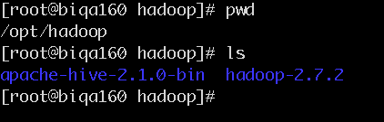
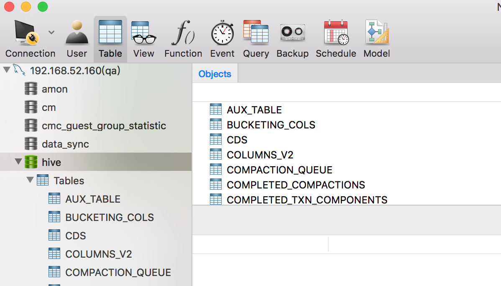
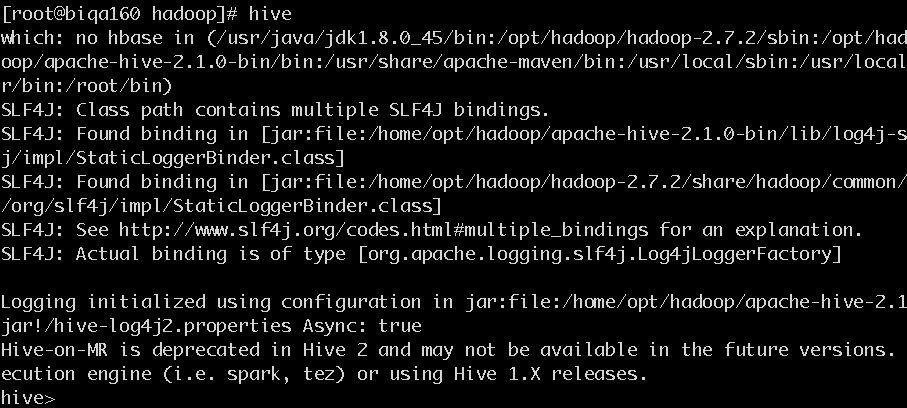

## hive集群安装(以192.168.52.160为例)
## 1. 安装
* 创建安装目录 

    ```
    mkdir -p /opt/hadoop/  
    cd /opt/hadoop/
    ```

* 下载压缩包  
[hive下载链接](http://archive.apache.org/dist/hive/)

* 解压缩文件

    `tar -zxvf apache-hive-2.1.0-bin.tar.gz`

    

## 2. 配置


#### 1. 添加环境变量

```
vi /etc/profile
//修改如下

export HIVE_HOME=/opt/hadoop/apache-hive-2.1.0-bin
export PATH=$JAVA_HOME/bin:$HADOOP_HOME/sbin:$HADOOP_HOME/bin:$HIVE_HOME/bin:$M2_HOME/bin:$PATH

<!-- 添加后执行： -->
source /etc/profile
```

#### 2. 修改配置文件

```
cd /opt/hadoop/apache-hive-2.1.0-bin/conf

<!-- 重命名文件 -->
cp hive-env.sh.template hive-env.sh
cp hive-default.xml.template hive-site.xml
```

*  修改文件hive-env.sh 

因为 Hive 使用了 Hadoop, 需要在 hive-env.sh 文件中指定 Hadoop 安装路径：

```
export JAVA_HOME=/usr/java/jdk1.8.0_45    ##Java路径
export HADOOP_HOME=/opt/hadoop/hadoop-2.7.2   ##Hadoop安装路径
export HIVE_HOME=/opt/hadoop/apache-hive-2.1.0-bin    ##Hive安装路径
export HIVE_CONF_DIR=/opt/hadoop/apache-hive-2.1.0-bin/conf   ##Hive配置文件路径
```


>安装MSql  
查看有没有安装过mysql 
rpm -qa | grep mysql*
删除已经安装过的mysql
#rpm -e --nodeps mysql-libs-5.1.61-4.el6.i686
安装服务端
#rpm -ivh MySQL-server-5.5.31-1.el6.i686.rpm
执行上面的命令后可能需要下载依赖的其libaio包，只需要yum install libaio 即可，或http://mirror.centos.org/centos/6/os/x86_64/Packages/libaio-0.3.107-10.el6.x86_64.rpm
下载然后，安装此包即可，然后执行下面命令安装mysql
安装客户端：
#rpm -ivh MySQL-client-5.5.31-1.el6.i686.rpm
启动mysql
#service mysql start --有些mysql需要写成service mysqld start。
查看mysql状态
#service mysql status
设置密码
#mysqladmin -u root password admin
登录mysql
#mysql -uroot -padmin
mysql> use mysql;
授权
mysql> grant all privileges on *.* to 'root'@'%' identified by 'admin' with grant option;
mysql> flush privileges;
mysql> quit;


*  配置MySQL的metastore

1.上传mysql-connector-java-5.1.18.jar到$HIVE_HOME/lib  
2.登录MYSQL，创建数据库hive
```
[root@biqa160 hadoop]# mysql -uroot -pxiaoaojianghu
mysql>create database hive;
mysql>GRANT all ON hive.* TO root@'%' IDENTIFIED BY 'xiaoaojianghu';
mysql>flush privileges;
mysql>set global binlog_format='MIXED';
```
3.把mysql的数据库字符类型改为latin1


*  修改文件hive-site.xml

```
<property>
    <name>javax.jdo.option.ConnectionURL</name>
    <value>jdbc:mysql://biqa160:3306/hive?createDatabaseIfNotExist=true</value>
</property>
<property>
    <name>javax.jdo.option.ConnectionDriverName</name>
    <value>com.mysql.jdbc.Driver</value>
</property>
<property>
    <name>javax.jdo.option.ConnectionUserName</name>
    <value>root</value>
</property>
<property>
    <name>javax.jdo.option.ConnectionPassword</name>
    <value>xiaoaojianghu</value>
</property>

<property>
    <name>hive.metastore.warehouse.dir</name>
    <value>/user/hive/warehouse</value>
  </property>
<property>
    <name>hive.exec.scratchdir</name>
    <value>/tmp/hive</value>
  </property>

<property>
    <name>hive.server2.logging.operation.log.location</name>
    <value>/tmp/hive/operation_logs</value>
    <description>Top level directory where operation logs are stored if logging functionality is enabled</description>
  </property>
<property>
    <name>hive.exec.local.scratchdir</name>
    <value>/tmp/hive</value>
    <description>Local scratch space for Hive jobs</description>
  </property>
<property>
    <name>hive.downloaded.resources.dir</name>
    <value>/tmp/hive/resources</value>
    <description>Temporary local directory for added resources in the remote file system.</description>
  </property>

<!-- 添加事务配置 -->
  <property>

    <name>hive.support.concurrency</name>

    <value>true</value>

</property>

<property>

    <name>hive.exec.dynamic.partition.mode</name>

    <value>nonstrict</value>

</property>

<property>

    <name>hive.txn.manager</name>

    <value>org.apache.hadoop.hive.ql.lockmgr.DbTxnManager</value>

</property>

<property>

    <name>hive.compactor.initiator.on</name>

    <value>true</value>

</property>

<property>

    <name>hive.compactor.worker.threads</name>

    <value>1</value>

</property>

```

复制文件到其他服务端：
```
scp -r /opt/hadoop/apache-hive-2.1.0-bin/ biqa161:/opt/hadoop/
scp -r /opt/hadoop/apache-hive-2.1.0-bin/ biqa162:/opt/hadoop/
```

## 3. 运行hive

*命令行运行hive命令时必须保证以下两点： *  
1.HDFS 已经启动。可以使用 start-dfs.sh 脚本来启动 HDFS。  
2.MySQL Java 连接器添加到 $HIVE_HOME/lib 目录下。安装时使用的是 mysql-connector-java-5.1.18.jar。


从 Hive 2.1 版本开始, 我们需要先运行 schematool 命令来执行初始化操作。

schematool -dbType mysql -initSchema

终端输出：
```
[root@biqa160 hadoop]# schematool -dbType mysql -initSchema
which: no hbase in (/usr/java/jdk1.8.0_45/bin:/opt/hadoop/hadoop-2.7.2/sbin:/opt/hadoop/hadoop-2.7.2/bin:/opt/hadoop/apache-hive-2.1.0-bin/bin:/usr/share/apache-maven/bin:/usr/local/sbin:/usr/local/bin:/sbin:/bin:/usr/sbin:/usr/bin:/root/bin)
SLF4J: Class path contains multiple SLF4J bindings.
SLF4J: Found binding in [jar:file:/home/opt/hadoop/apache-hive-2.1.0-bin/lib/log4j-slf4j-impl-2.4.1.jar!/org/slf4j/impl/StaticLoggerBinder.class]
SLF4J: Found binding in [jar:file:/home/opt/hadoop/hadoop-2.7.2/share/hadoop/common/lib/slf4j-log4j12-1.7.10.jar!/org/slf4j/impl/StaticLoggerBinder.class]
SLF4J: See http://www.slf4j.org/codes.html#multiple_bindings for an explanation.
SLF4J: Actual binding is of type [org.apache.logging.slf4j.Log4jLoggerFactory]
Metastore connection URL:        jdbc:mysql://biqa160:3306/hive?createDatabaseIfNotExist=true
Metastore Connection Driver :    com.mysql.jdbc.Driver
Metastore connection User:       root
Starting metastore schema initialization to 2.1.0
Initialization script hive-schema-2.1.0.mysql.sql
Initialization script completed
```

打开mysql客户端查看hive元数据库是否创建成功：



要使用 Hive CLI（Hive command line interface）, 可以在终端输入以下命令：

`hive`
启动信息如下:


使用 show tables 来显示所有的表:
```
hive> show tables;
OK
test
Time taken: 1.129 seconds, Fetched: 1 row(s)
hive> 
```

后台启动metastore,关闭shell连接依然存在:
nohup bin/hive --service metastore 2>&1 >> /var/log.log &

hiveserver2,关闭shell连接依然存在:
nohup bin/hive --service hiveserver2 2>&1 >> /var/log.log &


## 4. 问题总结

* SSL问题

启动 hive 时，提示以下信息：
```
Sat May 21 10:25:12 CST 2016 WARN: Establishing SSL connection without server's identity verification is not recommended. According to MySQL 5.5.45+, 5.6.26+ and 5.7.6+ requirements SSL
connection must be established by default if explicit option isn't set. For compliance with existing applications not using SSL the verifyServerCertificate property is set to 'false'. You need either to explicitly disable SSL by setting useSSL=false, or set useSSL=true and provide truststore for server certificate verification.
```
解决方法：在 hive-site.xml 配置文件中 javax.jdo.option.ConnectionURL 配置项的值上加上 useSSL=false。即最后的配置如下：
```
<property>
    <name>javax.jdo.option.ConnectionURL</name>
    <value>jdbc:mysql://localhost:3306/hive?createDatabaseIfNotExist=true&amp;useUnicode=true&amp;characterEncoding=UTF-8&amp;useSSL=false</value>
    <description>JDBC connect string for a JDBC metastore</description>
  </property>
```

* initSchema问题

启动 hive 时，提示以下信息：
```
Exception in thread "main" java.lang.RuntimeException: Hive metastore database is not initialized. Please use schematool (e.g. ./schematool -initSchema -dbType ...) to create the schema. If needed, don't forget to include the option to auto-create the underlying database in your JDBC connection string (e.g. ?createDatabaseIfNotExist=true for mysql)
```

解决方法：执行 schematool -initSchema -dbType mysql。即安装 Hive 后，在首次运行 hive 之前要执行以上命令。

* 相对路径问题

启动Hive时报以下错误:
```
Exception in thread "main"java.lang.RuntimeException: java.lang.IllegalArgumentException:java.net.URISyntaxException: Relative path in absolute URI:${system:java.io.tmpdir%7D/$%7Bsystem:user.name%7D
        atorg.apache.hadoop.hive.ql.session.SessionState.start(SessionState.java:444)
        atorg.apache.hadoop.hive.cli.CliDriver.run(CliDriver.java:672)
        atorg.apache.hadoop.hive.cli.CliDriver.main(CliDriver.java:616)
        atsun.reflect.NativeMethodAccessorImpl.invoke0(Native Method)
        atsun.reflect.NativeMethodAccessorImpl.invoke(NativeMethodAccessorImpl.java:57)
        atsun.reflect.DelegatingMethodAccessorImpl.invoke(DelegatingMethodAccessorImpl.java:43)
        atjava.lang.reflect.Method.invoke(Method.java:606)
        atorg.apache.hadoop.util.RunJar.main(RunJar.java:160)
Caused by: java.lang.IllegalArgumentException:java.net.URISyntaxException: Relative path in absolute URI:${system:java.io.tmpdir%7D/$%7Bsystem:user.name%7D
        atorg.apache.hadoop.fs.Path.initialize(Path.java:148)
        atorg.apache.hadoop.fs.Path.<init>(Path.java:126)
        atorg.apache.hadoop.hive.ql.session.SessionState.createSessionDirs(SessionState.java:487)
        atorg.apache.hadoop.hive.ql.session.SessionState.start(SessionState.java:430)
        ... 7more
```
解决方案：将 hive-site.xml 中的 ${system:java.io.tmpdir} 和 ${system:user.name} 分别替换成 /tmp 和 ${user.name}

* mysql-connector-java版本问题

启动Hive时报以下错误：
```
Exception in thread "main" java.lang.RuntimeException: org.apache.hadoop.hive.ql.metadata.HiveException: java.lang.RuntimeException: Unable to instantiate org.apache.hadoop.hive.ql.metadata.SessionHiveMetaStoreClient
    at org.apache.hadoop.hive.ql.session.SessionState.start(SessionState.java:578)
    at org.apache.hadoop.hive.ql.session.SessionState.beginStart(SessionState.java:518)
    at org.apache.hadoop.hive.cli.CliDriver.run(CliDriver.java:705)
    at org.apache.hadoop.hive.cli.CliDriver.main(CliDriver.java:641)
    at sun.reflect.NativeMethodAccessorImpl.invoke0(Native Method)
    at sun.reflect.NativeMethodAccessorImpl.invoke(NativeMethodAccessorImpl.java:62)
    at sun.reflect.DelegatingMethodAccessorImpl.invoke(DelegatingMethodAccessorImpl.java:43)
    at java.lang.reflect.Method.invoke(Method.java:498)
    at org.apache.hadoop.util.RunJar.run(RunJar.java:221)
    at org.apache.hadoop.util.RunJar.main(RunJar.java:136)
Caused by: org.apache.hadoop.hive.ql.metadata.HiveException: java.lang.RuntimeException: Unable to instantiate org.apache.hadoop.hive.ql.metadata.SessionHiveMetaStoreClient
    at org.apache.hadoop.hive.ql.metadata.Hive.registerAllFunctionsOnce(Hive.java:226)
    at org.apache.hadoop.hive.ql.metadata.Hive.<init>(Hive.java:366)
    at org.apache.hadoop.hive.ql.metadata.Hive.create(Hive.java:310)
    at org.apache.hadoop.hive.ql.metadata.Hive.getInternal(Hive.java:290)
    at org.apache.hadoop.hive.ql.metadata.Hive.get(Hive.java:266)
    at org.apache.hadoop.hive.ql.session.SessionState.start(SessionState.java:545)
    ... 9 more
Caused by: java.lang.RuntimeException: Unable to instantiate org.apache.hadoop.hive.ql.metadata.SessionHiveMetaStoreClient
    at org.apache.hadoop.hive.metastore.MetaStoreUtils.newInstance(MetaStoreUtils.java:1627)
    at org.apache.hadoop.hive.metastore.RetryingMetaStoreClient.<init>(RetryingMetaStoreClient.java:80)
    at org.apache.hadoop.hive.metastore.RetryingMetaStoreClient.getProxy(RetryingMetaStoreClient.java:130)
    at org.apache.hadoop.hive.metastore.RetryingMetaStoreClient.getProxy(RetryingMetaStoreClient.java:101)
    at org.apache.hadoop.hive.ql.metadata.Hive.createMetaStoreClient(Hive.java:3317)
    at org.apache.hadoop.hive.ql.metadata.Hive.getMSC(Hive.java:3356)
    at org.apache.hadoop.hive.ql.metadata.Hive.getMSC(Hive.java:3336)
    at org.apache.hadoop.hive.ql.metadata.Hive.getAllFunctions(Hive.java:3590)
    at org.apache.hadoop.hive.ql.metadata.Hive.reloadFunctions(Hive.java:236)
    at org.apache.hadoop.hive.ql.metadata.Hive.registerAllFunctionsOnce(Hive.java:221)
    ... 14 more
Caused by: java.lang.reflect.InvocationTargetException
    at sun.reflect.NativeConstructorAccessorImpl.newInstance0(Native Method)
    at sun.reflect.NativeConstructorAccessorImpl.newInstance(NativeConstructorAccessorImpl.java:62)
    at sun.reflect.DelegatingConstructorAccessorImpl.newInstance(DelegatingConstructorAccessorImpl.java:45)
    at java.lang.reflect.Constructor.newInstance(Constructor.java:423)
    at org.apache.hadoop.hive.metastore.MetaStoreUtils.newInstance(MetaStoreUtils.java:1625)
    ... 23 more
Caused by: javax.jdo.JDODataStoreException: Exception thrown obtaining schema column information from datastore
NestedThrowables:
java.sql.SQLException: Column name pattern can not be NULL or empty.
    at org.datanucleus.api.jdo.NucleusJDOHelper.getJDOExceptionForNucleusException(NucleusJDOHelper.java:543)
    at org.datanucleus.api.jdo.JDOPersistenceManager.jdoMakePersistent(JDOPersistenceManager.java:720)
    at org.datanucleus.api.jdo.JDOPersistenceManager.makePersistent(JDOPersistenceManager.java:740)
    at org.apache.hadoop.hive.metastore.ObjectStore.setMetaStoreSchemaVersion(ObjectStore.java:7763)
    at org.apache.hadoop.hive.metastore.ObjectStore.checkSchema(ObjectStore.java:7657)
    at org.apache.hadoop.hive.metastore.ObjectStore.verifySchema(ObjectStore.java:7632)
    at sun.reflect.NativeMethodAccessorImpl.invoke0(Native Method)
    at sun.reflect.NativeMethodAccessorImpl.invoke(NativeMethodAccessorImpl.java:62)
    at sun.reflect.DelegatingMethodAccessorImpl.invoke(DelegatingMethodAccessorImpl.java:43)
    at java.lang.reflect.Method.invoke(Method.java:498)
    at org.apache.hadoop.hive.metastore.RawStoreProxy.invoke(RawStoreProxy.java:101)
    at com.sun.proxy.$Proxy21.verifySchema(Unknown Source)
    at org.apache.hadoop.hive.metastore.HiveMetaStore$HMSHandler.getMS(HiveMetaStore.java:547)
    at org.apache.hadoop.hive.metastore.HiveMetaStore$HMSHandler.createDefaultDB(HiveMetaStore.java:612)
    at org.apache.hadoop.hive.metastore.HiveMetaStore$HMSHandler.init(HiveMetaStore.java:398)
    at org.apache.hadoop.hive.metastore.RetryingHMSHandler.<init>(RetryingHMSHandler.java:78)
    at org.apache.hadoop.hive.metastore.RetryingHMSHandler.getProxy(RetryingHMSHandler.java:84)
    at org.apache.hadoop.hive.metastore.HiveMetaStore.newRetryingHMSHandler(HiveMetaStore.java:6396)
    at org.apache.hadoop.hive.metastore.HiveMetaStoreClient.<init>(HiveMetaStoreClient.java:236)
    at org.apache.hadoop.hive.ql.metadata.SessionHiveMetaStoreClient.<init>(SessionHiveMetaStoreClient.java:70)
    ... 28 more
```
解决方案：将 $HIVE_HOME/lib 下 的 mysql-connector-java-6.0.3.jar 替换成 mysql-connector-java-5.1.18.jar。   
原因分析：mysql-connector-java 6.x 版本 和 5.1.x 版本不兼容 , nullNamePatternMatchesAll 连接属性的默认值在 mysql-connector-java 5.1 和 6.0 之间发生了改变. 在 5.1 版本中默认值是 true, 而 6.0 版本中默认值是 false。

## hive客户端安装

* [参考地址](http://www.aboutyun.com/thread-10937-1-1.html)

* 修改hive-site.xml配置文件如下：

```
<?xml version="1.0" encoding="UTF-8" standalone="no"?>
<?xml-stylesheet type="text/xsl" href="configuration.xsl"?><!--
   Licensed to the Apache Software Foundation (ASF) under one or more
   contributor license agreements.  See the NOTICE file distributed with
   this work for additional information regarding copyright ownership.
   The ASF licenses this file to You under the Apache License, Version 2.0
   (the "License"); you may not use this file except in compliance with
   the License.  You may obtain a copy of the License at

       http://www.apache.org/licenses/LICENSE-2.0

   Unless required by applicable law or agreed to in writing, software
   distributed under the License is distributed on an "AS IS" BASIS,
   WITHOUT WARRANTIES OR CONDITIONS OF ANY KIND, either express or implied.
   See the License for the specific language governing permissions and
   limitations under the License.
-->
<configuration>
  <!-- WARNING!!! This file is auto generated for documentation purposes ONLY! -->
  <!-- WARNING!!! Any changes you make to this file will be ignored by Hive.   -->
  <!-- WARNING!!! You must make your changes in hive-site.xml instead.         -->
  <!-- Hive Execution Parameters -->
  <property>
    <name>hive.exec.scratchdir</name>
    <value>/tmp/hive</value>
    <description>HDFS root scratch dir for Hive jobs which gets created with write all (733) permission. For each connecting user, an HDFS scratch dir: ${hive.exec.scratchdir}/&lt;username&gt; is created, with ${hive.scratch.dir.permission}.</description>
  </property>
  <property>
    <name>hive.querylog.location</name>
    <value>${system:java.io.tmpdir}/${system:user.name}</value>
    <description>Location of Hive run time structured log file</description>
  </property>
  <property>
    <name>hive.metastore.warehouse.dir</name>
    <value>/user/hive/warehouse</value>
  </property>
  <property>
    <name>hive.metastore.local</name>
    <value>false</value>
  </property>
  <property>
    <name>hive.metastore.uris</name>
    <value>thrift://hadoop1.jwl.com:9083,hadoop2.jwl.com:9083,hadoop3.jwl.com:9083</value>
  </property>
</configuration>
```

## 1. Hive 字段和表注释中文乱码

* [参考地址](https://my.oschina.net/jackieyeah/blog/742088)

* 修改mysql中hive原数据库的编码格式如下：

```
alter database hive default character set latin1;
use hive; 
alter table COLUMNS_V2 modify column COMMENT varchar(256) character set utf8;
alter table TABLE_PARAMS modify column PARAM_VALUE varchar(4000) character set utf8;
alter table PARTITION_PARAMS  modify column PARAM_VALUE varchar(4000) character set utf8;
alter table PARTITION_KEYS  modify column PKEY_COMMENT varchar(4000) character set utf8;
alter table  INDEX_PARAMS  modify column PARAM_VALUE  varchar(4000) character set utf8;
alter table DBS modify column `DESC` varchar(4000) character set utf8;
```

## 2. Hive 通过flume收集到hive，首先需要hive支持事物，然后hive表必须为orc格式，并且表需要支持分桶

* [参考地址](http://blog.csdn.net/maixia24/article/details/73250155)

* hive开启事务配置如下（需要修改hive-site.xml文件）：

```
set hive.support.concurrency=true; 
set hive.enforce.bucketing=true; 
set hive.exec.dynamic.partition.mode=nonstrict; 
set hive.txn.manager=org.apache.hadoop.hive.ql.lockmgr.DbTxnManager;
```

* hive建表语句如下：

```
use mx_ods;
drop table if exists order_detail_log;
create table if not exists order_detail_log
(
main_order_id string comment '主订单id',
ticket_order_id string comment '订单id',
main_part_code string comment '主体',
channel_code string comment '渠道编码',
cinema_id string comment '影院id',
current_status string comment '
100  "开始创建"
101, "创建成功"
20, "创建失败"
102, "开始出票"
103, "出票成功"
80, "出票失败"
104, "开始取消"
105, "已取消"
50, "取消失败"
   --取票状态
106, "开始取票"
107, "已取票"
108, "部分取票"
   --退票状态
109, "开始退单"
110, "退单成功"
3, "退单失败',
last_status string comment '
100  "开始创建"
101, "创建成功"
20, "创建失败"
102, "开始出票"
103, "出票成功"
80, "出票失败"
104, "开始取消"
105, "已取消"
50, "取消失败"
   --取票状态
106, "开始取票"
107, "已取票"
108, "部分取票"
  退票状态
109, "开始退单"
110, "退单成功"
3, "退单失败',
fail_type int comment '失败类型',
show_time string comment '放映时间',
create_time string comment '创建时间',
log_time string comment '日志时间'
)
PARTITIONED BY (dt string)
clustered by (channel_code) into 10 buckets
ROW FORMAT DELIMITED FIELDS TERMINATED BY '\u0001'
stored as orc
location '/MX/mx_ods/order_detail_log'
TBLPROPERTIES('transactional'='true','orc.compress'='SNAPPY');
```

### 3. Hive 计算式报内存溢出：

* `FATAL [main] org.apache.hadoop.mapred.YarnChild: Error running child : java.lang.OutOfMemoryError GC overhead limit exceeded`
* `可能是由于orc格式默认设置block siz为256m的原因，应该设置为统一的64m`

```
在hive脚本中设置（只对当前会话有效）：
set mapreduce.map.memory.mb=8192;
set mapreduce.map.java.opts=-Xmx7000m -Xms7000m;

或者

设置mapred-site.xml中添加两个属性：
mapreduce.map.memory.mb=8192;
mapreduce.map.java.opts=-Xmx7000m -Xms7000m;
```

### 4. orc格式文件默认256m的问题：

* `现象，通过flume收集到hive中orc的block size是256m，这个需要设置hive-site.xml中的配置项`

* [参考地址](http://blog.csdn.net/dabokele/article/details/51542327)

```

参数名	默认值	说明
hive.exec.orc.default.stripe.size	256*1024*1024	stripe的默认大小
hive.exec.orc.default.block.size	256*1024*1024	orc文件在文件系统中的默认block大小，从hive-0.14开始
hive.exec.orc.dictionary.key.size.threshold	0.8	String类型字段使用字典编码的阈值
hive.exec.orc.default.row.index.stride	10000	stripe中的分组大小
hive.exec.orc.default.compress	ZLIB	ORC文件的默认压缩方式
hive.exec.orc.skip.corrupt.data	false	遇到错误数据的处理方式，false直接抛出异常，true则跳过该记录

更改hive-site.xml配置到64M
  <property>
    <name>hive.exec.orc.default.stripe.size</name>
    <value>67108864</value>
    <description>Define the default ORC stripe size, in bytes.</description>
  </property>
  <property>
    <name>hive.exec.orc.default.block.size</name>
    <value>67108864</value>
    <description>Define the default file system block size for ORC files.</description>
  </property>
```

### 5. orc格式文件做inner join报错问题：

* `现象，hive中orc格式的表做inner join时报错`

* [参考地址](https://yq.aliyun.com/articles/64306)

```
方案一：
搜索结果建议的解决方案
set hive.auto.convert.join = false; 关闭mapjion
调小hive.smalltable.filesize，默认是25000000（在2.0.0版本中）
hive.mapjoin.localtask.max.memory.usage 调大到0.999
set hive.ignore.mapjoin.hint=false; 关闭忽略mapjoin的hints

方案二：
增加的一种解决方案，调大MapredLocalTask JVM启动参数
解决方案还是需要考虑不影响性能。
调大MapredLocalTask 的JVM启动参数，进而可以增加maxHeapSize，同样也可以解决这个问题。如何去调大这个参数呢？通过查看MapredLocalTask代码我们可以看到

      jarCmd = hiveJar + " " + ExecDriver.class.getName();
      String hiveConfArgs = ExecDriver.generateCmdLine(conf, ctx);
      String cmdLine = hadoopExec + " jar " + jarCmd + " -localtask -plan " + planPath.toString()
          + " " + isSilent + " " + hiveConfArgs;
      ...
      Map<String, String> variables = new HashMap<String, String>(System.getenv());
      ...
      // Run ExecDriver in another JVM
      executor = Runtime.getRuntime().exec(cmdLine, env, new File(workDir));
启动新的ExecDriver，使用的是hadoop jar，系统环境参数继承了父进程的系统环境变量（里面逻辑有一些参数会覆盖）。而hadoop jar 启动java进程，内存参数会受哪些地方影响呢？如果没有设置，受hadoop自身一些脚本配置的影响；HADOOP_HEAPSIZE，如果设置了该变量，JVM参数就是-Xmx${HADOOP_HEAPSIZE}m ；如果不设置 ，就会受/usr/lib/hadoop-current/libexec/hadoop-config.sh里面配置的JAVA_HEAP_MAX=-Xmx1000m 。有没有印象？你使用hadoop jar启动的一些进程参数都是-Xmx1000m, 如果注意观察，ExecDriver这个进程也是这个参数。知道这个参数之后，可以在/usr/lib/hadoop-current/libexec/hadoop-config.sh 这里将参数调大，例如设置JAVA_HEAP_MAX=-Xmx1408m 可以解决问题。
```


