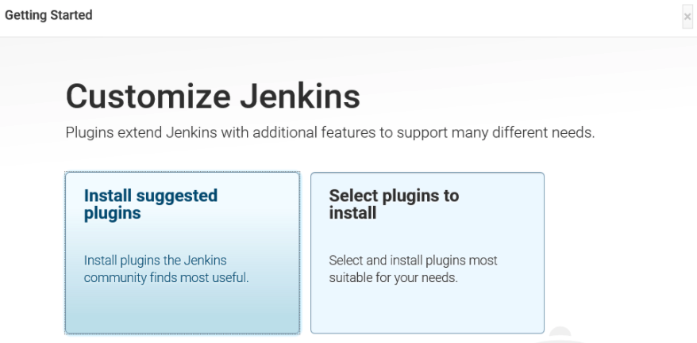
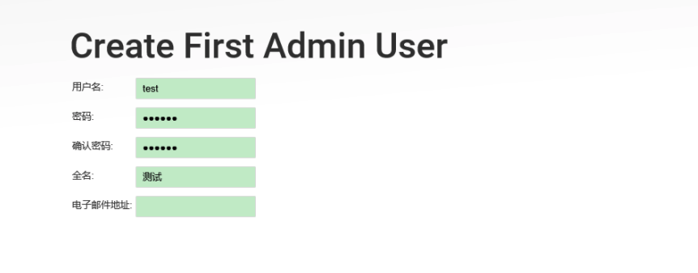
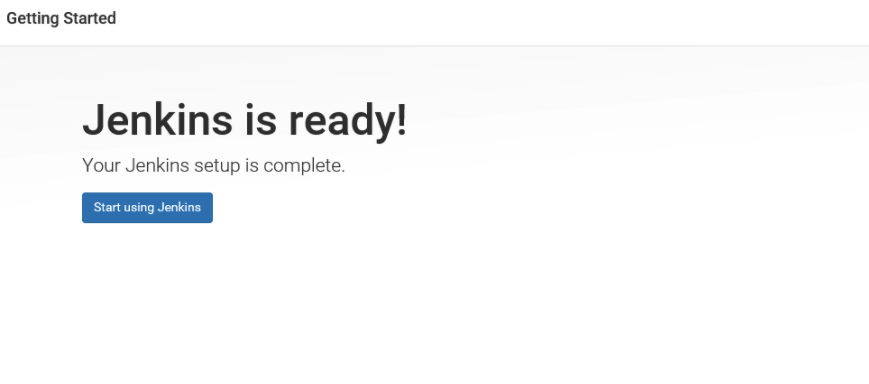
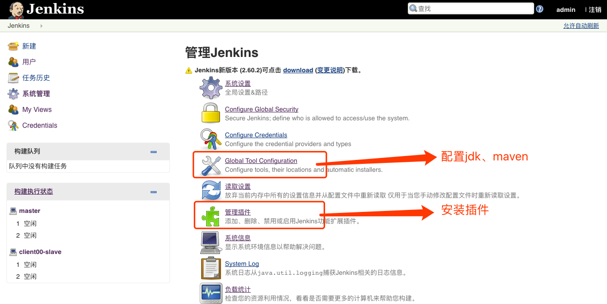
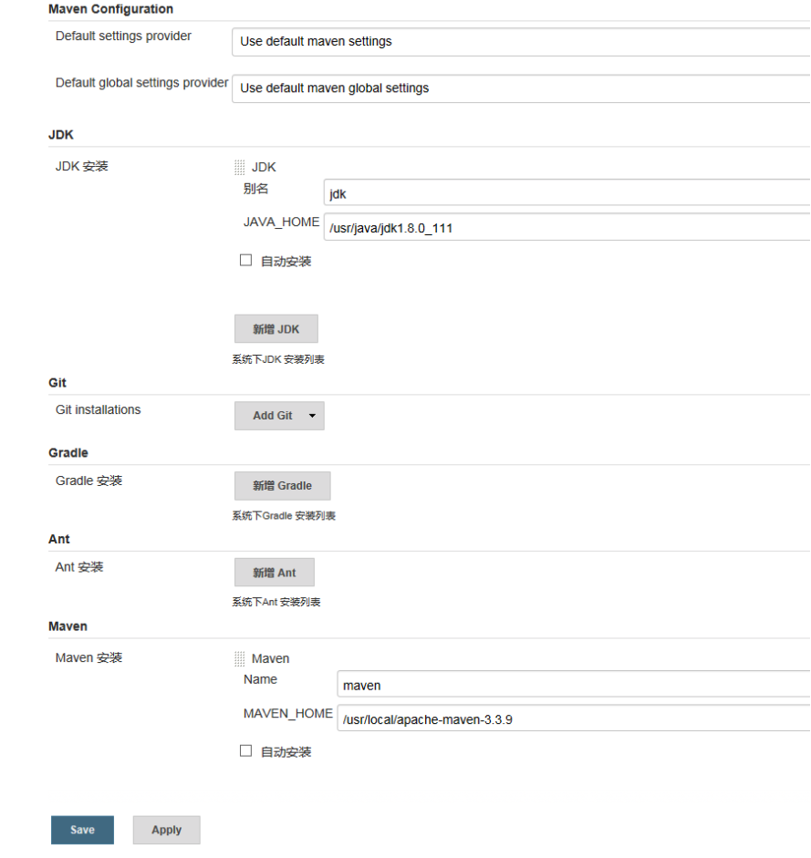
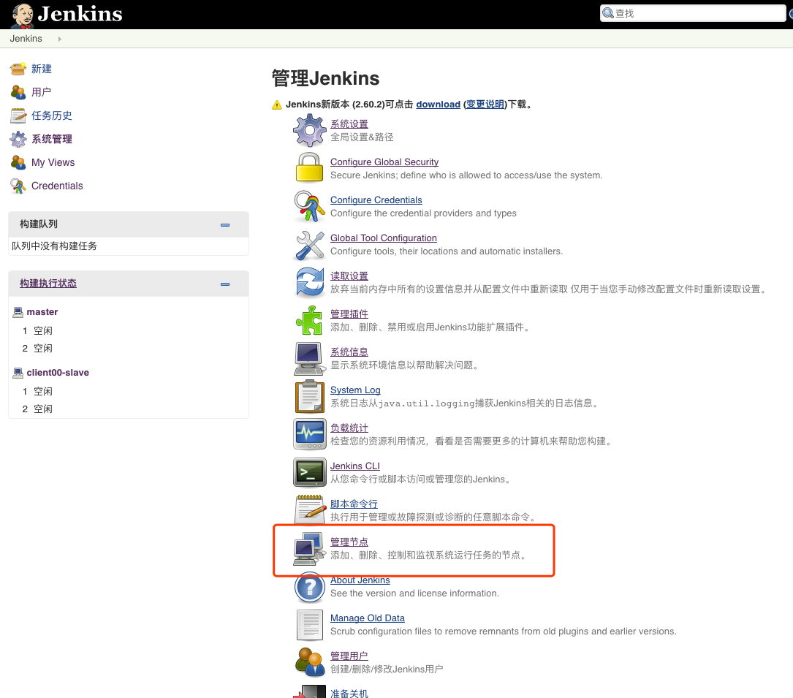
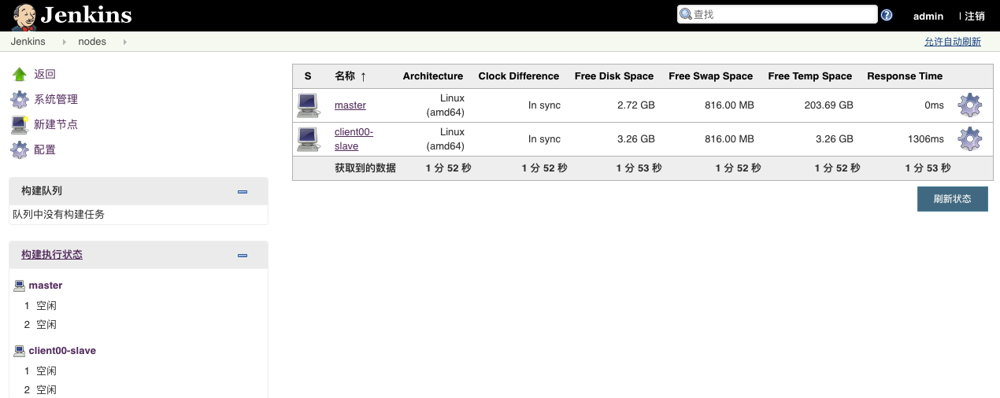
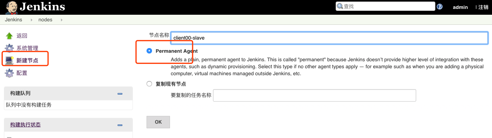
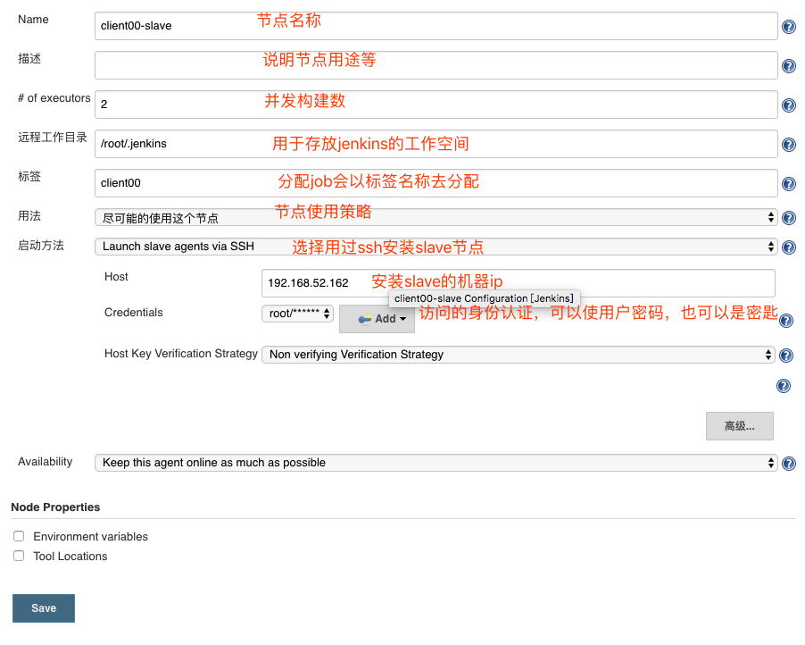
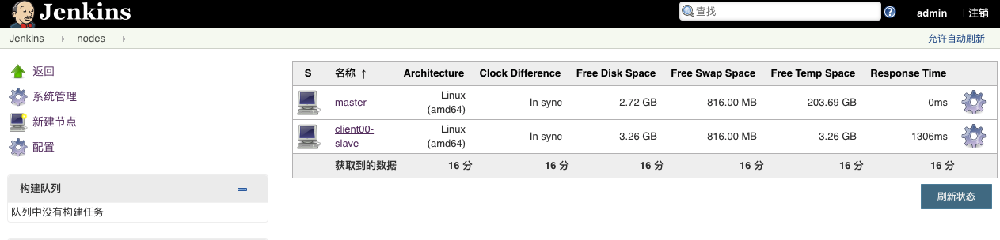

## jenkins安装(以192.168.52.161为例)
## 1. 下载安装
* 创建安装目录 

    ```
    mkdir -p /opt/hadoop/  
    cd /opt/hadoop/
    ```

* 下载压缩包  
  [jenkins下载](http://updates.jenkins-ci.org/download/war/)  
  [tomcat下载](http://tomcat.apache.org/download-70.cgi)

## 2. 配置

    - 安装tomcat略

    -  添加环境变量

    ```
    vi /etc/profile
    //修改如下
    export TOMCAT_HOME=/opt/hadoop/apache-tomcat-7.0.79
    source /etc/profile
    ```


* 将jenkins.war放到`/opt/hadoop/apache-tomcat-7.0.79/webapps`目录下

* 启动tomcat
`/opt/hadoop/apache-tomcat-7.0.79/bin/startup.sh`

* 进入浏览器`http://biqa161:8080/jenkins/`

  - 1、首次进入jenkins如要输入密码，密码位置：/root/.jenkins/secrets/initialAdminPassword
  - 2、进入选择插件安装界面，选择第一个（Install suggested plugins）也可稍后自行安装
  
  - 3、插件安装完成之后，需要创建第一个用户（建议统一使用test或者admin）
  
  - 4、创建用户之后，就可以使用jenkins了
  
  - 5、进入jenkins配置jdk、maven
  
  

  - 6、配置安装插件

    jenkins plugin

    需要安装的插件：

    •发布插件 Deploy to container Plugin 必须

    •Maven插件 Maven Integration plugin必须

    •git插件 Git plugin 这个根据实际情况

    •svn插件 Subversion Plug-in 这个jenkins自带已经安装过了，推荐安装时有显示

    非必须安装插件：

    •发送邮件插件 Email Extension Plugin 

## 3、配置jenkins集群
* 首先master需安装插件`SSH Slaves plugin`和 `SSH Credentials Plugin`

* 开始配置


* 节点列表：jenkins服务所在服务器为master节点，master负责分发任务给slave节点


* 点击左边新建节点，选中“Permanent Agent” 


* 配置节点 


* 集群安装完成，节点列表正常



