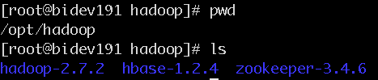
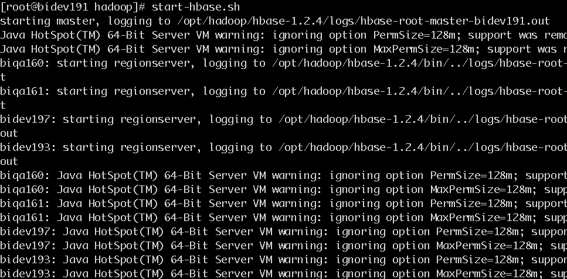
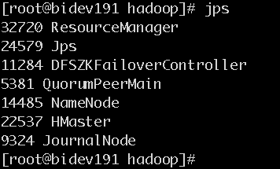
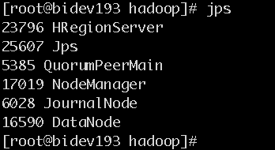
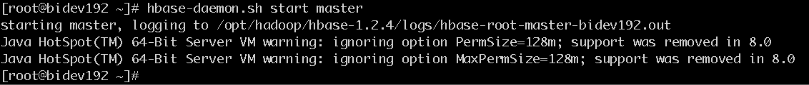
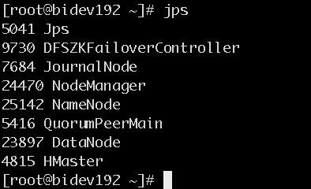
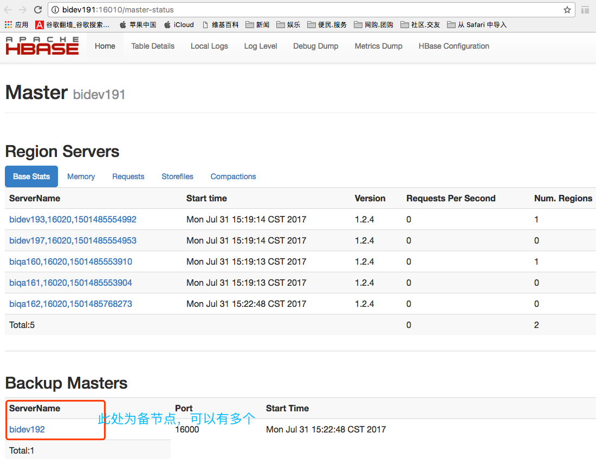
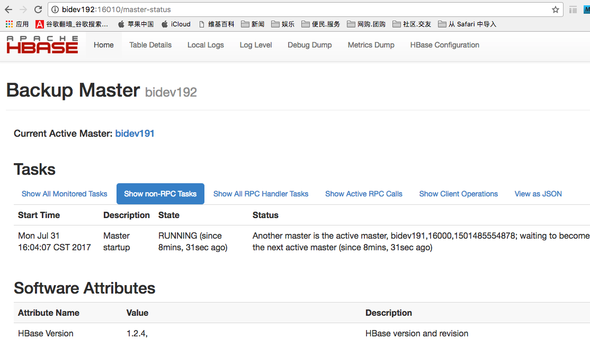

## hbase集群安装(以192.168.51.191为例)
## 1. 安装
* 创建安装目录 

    ```
    mkdir -p /opt/hadoop/  
    cd /opt/hadoop/
    ```

* 下载压缩包  
[hbase下载](http://archive.apache.org/dist/hbase/)

* 解压缩文件

    `tar -zxvf hbase-1.2.4-bin.tar.gz`


## 2. 配置

2.1 添加环境变量

```
vi /etc/profile
//修改如下

export HBASE_HOME=/opt/hadoop/hbase-1.2.4
export PATH=$JAVA_HOME/bin:$SCALA_HOME/bin:$ZK_HOME/bin:$HADOOP_HOME/sbin:$HADOOP_HOME/bin:$HBASE_HOME/bin:$M2_HOME/bin:$PATH
```


2.2 hbase相关文件配置

*  文件修改conf/hbase-env.sh  添加如下：

```
export HBASE_PID_DIR=/var/hadoop/pids   #默认在/tmp很容易丢失，造成hbase无法停止和启动
export JAVA_HOME=/usr/java/jdk1.8.0_45
export HBASE_CLASSPATH=/opt/hadoop/hadoop-2.7.2/etc/hadoop
export HBASE_MANAGES_ZK=false
```

    不管是什么模式，你都需要编辑 conf/hbase-env.sh来告知Hbase java的安装路径.在这个文件里你还可以设置Hbase的运行环境，诸如heapsize和其他 JVM有关的选项, 还有Log文件地址，等等. 设置 JAVA_HOME指向 java安装的路径.
    一个分布式运行的Hbase依赖一个zookeeper集群。所有的节点和客户端都必须能够访问zookeeper。默认的情况下Hbase会管理一个zookeep集群。这个集群会随着Hbase的启动而启动。当然，你也可以自己管理一个zookeeper集群，但需要配置Hbase。
    你需要修改conf/hbase-env.sh里面的HBASE_MANAGES_ZK 来切换。这个值默认是true的，作用是让Hbase启动的时候同时也启动zookeeper。让Hbase使用一个现有的不被Hbase托管的Zookeep集群，需要设置 conf/hbase-env.sh文件中的HBASE_MANAGES_ZK 属性为 false。

* 文件修改conf/hbase-site.xml

```
<property>  
    <name>hbase.rootdir</name>  
    <value>hdfs://bidev191:9000/hbase</value>  
</property>  
<property>  
    <name>hbase.master</name>  
    <value>6000</value>  <!--这里注意了，只需端口即可，不必再写主机名称了！-->
</property>  
<property>  
    <name>hbase.cluster.distributed</name>  
    <value>true</value>  
</property>  
<property>  
    <name>hbase.zookeeper.quorum</name>  
    <value>bidev191,bidev192,bidev193</value>  
</property>  
<property>  
    <name>hbase.zookeeper.property.clientPort</name>  
    <value>2181</value>  
</property>  
<property>    
    <name>hbase.zookeeper.property.dataDir</name>    
    <value>/opt/hadoop/hbase-1.2.4/dataZookeeper</value>    
</property>    
<property>  
    <name>zookeeper.session.timeout</name>  
    <value>60000000</value>  
</property>  
<property>  
    <name>dfs.support.append</name>  
    <value>true</value>  
</property>  
```

    要想运行完全分布式模式，加一个属性 hbase.cluster.distributed 设置为 true 然后把 hbase.rootdir 设置为HDFS的NameNode的位置。 例如，你的namenode运行在node1，端口是49002 你期望的目录是 /hbase,使用如下的配置：hdfs://node1:49002/hbase
    hbase.rootdir：这个目录是region server的共享目录，用来持久化Hbase。URL需要是'完全正确'的，还要包含文件系统的scheme。例如，要表示hdfs中的'/hbase'目录，namenode 运行在node1的49002端口。则需要设置为hdfs://node1:49002/hbase。默认情况下Hbase是写到/tmp的。不改这个配置，数据会在重启的时候丢失。默认: file:///tmp/hbase-${user.name}/hbase
    hbase.cluster.distributed ：Hbase的运行模式。false是单机模式，true是分布式模式。若为false,Hbase和Zookeeper会运行在同一个JVM里面。
    默认: false
    在hbase-site.xml配置zookeeper：
    当Hbase管理zookeeper的时候，你可以通过修改zoo.cfg来配置zookeeper，
    一个更加简单的方法是在 conf/hbase-site.xml里面修改zookeeper的配置。Zookeeer的配置是作为property写在 hbase-site.xml里面的。
    对于zookeepr的配置，你至少要在 hbase-site.xml中列出zookeepr的ensemble servers，具体的字段是 hbase.zookeeper.quorum. 该这个字段的默认值是 localhost，这个值对于分布式应用显然是不可以的. (远程连接无法使用)。
    hbase.zookeeper.property.clientPort：ZooKeeper的zoo.conf中的配置。 客户端连接的端口。
    hbase.zookeeper.quorum：Zookeeper集群的地址列表，用逗号分割。例如："host1.mydomain.com,host2.mydomain.com,host3.mydomain.com".默认是localhost,是给伪分布式用的。要修改才能在完全分布式的情况下使用。如果在hbase-env.sh设置了HBASE_MANAGES_ZK，这些ZooKeeper节点就会和Hbase一起启动。
    默认: localhost
    运行一个zookeeper也是可以的，但是在生产环境中，你最好部署3，5，7个节点。部署的越多，可靠性就越高，当然只能部署奇数个，偶数个是不可以的。你需要给每个zookeeper 1G左右的内存，如果可能的话，最好有独立的磁盘。 (独立磁盘可以确保zookeeper是高性能的。).如果你的集群负载很重，不要把Zookeeper和RegionServer运行在同一台机器上面。就像DataNodes 和 TaskTrackers一样
    hbase.zookeeper.property.dataDir：ZooKeeper的zoo.conf中的配置。 快照的存储位置
    把ZooKeeper保存数据的目录地址改掉。默认值是 /tmp ，这里在重启的时候会被操作系统删掉，可以把它修改到 /home/hadoop/zookeeper (这个路径hadoop用户拥有操作权限)
    对于独立的Zookeeper，要指明Zookeeper的host和端口。可以在 hbase-site.xml中设置, 也可以在Hbase的CLASSPATH下面加一个zoo.cfg配置文件。 HBase 会优先加载 zoo.cfg 里面的配置，把hbase-site.xml里面的覆盖掉.

*  修改文件conf/regionservers

```
bidev193
bidev197
biqa160
biqa161
biqa162
```

将配置好的分发到其他节点：

```
scp -r /opt/hadoop/hbase-1.2.4/ bidev192:/opt/hadoop/
scp -r /opt/hadoop/hbase-1.2.4/ bidev193:/opt/hadoop/
scp -r /opt/hadoop/hbase-1.2.4/ bidev197:/opt/hadoop/
scp -r /opt/hadoop/hbase-1.2.4/ biqa160:/opt/hadoop/
scp -r /opt/hadoop/hbase-1.2.4/ biqa161:/opt/hadoop/
scp -r /opt/hadoop/hbase-1.2.4/ biqa162:/opt/hadoop/
```

至此，hbase全部配置完成。

## 3. 运行并验证

**首先要确定hadoop启动(或hdfs): start-all.sh  **

**启动hbase :  **   

<font color="red">bidev191执行命令master节点：`start-hbase.sh`</font>  

 

<font color="blue"> 验证：  </font>

master节点  
  

slave节点  
  

【master多了java进程HMaster;  
  slave多了java进程HRegionServer】


<font color="red">bidev192执行命令master节点：`start-hbase.sh`</font>

  

<font color="blue"> 验证：  </font>

  


<font color="red">bidev191和bidev192均为HMaster，其中一个为主节点一个为备节点(高可用)</font>

这个时候就可以看到HMaster启动了。

如何区分哪个是Active哪个是standby呢，可以看log

也可以通过浏览器访问bidev191:16010：

  

可以通过浏览器访问bidev192:16010：

  

**【可知，bidev191为active，bidev192为standby】**


