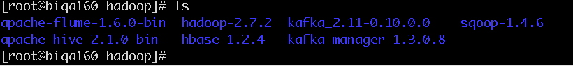

### hue安装(以192.168.52.160为例)
##### 1. 下载安装
* 创建安装目录 

    ```
    mkdir -p /opt/hadoop/  
    cd /opt/hadoop/
    ```

* 下载压缩包
[oozie-4.0.0.tar.gz](http://archive.apache.org/dist/oozie/4.0.0/)

* 解压缩文件

    `tar -zxvf oozie-4.0.0.tar.gz`


    

##### 2. 配置


*  添加环境变量

```
vi /etc/profile
//修改如下

export SQOOP_HOME=/opt/hadoop/sqoop-1.4.6

export PATH=$JAVA_HOME/bin:$HADOOP_HOME/sbin:$HADOOP_HOME/bin:$HIVE_HOME/bin:$KAFKA_HOME/bin:$FLUME_HOME/bin:$SQO
OP_HOME/bin:$M2_HOME/bin:$PATH

source /etc/profile
```


* 执行`sqoop help`

```
[root@biqa160 hadoop]# sqoop help         
Warning: /opt/hadoop/sqoop-1.4.6/../hbase does not exist! HBase imports will fail.
Please set $HBASE_HOME to the root of your HBase installation.
Warning: /opt/hadoop/sqoop-1.4.6/../hcatalog does not exist! HCatalog jobs will fail.
Please set $HCAT_HOME to the root of your HCatalog installation.
Warning: /opt/hadoop/sqoop-1.4.6/../accumulo does not exist! Accumulo imports will fail.
Please set $ACCUMULO_HOME to the root of your Accumulo installation.
Warning: /opt/hadoop/sqoop-1.4.6/../zookeeper does not exist! Accumulo imports will fail.
Please set $ZOOKEEPER_HOME to the root of your Zookeeper installation.
17/08/01 18:32:27 INFO sqoop.Sqoop: Running Sqoop version: 1.4.6
usage: sqoop COMMAND [ARGS]

<!-- #把sqoop/bin/configure-sqoop里面的两段内容注释掉就可以了。根据fail搜索  -->

Available commands:
  codegen            Generate code to interact with database records
  create-hive-table  Import a table definition into Hive
  eval               Evaluate a SQL statement and display the results
  export             Export an HDFS directory to a database table
  help               List available commands
  import             Import a table from a database to HDFS
  import-all-tables  Import tables from a database to HDFS
  import-mainframe   Import datasets from a mainframe server to HDFS
  job                Work with saved jobs
  list-databases     List available databases on a server
  list-tables        List available tables in a database
  merge              Merge results of incremental imports
  metastore          Run a standalone Sqoop metastore
  version            Display version information

See 'sqoop help COMMAND' for information on a specific command.
[root@biqa160 hadoop]# 
```


* 复制需要的类  
```
[root@biqa160 conf]# cp /opt/hadoop/hadoop-2.7.2/share/hadoop/common/hadoop-common-2.7.2.jar /opt/hadoop/sqoop-1.4.6/lib/
<!-- 此类必须 -->
[root@biqa160 conf]# cp /opt/hadoop/apache-hive-2.1.0-bin/lib/mysql-connector-java-5.1.18.jar /opt/hadoop/sqoop-1.4.6/lib/
```

*  设置配置文件`sqoop-env.sh`  

```
[root@biqa160 conf]$ cp sqoop-env-template.sh sqoop-env.sh  
[root@biqa160 conf]$ vi sqoop-env.sh  


<!-- (如果环境变量/etc/profile已设置，可以不添加如：HADOOP_HOME)
#export HADOOP_HOME=/opt/hadoop/hadoop-2.7.2 -->
export HADOOP_COMMON_HOME=/opt/hadoop/hadoop-2.7.2
export HADOOP_MAPRED_HOME=/opt/hadoop/hadoop-2.7.2
export HBASE_HOME=/opt/hadoop/hbase-1.2.4
export HIVE_HOME=/opt/hadoop/apache-hive-2.1.0-bin
export ZOOKEEPER_HOME=/opt/hadoop/zookeeper-3.4.6
export ZOOCFGDIR=/opt/hadoop/zookeeper-3.4.6/conf#zookeeper如果此台服务器未安装直接从其他节点复制一份即可，不要启动
```


* 测试

执行语句：
`sqoop import --connect jdbc:mysql://192.168.52.160:3306/tc_monitor --username root --password xiaoaojianghu --table test_table --hive-import --hive-overwrite --hive-table test_table --fields-terminated-by '\t'`

【默认导入到hdfs目录/user/root/test_table】


问题总结
启动服务后若网页显示django错误：attempt to write a readonly database或 unable to open database file，

chmod 777 hue-master/desktop/
chmod 766 hue-master/desktop/desktop.db


b.出现No package 'libffi' found的问题，如下图所示
yum install -y libffi libffi-devel


scp core-site.xml bidev192:/opt/hadoop/hadoop-2.7.2/etc/hadoop/
scp core-site.xml bidev193:/opt/hadoop/hadoop-2.7.2/etc/hadoop/
scp core-site.xml bidev197:/opt/hadoop/hadoop-2.7.2/etc/hadoop/
scp core-site.xml biqa160:/opt/hadoop/hadoop-2.7.2/etc/hadoop/
scp core-site.xml biqa161:/opt/hadoop/hadoop-2.7.2/etc/hadoop/
scp core-site.xml biqa162:/opt/hadoop/hadoop-2.7.2/etc/hadoop/

scp hdfs-site.xml bidev192:/opt/hadoop/hadoop-2.7.2/etc/hadoop/
scp hdfs-site.xml bidev193:/opt/hadoop/hadoop-2.7.2/etc/hadoop/
scp hdfs-site.xml bidev197:/opt/hadoop/hadoop-2.7.2/etc/hadoop/
scp hdfs-site.xml biqa160:/opt/hadoop/hadoop-2.7.2/etc/hadoop/
scp hdfs-site.xml biqa161:/opt/hadoop/hadoop-2.7.2/etc/hadoop/
scp hdfs-site.xml biqa162:/opt/hadoop/hadoop-2.7.2/etc/hadoop/


customer_group_exp_tmp
customer_group_result
customer_group_tmp
customer_group_tmp_365


