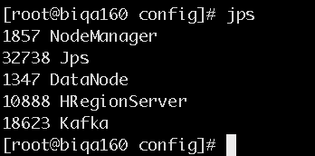
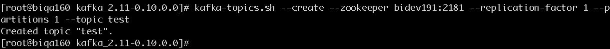
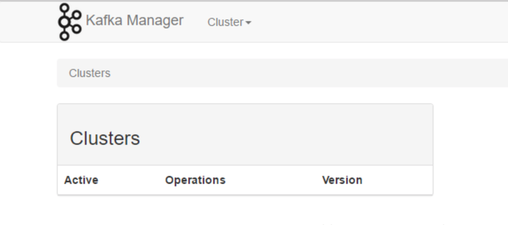

## kafka安装(以192.168.52.160为例)
## 1. 安装
* 创建安装目录 

    ```
    mkdir -p /opt/hadoop/  
    cd /opt/hadoop/
    ```

* 下载压缩包  
[kafka_2.11-0.10.0.0.tgz下载链接](http://www-eu.apache.org/dist/kafka/0.10.0.0/kafka_2.11-0.10.0.0.tgz)

* 解压缩文件

    `tar -xvzf kafka_2.11-0.10.0.0.tgz`


## 2. 配置


#### 1. 添加环境变量

```
vi /etc/profile
//修改如下

export KAFKA_HOME=/opt/hadoop/kafka_2.11-0.10.0.0

export PATH=$JAVA_HOME/bin:$HADOOP_HOME/sbin:$HADOOP_HOME/bin:$HIVE_HOME/bin:$KAFKA_HOME/bin:$M2_HOME/bin:$PATH


<!-- 添加后执行： -->
source /etc/profile
```

发送到集群中其他节点：  
这时候把我们的 /etc/profile 发送到 biqa161、biqa162 节点上:
```
scp /etc/profile biqa161:/etc/
scp /etc/profile biqa162:/etc/
```


#### 2. 修改文件server.properties


首先创建logs文件夹`mkdir /opt/hadoop/kafka_2.11-0.10.0.0/logs`

```
broker.id=1
【配置 broker 的ID】

listeners=PLAINTEXT://biqa160:9092
【打开监听端口】

log.dirs=/opt/hadoop/kafka_2.11-0.10.0.0/logs
【修改 log 的目录、在指定的位置创建好文件夹logs】

zookeeper.connect=bidev191:2181,bidev192:2181,bidev193:2181
【修改 zookeeper.connect】
```

#### 3. 将配置好的kafka文件分发到其他节点

```
scp -r /opt/hadoop/kafka_2.11-0.10.0.0/ biqa161:/opt/hadoop/
scp -r /opt/hadoop/kafka_2.11-0.10.0.0/ biqa162:/opt/hadoop/
```

分别修改biqa161中server.properties中broker.id=2、listeners=PLAINTEXT://biqa161:9092
       biqa162中server.properties中broker.id=3、listeners=PLAINTEXT://biqa162:9092

#### 4. 启动kafka

启动kafka之前需启动zookeeper，然后启动kafka，各个节点需单独启动

```
cd /opt/hadoop/kafka_2.11-0.10.0.0/config
kafka-server-start.sh -daemon server.properties
<!-- 或者 -->
kafka-server-start.sh -daemon /opt/hadoop/kafka_2.11-0.10.0.0/config/server.properties 
```

验证：

检查kafka是否启动成功，通过jps查看kafka是否启动成功

 


#### 5. 通过创建一个topic来测试是否能成功运行，随便选择一个节点运行

```
kafka-topics.sh --create --zookeeper bidev191:2181 --replication-factor 1 --partitions 1 --topic test
```

Created topic "test".

出现这个即表示创建test成功

 


在namenode上查看刚才创建的test主题

`kafka-topics.sh --list --zookeeper bidev191:2181`     

 


## kafka监控管理

* 下载kafka-manager-1.3.0.8.zip

* 下载后 使用`unzip kafka-manager-1.3.0.8.zip`解压 

* 修改conf/application.conf，把kafka-manager.zkhosts改为自己的zookeeper服务器地址 

* 启动 `nohup bin/kafka-manager -Dconfig.file=/opt/hadoop/kafka-manager-1.3.0.8/conf/application.conf -Dhttp.port=9001 &`
        (如启动报权限错误，可修改bin/kafka-manager权限后再启动)


浏览器输入： biqa160:9001可进入页面，配置集群基本属性



详细配置参看：

[kafka-manager配置](http://blog.csdn.net/isea533/article/details/73727485)


