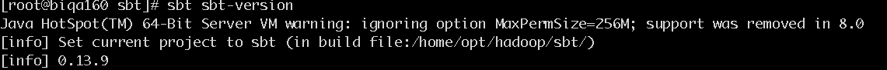

## scala安装(以192.168.52.192为例)


## 1. 准备

* 创建安装目录 

    ```
    mkdir -p /opt/hadoop/  
    cd /opt/hadoop/
    ```

* 必须安装jdk8(安装略)

* 用到命令行需安装sbt ---(或直接在intelliJ编译，但是不能在终端用命令行模式)

    - 下载sbt压缩包
    [sbt](http://www.scala-sbt.org/download.html)

    - 解压缩文件

        `tar xvf sbt-0.13.9.tar`

    解压后：
    ```
    [root@biqa160 hadoop]# pwd
    /opt/hadoop
    [root@biqa160 hadoop]# ls
    apache-flume-1.6.0-bin  hadoop-2.7.2  kafka_2.11-0.10.0.0    sbt          zookeeper-3.4.6
    apache-hive-2.1.0-bin   hbase-1.2.4   kafka-manager-1.3.0.8  sqoop-1.4.6
    [root@biqa160 hadoop]# 
    ```

    在sbt目录创建文件sbt并写入：
    ```
    [root@biqa160 hadoop]# cd sbt/
    [root@biqa160 sbt]# pwd
    /opt/hadoop/sbt
    [root@biqa160 sbt]# vi sbt 
    #!/bin/bash
    SBT_OPTS="-Xms512M -Xmx1536M -Xss1M -XX:+CMSClassUnloadingEnabled -XX:MaxPermSize=256M"
    java $SBT_OPTS -jar /opt/hadoop/sbt/bin/sbt-launch.jar "$@"
    ```

    修改刚创建的sbt文件权限`chmod a+x sbt`

    - 环境变量添加：`export PATH=$PATH:/opt/hadoop/sbt/`

    - 执行`sbt sbt-version`
    - 直到正确输出（执行一次可能会出现某些包下载失败，多次执行该命令即可，直到出现如下输出：）
    
    


## 2. 安装

#### 1. 下载  

[scala-2.11.8.tgz下载](http://www.scala-lang.org/download/all.html)


#### 2. 解压`tar -zxvf scala-2.11.8.tgz `   

```
[root@biqa160 hadoop]# ls
apache-flume-1.6.0-bin  hadoop-2.7.2  kafka_2.11-0.10.0.0    sbt             zookeeper-3.4.6 apache-hive-2.1.0-bin   hbase-1.2.4   kafka-manager-1.3.0.8  scala-2.11.8  sqoop-1.4.6
```

#### 3. 添加环境变量

```
vi /etc/profile
//修改如下

export SCALA_HOME=/opt/hadoop/scala-2.11.8

export PATH=$JAVA_HOME/bin:$HADOOP_HOME/sbin:$HADOOP_HOME/bin:$HIVE_HOME/bin:$KAFKA_HOME/bin:$FLUME_HOME/bin:$SQOOP_HOME/bin:$SBT_HOME:$SCALA_HOME/bin:$M2_HOME/bin:$PATH

<!-- 添加后执行： -->
source /etc/profile
```

#### 4. 检查scala是否安装成功

执行`scala -version`或`scala`出现如下输出即安装成功

```
[root@biqa160 ~]# scala -version
Scala code runner version 2.11.8 -- Copyright 2002-2016, LAMP/EPFL
[root@biqa160 ~]# scala
Welcome to Scala 2.11.8 (Java HotSpot(TM) 64-Bit Server VM, Java 1.8.0_45).
Type in expressions for evaluation. Or try :help.

scala> 
```


