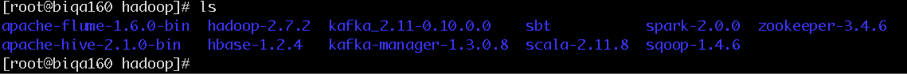
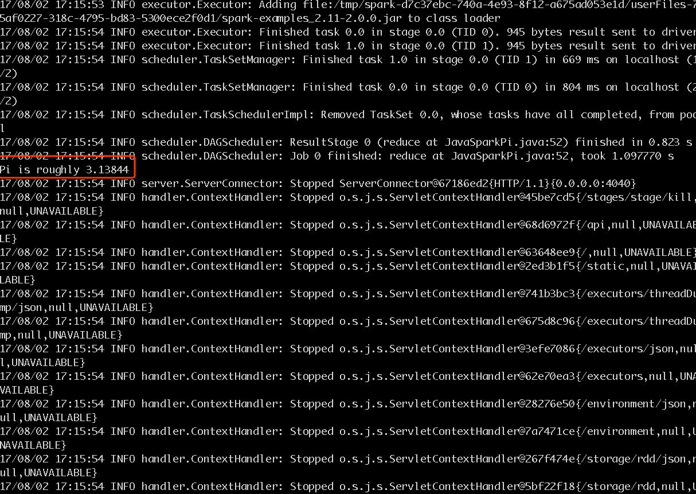
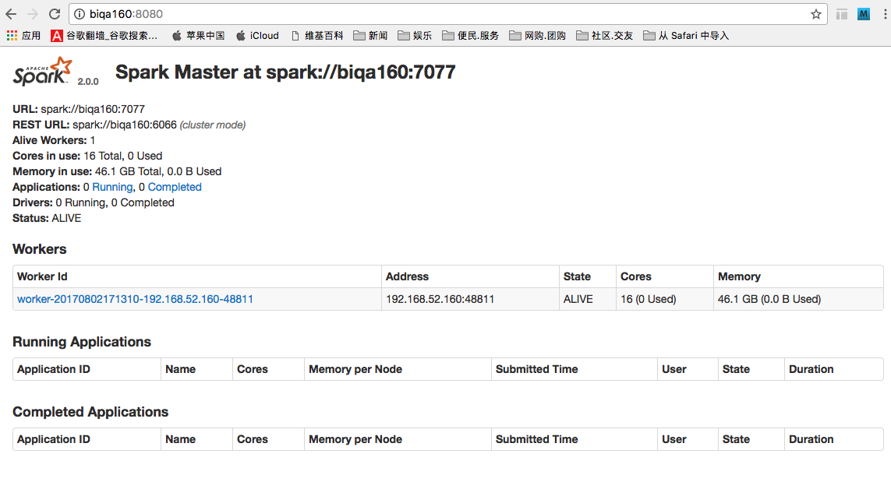
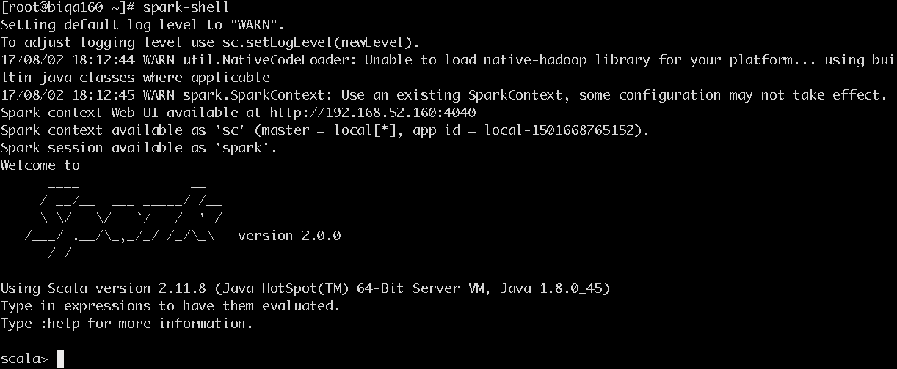

## spark安装(以192.168.52.160为例)
## 1. 安装
* 创建安装目录 

    ```
    mkdir -p /opt/hadoop/  
    cd /opt/hadoop/
    ```

* 下载压缩包
[spark-2.0.0-bin-hadoop2.7.tgz](http://spark.apache.org/downloads.html)

* 解压缩文件

    `tar -zxvf spark-2.0.0-bin-hadoop2.7.tgz -C /opt/hadoop/`

    [root@biqa160 hadoop]# cd /opt/hadoop/
    [root@biqa160 hadoop]# mv spark-2.0.0-bin-hadoop2.7/ spark-2.0.0/ 

    

## 2. 配置

* 配置环境变量

```
vi /etc/profile
//修改如下

export SPARK_HOME=/opt/hadoop/spark-2.0.0

export PATH=$JAVA_HOME/bin:$HADOOP_HOME/sbin:$HADOOP_HOME/bin:$HIVE_HOME/bin:$KAFKA_HOME/bin:$FLUME_HOME/bin:$SQOOP_HOME/bin:$SBT_HOME:$SCALA_HOME/bin:$SPARK_HOME/bin:$M2_HOME/bin:$PATH

<!-- 添加后执行： -->
source /etc/profile
```

***
# 单节点配置

* 修改配置文件`spark-env.sh`

```
[root@biqa160 conf]# pwd
/opt/hadoop/spark-2.0.0/conf
[root@biqa160 conf]# cp spark-env.sh.template spark-env.sh
[root@biqa160 conf]# vi spark-env.sh

export JAVA_HOME=/usr/java/jdk1.8.0_45
export SPARK_MASTER_HOST=biqa160
export HADOOP_HOME=/opt/hadoop/hadoop-2.7.2
export HADOOP_CONF_DIR=/opt/hadoop/hadoop-2.7.2/etc/hadoop
export SCALA_HOME=/opt/hadoop/scala-2.11.8
```

*  执行`sbin/start-all.sh`

```
[root@biqa160 sbin]# ./start-all.sh 
starting org.apache.spark.deploy.master.Master, logging to /opt/hadoop/spark-2.0.0/logs/spark-root-org.apache.spark.deploy.master.Master-1-biqa160.out
localhost: starting org.apache.spark.deploy.worker.Worker, logging to /opt/hadoop/spark-2.0.0/logs/spark-root-org.apache.spark.deploy.worker.Worker-1-biqa160.out
[root@biqa160 sbin]# jps
592 Master
1857 NodeManager
1347 DataNode
10888 HRegionServer
730 Worker
14923 ProdServerStart
844 Jps
18623 Kafka
[root@biqa160 sbin]# 
```
【查看存在Master和Worker进程，启动成功】

* 运行spark提供的示例检测：`bin/run-example JavaSparkPi 5 2`



<font color=blue>浏览器输入地址`http://biqa160:8080/`</font>  




终端输入`spark-shell`



***

# 多节点配置

>我们部署的是单节点，多节点只做简要讲述。

在上述单个节点启动成功的基础上，配置多个节点集群环境是比较简单的一件事情。

## 1.  修改文件slaves
 
    修改master上节点的slaves配置文件来配置Worker节点的位置，这里可以将biqa161、biqa162 作为Worker节点的运行机器，在conf/slaves(复制slaves.template)中添加biqa161、biqa162

```
[root@biqa160 conf]# pwd
/opt/hadoop/spark-2.0.0/conf
[root@biqa160 conf]# cp slaves.template slaves

biqa161
biqa162
```

## 2.  将Master节点的spark目录，分发到其他节点相同目录下

```
scp -r /opt/hadoop/spark-2.0.0 biqa161:/opt/hadoop/
scp -r /opt/hadoop/spark-2.0.0 biqa162:/opt/hadoop/
```

## 3. 启动spark集群`sbin/start-all.sh`

    【通过jsp命令查看其他节点Worker进程是否存在】

## 4. 浏览器输入地址`http://biqa160:8080/`

【可以查看集群状态】

## 5. 运行测试

Standalone模式的测试

在shell环境下运行Spark提供的案例程序JavaSparkPi，通过如下命令：
bin/spark-submit –class org.apache.spark.examples.JavaSparkPi –master spark://biqa160:7077 examples/jars/spark-examples_2.11-2.0.0.jar 10 4

可在浏览器查看程序运行情况


