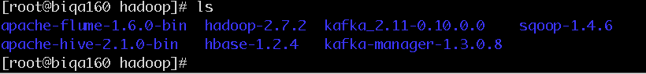

### sqoop安装(以192.168.52.160为例)
##### 1. 下载安装
* 创建安装目录 

    ```
    mkdir -p /opt/hadoop/  
    cd /opt/hadoop/
    ```

* 下载压缩包
[zookeeper-3.4.6.tar.gz](http://mirror.bit.edu.cn/apache/zookeeper/zookeeper-3.4.6/zookeeper-3.4.6.tar.gz)

* 解压缩文件

    `tar -zxvf sqoop-1.99.7-bin-hadoop200.tar.gz`

    解压后`mv sqoop-1.4.6.bin__hadoop-0.23/ sqoop-1.4.6`修改文件名

    

##### 2. 配置


*  添加环境变量

```
vi /etc/profile
//修改如下

export SQOOP_HOME=/opt/hadoop/sqoop-1.4.6

export PATH=$JAVA_HOME/bin:$HADOOP_HOME/sbin:$HADOOP_HOME/bin:$HIVE_HOME/bin:$KAFKA_HOME/bin:$FLUME_HOME/bin:$SQOOP_HOME/bin:$M2_HOME/bin:$PATH

source /etc/profile
```


* 执行`sqoop help`

```
[root@biqa160 hadoop]# sqoop help         
Warning: /opt/hadoop/sqoop-1.4.6/../hbase does not exist! HBase imports will fail.
Please set $HBASE_HOME to the root of your HBase installation.
Warning: /opt/hadoop/sqoop-1.4.6/../hcatalog does not exist! HCatalog jobs will fail.
Please set $HCAT_HOME to the root of your HCatalog installation.
Warning: /opt/hadoop/sqoop-1.4.6/../accumulo does not exist! Accumulo imports will fail.
Please set $ACCUMULO_HOME to the root of your Accumulo installation.
Warning: /opt/hadoop/sqoop-1.4.6/../zookeeper does not exist! Accumulo imports will fail.
Please set $ZOOKEEPER_HOME to the root of your Zookeeper installation.
17/08/01 18:32:27 INFO sqoop.Sqoop: Running Sqoop version: 1.4.6
usage: sqoop COMMAND [ARGS]

<!-- #把sqoop/bin/configure-sqoop里面的两段内容注释掉就可以了。根据fail搜索  -->

Available commands:
  codegen            Generate code to interact with database records
  create-hive-table  Import a table definition into Hive
  eval               Evaluate a SQL statement and display the results
  export             Export an HDFS directory to a database table
  help               List available commands
  import             Import a table from a database to HDFS
  import-all-tables  Import tables from a database to HDFS
  import-mainframe   Import datasets from a mainframe server to HDFS
  job                Work with saved jobs
  list-databases     List available databases on a server
  list-tables        List available tables in a database
  merge              Merge results of incremental imports
  metastore          Run a standalone Sqoop metastore
  version            Display version information

See 'sqoop help COMMAND' for information on a specific command.
[root@biqa160 hadoop]# 
```


* 复制需要的类  
* 注意：`hadoop-common-2.7.2.jar不能导入到sqoop的lib目录下`  
```
[root@biqa160 conf]# cp /opt/hadoop/hadoop-2.7.2/share/hadoop/common/hadoop-common-2.7.2.jar /opt/hadoop/sqoop-1.4.6/lib/
<!-- 此类必须 -->
[root@biqa160 conf]# cp /opt/hadoop/apache-hive-2.1.0-bin/lib/mysql-connector-java-5.1.18.jar /opt/hadoop/sqoop-1.4.6/lib/
```

*  设置配置文件`sqoop-env.sh`  

```
[root@biqa160 conf]$ cp sqoop-env-template.sh sqoop-env.sh  
[root@biqa160 conf]$ vi sqoop-env.sh  


<!-- (如果环境变量/etc/profile已设置，可以不添加如：HADOOP_HOME)
#export HADOOP_HOME=/opt/hadoop/hadoop-2.7.2 -->
export HADOOP_COMMON_HOME=/opt/hadoop/hadoop-2.7.2
export HADOOP_MAPRED_HOME=/opt/hadoop/hadoop-2.7.2
export HBASE_HOME=/opt/hadoop/hbase-1.2.4
export HIVE_HOME=/opt/hadoop/apache-hive-2.1.0-bin
export ZOOKEEPER_HOME=/opt/hadoop/zookeeper-3.4.6
export ZOOCFGDIR=/opt/hadoop/zookeeper-3.4.6/conf#zookeeper如果此台服务器未安装直接从其他节点复制一份即可，不要启动
```


* 测试

执行语句：
`sqoop import --connect jdbc:mysql://192.168.52.160:3306/tc_monitor --username root --password xiaoaojianghu --table test_table --hive-import --hive-overwrite --hive-table test_table --fields-terminated-by '\t'`

【默认导入到hdfs目录/user/root/test_table】


* 使用指南

[参考地址1](http://blog.csdn.net/wonder4/article/details/52529049)

```
1. sqoop-1.4.6.jar
第一步先将sqoop jar包拷贝至Hadoop的mapreduce目录下：
cp $SQOOP_HOME/sqoop-1.4.6.jar $HADOOP/share/hadoop/mapreduce/
2. JDBC jar包
第二步将Oracle和MySQL分别需要用到的jar包拷贝至$SQOOP_HOME/lib下
cp ojdbc6.jar $SQOOP_HOME/lib/
cp mysql-connector-java-5.1.38-bin.jar $SQOOP_HOME/lib/
2. 导入
1. 从RDB导入表数据至HDFS
1. Oracle
从Oracle数据库的Schema为pdbORCL中导入表PUB_DATE_D
sqoop import --connect jdbc:oracle:thin:@//myoracle:1521/pdbORCL --username DM -password 123456 --table PUB_DATE_D --warehouse-dir /user/nanyue/oracletest -m 1
此时会在/user/nanyue/下生成目录为oracletest的目录，且表中的数据均在这个目录下，字段之间以逗号（，）作为分隔符。
2. MySQL
如果不指定目录，默认文件导入到/user/nanyue下，指定目录用–warehouse-dir或–target-dir
sqoop import --connect jdbc:mysql://mysql:3306/taobao --username root --password 123456 --table we --warehouse-dir /mytargetdir -m 1
2. 从RDB导入表数据至Hive
1. Oracle
从Oracle中导入表数据至Hive中的default数据库，并直接创建该表（即原本此表结构在hive中是不存在的）
sqoop import --connect jdbc:oracle:thin:@//myoracle:1521/pdbORCL --username DM -password 123456 --table PUB_DATE_D --hive-import --hive-database default --create-hive-table -m 1
通过这种方式导入的数据在hive中生成的数据内容（HDFS文件）以hive中的默认分隔符进行字段分隔；
2. MySQL
当表在Hive不存在时，添加–create-hive-table则在指定数据库中添加同名表
sqoop import --connect jdbc:mysql://mysql:3306/taobao --username root --password 123456 --table we --hive-import --hive-database default --create-hive-table -m 1
3. 导入全部表
如果要导入某一个数据库的所有表，可以直接执行一次命令即可，如下：
sqoop import-all-tables --connect jdbc:oracle:thin:@//myoracle:1521/pdbORCL --username DM --password-file sqoop.pwd --hive-import --hive-database oracle -m 1
如果在导入所有表中的绝大多数表，则可以用参数–exclude-tables排除不需要导入的表（多表以逗号分隔）即可。
4. 空值的处理
默认情况下，如果RDB中存在空值，则导入时用字符串常量null（小写）代替所有空值。此种处理方式并不符合大多数的空值处理要求。而Sqoop提供了2个参数以供处理空值： 
其中null-string用于处理数据库中文本类型的字段，null-non-string用于处理非文本类型的字段
sqoop import --connect jdbc:oracle:thin:@//myoracle:1521/pdbORCL --username DM --password-file sqoop.pwd --table PUB_DATE_D --where "QUARTER_NAME<'Q2'" --hive-import --hive-database default --null-string '\\N' --null-non-string '\\N'
3. 增量导入
1. 导入新数据
RDB中的数据库表中的数据仅附加，不做修改（append模式），需要有一个检查字段，和此字段中导入的最后值，则利用以下3个参数进行增量导入，导入id字段中值大于2的数据记录：（这种方式不能导入已有数据的更新记录），每次导入会打印出这3个参数的值。 
导入至Hive暂时不支持append模式，所以需要使用导入至HDFS的方式进行。
--incremental append
--check-column id
--last-value 2
具体示例：
sqoop import --connect jdbc:oracle:thin:@//myoracle:1521/pdbORCL --username DM --password-file sqoop.pwd --table WE --warehouse-dir /user/hive/warehouse/ --null-string '\\N' --null-non-string '\\N' --incremental append --check-column ID --last-value 4
2. 导入更新数据
导入更新数据时使用lastmodified模式，每次导入会打印出这3个参数的值。这种模式要求标识字段必须是日期值（适合类型有date,time,datetime,timestamp）
--incremental lastmodified
--check-column last_update_date
--last-value "2016-04-14 19:11:20"
更新数据是指在数据表中发生变化的数据，指定一个标识字段，并指定一个更新值，当目的路径已存在该目录时，需要添加一个–append或–merge-key。
下列命令将导出表WE中字段LT的值>’2016-04-13 19:11:10’且<’当前系统时间’的所有数据记录，不同之处在于–append参数表示根据更新要求直接将抽取出来的数据附加至目标目录，而–merge-key参数则表示此更新操作将分成2个MR Job，Job1将表中的更新数据导入到HDFS中一个临时目录下，Job2将结合新数据和已经存在HDFS上的旧数据按照merge-key指定的字段进行合并（类似于去重），并输出到目标目录，每一行仅保留最新的值。 
此模式支持导入至Hive表，但是即便使用了merge-key参数也无法使新数据和旧数据进行合并去重 
示例1：
sqoop import --connect jdbc:oracle:thin:@//myoracle:1521/pdbORCL --username DM --password-file sqoop.pwd --table WE --warehouse-dir /user/hive/warehouse/ --null-string '\\N' --null-non-string '\\N' --incremental lastmodified --check-column LT --last-value '2016-04-13 19:11:10' --append
示例2：
sqoop import --connect jdbc:oracle:thin:@//myoracle:1521/pdbORCL --username DM --password-file sqoop.pwd --table WE --warehouse-dir /user/hive/warehouse/ --null-string '\\N' --null-non-string '\\N' --incremental lastmodified --check-column LT --last-value '2016-04-13 19:11:10' --merge-key ID
3. 导入数据表的子集（可看做增量导入）
下列实例仅导入QUARTER_NAME为Q3和Q4的数据（按天增量时，可考虑按照某个日期字段或时间字段取子集）
sqoop import --connect jdbc:oracle:thin:@//myoracle:1521/pdbORCL --username DM -password research --table PUB_DATE_D --where "QUARTER_NAME>='Q3'" --hive-import --hive-database default
4. 保存上次导入的值
无论incremental是append模式还是lastmodified模式，都需要指定标识字段和上次更新值，如果手动写命令更新导入，则需要记录每一次的导入后打印的值，如下：
16/04/12 19:25:10 INFO tool.ImportTool:  --incremental append
16/04/12 19:25:10 INFO tool.ImportTool:   --check-column ID
16/04/12 19:25:10 INFO tool.ImportTool:   --last-value 5
可以利用sqoop metastore保存导入导出的参数及其值
创建sqoop job
sqoop job --create test -- import --connect jdbc:oracle:thin:@//myoracle:1521/pdbORCL --username DM --password-file sqoop.pwd --table WE --hive-import --hive-table we1 --incremental lastmodified --check-column LT --last-value '2016-04-13 19:11:10' --merge-key ID
执行sqoop job
sqoop job --exec test
每次执行sqoop job test，sqoop metastore会保存此次job中last-value的最新值（即每次执行的系统时间），无需手动人工记住，以便于自动增量导入。
增量导入总结
Sqoop 1.4.6支持的增量导入方式只有append附加新数据记录和lastmodified新增修改数据两种，其中append不支持导入至Hive，而lastmodifed支持导入至Hive。
在自动化导入中，务必使用sqoop job的方式，在crontab中写入，并导出日志信息。
3. 密码保护（非命令行密码显示输入）
在上述的所有示例中是直接用password参数指定密码，可以通过以下两种方式进行密码保护。
-P 
这种方式是使用-P参数替代-password，但这种方式在运行命令之后必须手动输入密码。
–password-file filename 
这种方式是事先将密码写入文件filename（此文件必须在HDFS上），然后通过–password-file进行读取 
先创建文件并上传到HDFS中，并将读写权限设置为400：
echo 'research' > sqoop.pwd
hdfs dfs -put sqoop.pwd /user/nanyue/
hdfs dfs -chmod 400 /user/nanyue/sqoop.pwd
rm -rf sqoop.pwd
导入测试
sqoop import --connect jdbc:oracle:thin:@//myoracle:1521/pdbORCL --username DM --password-file sqoop.pwd --table PUB_DATE_D --where "QUARTER_NAME<'Q2'" --hive-import --hive-database default
4. 压缩
sqoop默认支持压缩，其默认的压缩格式是gzip，直接在sqoop import命令末尾添加–compress即可执行默认压缩，也可以使用–compression-codec参数指定压缩格式，例如下面示例为指定bzip2压缩格式。
sqoop import --connect jdbc:oracle:thin:@//myoracle:1521/pdbORCL --username DM --password-file sqoop.pwd --table PUB_DATE_D --where "QUARTER_NAME<'Q2'" --hive-import --hive-database default --compress --compression-codec org.apache.hadoop.io.compress.BZip2Codec
5. 关于Hive版本
上述操作在以下版本中都可以顺利执行：
Hadoop 2.7.2
Hive 1.2.1
Sqoop 1.4.6
当我将Hive替换成2.0时，会包缺包的错误，此时，从Hive中拷贝一些包到$SQOOP_HOME/lib下即可。
cp $HIVE_HOME/lib/log4j-1.2-api-2.4.1.jar $SQOOP_HOME/lib/
cp $HIVE_HOME/lib/log4j-api-2.4.1.jar $SQOOP_HOME/lib/
cp $HIVE_HOME/lib/log4j-core-2.4.1.jar $SQOOP_HOME/lib/
cp $HIVE_HOME/lib/antlr-2.7.7.jar $SQOOP_HOME/lib/
cp $HIVE_HOME/lib/antlr4-runtime-4.5.jar $SQOOP_HOME/lib/
cp $HIVE_HOME/lib/antlr-runtime-3.4.jar $SQOOP_HOME/lib/
cp $HIVE_HOME/lib/calcite-avatica-1.5.0.jar $SQOOP_HOME/lib/
cp $HIVE_HOME/lib/calcite-core-1.5.0.jar $SQOOP_HOME/lib/
cp $HIVE_HOME/lib/calcite-linq4j-1.5.0.jar $SQOOP_HOME/lib/
cp $HIVE_HOME/lib/hive-cli-2.0.0.jar $SQOOP_HOME/lib/
```

[参考地址2](http://blog.csdn.net/gdmzlhj1/article/details/50483171)

```
sqoop1.4.6安装

sqoop2不建议生产中使用，这里测试sqoop1.

--下载sqoop-1.4.6
http://mirror.bit.edu.cn/apache/sqoop/1.4.6/
[   ] sqoop-1.4.6.bin__hadoop-0.23.tar.gz        08-May-2015 16:28   16M  

[   ] sqoop-1.4.6.bin__hadoop-1.0.0.tar.gz       08-May-2015 16:28   16M  

[   ] sqoop-1.4.6.bin__hadoop-2.0.4-alpha.tar.gz 08-May-2015 16:28   16M  

[   ] sqoop-1.4.6.tar.gz                         08-May-2015 16:28  2.1M  


选择对应的hadoop版本，我的hadoop版本是hadoop-2.7.1

[hadoop@node1 ~]$ tar -zxvf sqoop-1.4.6.bin__hadoop-2.0.4-alpha.tar.gz

--设置环境变量
[hadoop@node1 bin]$ sudo vi /etc/profile
export JAVA_HOME=/home/hadoop/jdk1.7.0_67
export HADOOP_HOME=/home/hadoop/hadoop-2.7.1
export ZK_HOME=/home/hadoop/zookeeper-3.4.6
export HIVE_HOME=/home/hadoop/apache-hive-1.2.1-bin
export HBASE_HOME=/home/hadoop/hbase-1.1.2
export SQOOP_HOME=/home/hadoop/sqoop-1.4.6.bin__hadoop-2.0.4-alpha
export PATH=$PATH:${JAVA_HOME}/bin:${HADOOP_HOME}/bin:${HADOOP_HOME}/sbin:${ZK_HOME}/bin:${HIVE_HOME}/bin:${HBASE_HOME}/bin:${SQOOP_HOME}/bin


[hadoop@node1 bin]$ sqoop help
Warning: /home/hadoop/sqoop-1.4.6.bin__hadoop-2.0.4-alpha/../hcatalog does not exist! HCatalog jobs will fail.
Please set $HCAT_HOME to the root of your HCatalog installation.
Warning: /home/hadoop/sqoop-1.4.6.bin__hadoop-2.0.4-alpha/../accumulo does not exist! Accumulo imports will fail.
Please set $ACCUMULO_HOME to the root of your Accumulo installation.
Warning: /home/hadoop/sqoop-1.4.6.bin__hadoop-2.0.4-alpha/../zookeeper does not exist! Accumulo imports will fail.
Please set $ZOOKEEPER_HOME to the root of your Zookeeper installation.
15/11/24 13:44:31 INFO sqoop.Sqoop: Running Sqoop version: 1.4.6
usage: sqoop COMMAND [ARGS]

--把sqoop/bin/configure-sqoop里面的两段内容注释掉就可以了。根据fail搜索

Available commands:
  codegen            Generate code to interact with database records
  create-hive-table  Import a table definition into Hive
  eval               Evaluate a SQL statement and display the results
  export             Export an HDFS directory to a database table
  help               List available commands
  import             Import a table from a database to HDFS
  import-all-tables  Import tables from a database to HDFS
  import-mainframe   Import datasets from a mainframe server to HDFS
  job                Work with saved jobs
  list-databases     List available databases on a server
  list-tables        List available tables in a database
  merge              Merge results of incremental imports
  metastore          Run a standalone Sqoop metastore
  version            Display version information

See 'sqoop help COMMAND' for information on a specific command.


--设置配置文件
[hadoop@node1 conf]$ cp sqoop-env-template.sh sqoop-env.sh
[hadoop@node1 conf]$ vi sqoop-env.sh
[hadoop@node1 conf]$ vi sqoop-site.xml 


--复制需要的类
[hadoop@node1 ~]$ cp $HADOOP_HOME/share/hadoop/common/hadoop-common-2.7.1.jar $SQOOP_HOME/lib
[hadoop@node1 mysql-connector-java-5.1.37]$ cp mysql-connector-java-5.1.37-bin.jar $SQOOP_HOME/lib

mysql-connector-java-5.1.37-bin.jar这个包才有用


---------------------------------------------------------------    
--附配置：    
---------------------------------------------------------------   
[hadoop@node1 conf]$ vi sqoop-env.sh
export HADOOP_COMMON_HOME=/home/hadoop/hadoop-2.7.1/
export HADOOP_MAPRED_HOME=/home/hadoop/hadoop-2.7.1/
export HBASE_HOME=/home/hadoop/hbase-1.1.2
export HIVE_HOME=/home/hadoop/apache-hive-1.2.1-bin
export ZOOCFGDIR=/home/hadoop/zookeeper-3.4.6/conf

[hadoop@node1 conf]$ vi sqoop-site.xml 
sqoop list-databases --connect jdbc:mysql://node1 --username root --password 123456

  <property>
    <name>sqoop.metastore.client.autoconnect.url</name>
    <value>jdbc:hsqldb:file:/tmp/sqoop-meta/meta.db;shutdown=true</value>
    <value>jdbc:mysql://node1/hive?useUnicode=true&characterEncoding=utf-8</value>
    <description>The connect string to use when connecting to a
      job-management metastore. If unspecified, uses ~/.sqoop/.
      You can specify a different path here.
    </description>
  </property>
  <property>
    <name>sqoop.metastore.client.autoconnect.username</name>
    <value>root</value>
    <description>The username to bind to the metastore.
    </description>
  </property>
  <property>
    <name>sqoop.metastore.client.autoconnect.password</name>
    <value>123456</value>
    <description>The password to bind to the metastore.
    </description>
  </property>


---------------------------------------------------------------    
--测试：    
---------------------------------------------------------------   

[hadoop@node1 hadoop]$ sudo service mysqld start
正在启动 mysqld： [确定]

[hadoop@node1 hadoop]$ mysql -uroot -p123456
mysql>use
mysql> create table a(id int,name varchar(50));
mysql> insert into a values(1,'a1');
mysql> insert into a values(2,'a2');
mysql> commit;
mysql> select * from a;
+------+------+
| id   | name |
+------+------+
|    1 | a1   |
|    2 | a2   |
+------+------+

[hadoop@node1 lib]$ sqoop create-hive-table --connect jdbc:mysql://node1/hive --username root --password 123456 --table a --hive-table a --fields-terminated-by ',' --hive-overwrite
[hadoop@node1 conf]$ sqoop list-tables --connect jdbc:mysql://node1/hive --username root --password 123456
a
mysql导入到hive中，导出格式如上方   
[hadoop@node1 lib]$ sqoop import --connect jdbc:mysql://node1/hive --username root --password 123456 --table a --hive-table a --hive-import --fields-terminated-by ',' --hive-overwrite -m 1


mysql> create table b(id int,name varchar(50));    --先建立表
Query OK, 0 rows affected (0.13 sec)

--导出：
mysql> select * from b;
+------+------+
| id   | name |
+------+------+
|    1 | a1   |
|    2 | a2   |
+------+------+
2 rows in set (0.15 sec)

--将a文件夹导出到mysql中的b表
[hadoop@node1 lib]$ sqoop export --connect jdbc:mysql://node1/hive --username root --password 123456 --table b --export-dir /user/hive/warehouse/a --input-fields-terminated-by ','

--sqoop eval连接mysql直接select和dml
[hadoop@node1 lib]$ sqoop eval --connect jdbc:mysql://node1/hive --username root --password 123456 --query 'select * from a'
[hadoop@node1 lib]$ sqoop eval --connect jdbc:mysql://node1/hive --username root --password 123456 -e 'select * from a'
[hadoop@node1 lib]$ sqoop eval --connect jdbc:mysql://node1/hive --username root --password 123456 -e "insert into a values (4,'a4')"
[hadoop@node1 lib]$ sqoop eval --connect jdbc:mysql://node1/hive --username root --password 123456 --query "insert into a values (5,'a5')"
[hadoop@node1 lib]$ sqoop eval --connect jdbc:mysql://node1/hive --username root --password 123456 -e "select * from a"

sqoop job --create myjob -- import --connect jdbc:mysql://node1/hive --username root --password 123456 --table a  -m 1 --target-dir /test/a_old
sqoop job --list
sqoop job --show myjob
sqoop job --exec myjob
sqoop job --exec myjob -- --username root -P
sqoop job --delete myjob

-sqoop codegen生成java代码
[hadoop@node1 ~]$  sqoop codegen --connect jdbc:mysql://node1/hive --username root --password 123456 --table a
...
15/11/25 00:25:21 INFO orm.CompilationManager: Writing jar file: /tmp/sqoop-hadoop/compile/0fc68731200a4f397cac20ef4a4c718f/a.jar

[hadoop@node1 ~]$ ll /tmp/sqoop-hadoop/compile/0fc68731200a4f397cac20ef4a4c718f/
总用量 28
-rw-rw-r--. 1 hadoop hadoop  8715 11月 25 00:25 a.class
-rw-rw-r--. 1 hadoop hadoop  3618 11月 25 00:25 a.jar
-rw-rw-r--. 1 hadoop hadoop 10346 11月 25 00:25 a.java


---------------------------------------------------------------    
--mysql数据增量导入hive：    
--------------------------------------------------------------- 

Incremental import arguments:  --增量导入
   --check-column <column>        Source column to check for incremental
                                  change
   --incremental <import-type>    Define an incremental import of type
                                  'append' or 'lastmodified'
   --last-value <value>           Last imported value in the incremental
                                  check column

--append不支持
Append mode for hive imports is not  yet supported. Please remove the parameter --append-mode


--1.mysql中建表
drop table a;
create table a(id int,name varchar(50),crt_date timestamp);
insert into a values(1,'a1',sysdate());
insert into a values(2,'a2',sysdate());
insert into a values(3,'a3',sysdate());
select * from a;
mysql> select * from a;
+------+------+---------------------+
| id   | name | crt_date            |
+------+------+---------------------+
|    1 | a1   | 2015-11-25 12:41:39 |
|    2 | a2   | 2015-11-25 12:41:39 |
|    3 | a3   | 2015-11-25 12:41:39 |
+------+------+---------------------+

--2.第一次mysql导出到a_1,a_1不要创建
sqoop import --connect jdbc:mysql://node1/hive --username root --password 123456 --table a  -m 1 --target-dir /test/a_1

--3.插入数据
mysql> insert into a values(4,'a4',sysdate());
mysql> insert into a values(5,'a5',sysdate());
mysql> select * from a;
+------+------+---------------------+
| id   | name | crt_date            |
+------+------+---------------------+
|    1 | a1   | 2015-11-25 12:41:39 |
|    2 | a2   | 2015-11-25 12:41:39 |
|    3 | a3   | 2015-11-25 12:41:39 |
|    4 | a4   | 2015-11-25 13:46:42 |
|    5 | a5   | 2015-11-25 13:46:42 |
+------+------+---------------------+

--4.第二次导出
sqoop import --connect jdbc:mysql://node1/hive --username root --password 123456 --table a  -m 1 --target-dir /test/a_2 --incremental lastmodified --check-column crt_date --last-value "2015-11-25 12:41:40"

--where crt_date>="2015-11-25 12:41:40",时间要比id=3大一点,不然会把前面3条导进去

[hadoop@node1 ~]$ hadoop fs -cat /test/a_old/*
1,a1,2015-11-25 12:41:39.0
2,a2,2015-11-25 12:41:39.0
3,a3,2015-11-25 12:41:39.0

[hadoop@node1 ~]$ hadoop fs -cat /test/a_new/*
4,a4,2015-11-25 13:46:42.0
5,a5,2015-11-25 13:46:42.0

--5.生成a.jar
sqoop codegen --connect jdbc:mysql://node1/hive --username root --password 123456 --table a
/tmp/sqoop-hadoop/compile/6e3034f9fa9b0b46716ff31aee94c2e4/a.jar

[hadoop@node1 ~]$ ll /tmp/sqoop-hadoop/compile/6e3034f9fa9b0b46716ff31aee94c2e4/
-rw-rw-r--. 1 hadoop hadoop 10321 11月 25 14:31 a.class
-rw-rw-r--. 1 hadoop hadoop  4201 11月 25 14:31 a.jar
-rw-rw-r--. 1 hadoop hadoop 12969 11月 25 14:31 a.java

--6.合并，a_merge不要创建，--class-name a(这里是表名)
sqoop merge --new-data /test/a_2 --onto /test/a_1 --target-dir /test/a_merge --jar-file /tmp/sqoop-hadoop/compile/6e3034f9fa9b0b46716ff31aee94c2e4/a.jar --class-name a --merge-key id

[hadoop@node1 ~]$ hadoop fs -ls /test/a_merge
-rw-r--r--   3 hadoop supergroup          0 2015-11-25 15:57 /test/a_merge/_SUCCESS
-rw-r--r--   3 hadoop supergroup        135 2015-11-25 15:57 /test/a_merge/part-r-00000    --hive后面load进去后会在这里删除
[hadoop@node1 6e3034f9fa9b0b46716ff31aee94c2e4]$ hadoop fs -cat /test/a_merge/part*
1,a1,2015-11-25 12:41:39.0
2,a2,2015-11-25 12:41:39.0
3,a3,2015-11-25 12:41:39.0
4,a4,2015-11-25 13:46:42.0
5,a5,2015-11-25 13:46:42.0

--7.导入hive
hive> create table a(id int,name string,crt_date string) row format delimited fields terminated by ',';
hive> load data inpath '/test/a_merge/part*' into table a;
hive> show create table a;
OK
CREATE TABLE `a`(
  `id` int, 
  `name` string, 
  `crt_date` string)
ROW FORMAT DELIMITED 
  FIELDS TERMINATED BY ',' 
STORED AS INPUTFORMAT 
  'org.apache.hadoop.mapred.TextInputFormat' 
OUTPUTFORMAT 
  'org.apache.hadoop.hive.ql.io.HiveIgnoreKeyTextOutputFormat'
LOCATION
  'hdfs://odscluster/user/hive/warehouse/a'
TBLPROPERTIES (
  'COLUMN_STATS_ACCURATE'='true', 
  'numFiles'='1', 
  'totalSize'='135', 
  'transient_lastDdlTime'='1448437545')
Time taken: 0.485 seconds, Fetched: 17 row(s)


--8.检查数据文件，会从hdfs中移动到hive
[hadoop@node1 ~]$ hadoop fs -ls /test/a_merge
-rw-r--r--   3 hadoop supergroup          0 2015-11-25 15:57 /test/a_merge/_SUCCESS

[hadoop@node1 ~]$ hadoop fs -ls /user/hive/warehouse/a
-rwxr-xr-x   3 hadoop supergroup        135 2015-11-25 15:57 /user/hive/warehouse/a/part-r-00000

hive> select * from a;
OK
1       a1      2015-11-25 12:41:39.0
2       a2      2015-11-25 12:41:39.0
3       a3      2015-11-25 12:41:39.0
4       a4      2015-11-25 13:46:42.0
5       a5      2015-11-25 13:46:42.0
```
