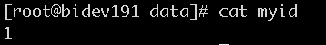
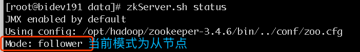
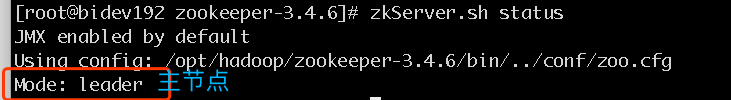

### 一、zookeeper集群安装(以192.168.51.191为例)
##### 1.1 安装
* 创建安装目录 

    ```
    mkdir -p /opt/hadoop/  
    cd /opt/hadoop/
    ```

* 下载压缩包
[zookeeper-3.4.6.tar.gz](http://mirror.bit.edu.cn/apache/zookeeper/zookeeper-3.4.6/zookeeper-3.4.6.tar.gz)

* 解压缩文件

    `tar -zxvf zookeeper-3.4.6.tar.gz`

    

##### 1.2 配置

> 我们把提供相同应用的服务器组称之为一个quorum，quorum中的所有机器都有相同的配置文件。
在这里我们以3个机器组成的quorum为例，具体配置如下。

*  添加环境变量

```
vi /etc/profile
//修改如下

export ZK_HOME=/opt/hadoop/zookeeper-3.4.6
export PATH=$JAVA_HOME/bin:$ZK_HOME/bin:$PATH

```

*  建立数据目录
 `mkdir -p /opt/hadoop/zookeeper-3.4.6/data`

*  编辑配置文件zoo.cfg
  
    将zoo_sample.cfg重命名或复制为zoo.cfg


`vi /opt/hadoop/zookeeper-3.4.6/conf/zoo.cfg`


    ```
    dataDir=/opt/hadoop/zookeeper-3.4.6/data //刚创建的数据目录
    clientPort=2181 
    initLimit=10 
    syncLimit=5 
    tickTime=2000 
    server.1=192.168.51.191:2888:3888 
    server.2=192.168.51.192:2888:3888 
    server.3=192.168.51.193:2888:3888
    ```

>其中server.X代表组成整个服务的机器，当服务启动时，会在数据目录下查找这个文件myid,这个文件中存有服务器的号码。下面会讲myid文件的配置。

*  创建dataDir参数指定的目录(这里指的是`/opt/hadoop/zookeeper-3.4.6/data`)，并在目录下创建文件，命名为“myid”, 编辑该“myid”文件，并在对应的IP的机器上输入对应的编号。如在192.168.51.191上，“myid”文件内容就是1，如在192.168.51.192上，“myid”文件内容就是2，在192.168.51.193上，内容就是 3  
`eg:192.168.51.191`   


##### 1.3 将文件拷贝到另外两台服务器并修改

```
//拷贝命令
scp /etc/profile 192.168.51.192:/etc/
scp /etc/profile 192.168.51.193:/etc/

scp -r /opt/hadoop/zookeeper-3.4.6/ 192.168.51.192:/opt/hadoop/
scp -r /opt/hadoop/zookeeper-3.4.6/ 192.168.51.193:/opt/hadoop/
```

分别修改`/opt/hadoop/zookeeper-3.4.6/data/myid`文件内容为“2”、“3”

##### 1.4 启动服务
>三台电脑先后下zkServer start 指令，不限定先后，但三台电脑间执行此指令的间隔不宜过久（因為有設定timeout時間）
 bin/zkServer.sh start
 没有出错信息，则成功启动

##### 1.5 执行测试

* 在一台机器如server.1上进行一个写操作：
`zkCli.sh -server 127.0.0.1:2181`

        [zk: 127.0.0.1:2181(CONNECTED) 0] create /mytest test
        Created /mytest
        [zk: 127.0.0.1:2181(CONNECTED) 1] ls /
        [mytest, zookeeper]
        [zk: 127.0.0.1:2181(CONNECTED) 2] get /mytest
        test
        cZxid = 0x100000002
        ctime = Thu Jul 27 16:06:12 CST 2017
        mZxid = 0x100000002
        mtime = Thu Jul 27 16:06:12 CST 2017
        pZxid = 0x100000002
        cversion = 0
        dataVersion = 0
        aclVersion = 0
        ephemeralOwner = 0x0
        dataLength = 4
        numChildren = 0

* 在其他机器上查询(例如在server.3)

        [zk: 127.0.0.1:2181(CONNECTED) 0] ls /
        [mytest, zookeeper]
        [zk: 127.0.0.1:2181(CONNECTED) 1] ls /mytest
        []
        [zk: 127.0.0.1:2181(CONNECTED) 2] get /mytest
        test
        cZxid = 0x100000002
        ctime = Thu Jul 27 16:06:12 CST 2017
        mZxid = 0x100000002
        mtime = Thu Jul 27 16:06:12 CST 2017
        pZxid = 0x100000002
        cversion = 0
        dataVersion = 0
        aclVersion = 0
        ephemeralOwner = 0x0
        dataLength = 4
        numChildren = 0


* 查看zookeeper状态(mode自动分配)

    `zkServer.sh status`

    
    


##### 1.6  注意事项

>  通过shell脚本在每个机器上启动zookeeper的时候，可能会显示错误信息“Cannot open channel to X at election address”。这是由于zoo.cfg文件中指定的其他zookeeper服务找不到所导致。所有机器的zookeeper服务启动之后该错误提示将会消失。


